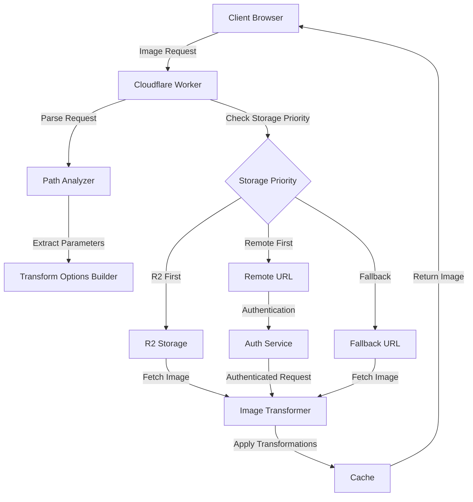
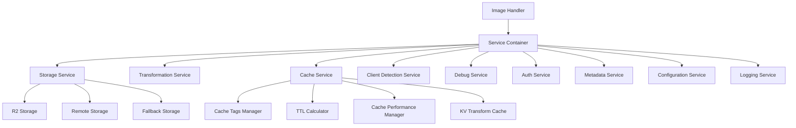

# Image Resizer 2

A comprehensive Cloudflare Worker for image transformation with enterprise-grade features, built on a service-oriented architecture.

## Overview

Image Resizer 2 provides a high-performance, feature-rich image transformation service that leverages Cloudflare's Image Resizing capabilities while adding:

- Multiple storage backends with parallel fetching
- Multi-layer caching with intelligent cache management
- Advanced client detection for optimized delivery
- Comprehensive debugging and monitoring tools
- Extensive customization options

## Architecture Diagrams

### Core Image Processing Flow



### Service-Oriented Architecture



## Key Features

### Core Features

- **Image Transformation**: Resize, crop, format conversion, quality adjustment, and effects
- **Multiple Storage Options**: R2, remote URLs, and fallbacks with priority-based parallel fetching
- **Responsive Images**: Auto-optimization based on client hints and device detection
- **Smart Transformations**: Automated cropping, aspect ratio handling, and focal point detection
- **Service-Oriented Architecture**: Modular design with clean interfaces and lazy initialization

### Advanced Features

- **Multi-Layer Caching**: Tiered caching strategy with intelligent TTL calculations and cache tags
- **KV Transform Cache**: Persistent storage for transformed images with purging capabilities
- **Authenticated Origins**: Support for secure image sources with multiple auth strategies
- **Akamai Compatibility**: Seamless migration path from Akamai Image Manager with parameter translation
- **Path Templates**: URL-based transformation templates for consistent image presentation
- **Path Transformations**: Storage-specific path mapping for flexible directory structures

### Developer Experience

- **Comprehensive Logging**: Multi-level logging with structured output and breadcrumb tracing
- **Debug Tools**: Interactive debug reports, detailed headers, and visualization tools
- **Performance Optimization**: Optimized services with parallel operations and efficient resource usage
- **Error Handling**: Structured error system with detailed context and appropriate status codes
- **Centralized Configuration**: Unified configuration with environment-specific settings

## Usage Examples

### Basic Parameter Usage

```
https://your-worker.com/image.jpg?width=800&height=600&fit=cover
```

### Compact Parameter Syntax

```
https://your-worker.com/image.jpg?r=16:9&p=0.5,0.3&f=l
```

Where:
- `r=16:9` sets a 16:9 aspect ratio
- `p=0.5,0.3` defines the focal point (center of the image)
- `f=l` uses the large size preset (750px width)

### Path Parameters

```
https://your-worker.com/_width=800/_format=webp/image.jpg
```

### Derivative Templates

```
https://your-worker.com/thumbnail/image.jpg
https://your-worker.com/og-image/image.jpg
```

### Smart Transformations

```
https://your-worker.com/image.jpg?smart=true&aspect=1:1&width=400
```

### Akamai Compatibility

```
https://your-worker.com/image.jpg?im.resize=width:400,height:300,mode:fit
```

## Getting Started

### Prerequisites

- Node.js (version 18 or later)
- Wrangler CLI (version 4.2.0 or later)

### Quick Start

1. Clone this repository
2. Install dependencies:

```bash
npm install
```

3. Configure your storage options in `wrangler.jsonc`
4. Start the development server:

```bash
npm run dev
```

### Deployment

Deploy to different environments:

```bash
# Development
npm run deploy:dev

# Staging
npm run deploy:staging

# Production
npm run deploy:prod
```

## Available Configuration

The Image Resizer can be configured through:

1. **wrangler.jsonc**: Main configuration file with environment-specific settings
2. **Environment Variables**: Override specific settings via environment variables
3. **Configuration API**: Dynamically update configuration via the API (when enabled)

See the [Configuration Guide](docs/public/configuration/index.md) for detailed options.

## Documentation

Our documentation has been completely reorganized and updated to provide comprehensive information for both users and developers.

### User Documentation

- [**Introduction**](docs/public/README.md) - Overview and getting started
- [**Core**](docs/public/core/index.md) - Architecture, setup, and core concepts
- [**Configuration**](docs/public/configuration/index.md) - Configuring the service
- [**Features**](docs/public/features/index.md) - Detailed feature documentation
- [**Caching**](docs/public/caching/consolidated-caching-guide.md) - Comprehensive caching guide
- [**Storage**](docs/public/storage/index.md) - Storage options and configuration
- [**Integrations**](docs/public/integrations/index.md) - Third-party integrations
- [**Debugging**](docs/public/debugging/index.md) - Debugging and monitoring

### Developer Documentation

- [**Architecture**](docs/internal/architecture/index.md) - Architectural decisions and patterns
- [**Development**](docs/internal/development/index.md) - Development guidelines and implementation details
- [**Performance**](docs/internal/performance/consolidated-performance-guide.md) - Performance optimization guide
- [**Error Handling**](docs/internal/development/error-handling-system.md) - Error system documentation
- [**Testing**](docs/internal/testing/index.md) - Testing strategy and guidelines

### Quick Navigation

Use our [Documentation Navigation](docs/NAVIGATION.md) for a complete overview of all documentation.

## Project Structure

The Image Resizer follows a service-oriented architecture:

- `src/index.ts` - Main entry point and request handler
- `src/services/` - Core service implementations
- `src/domain/` - Domain logic and commands
- `src/errors/` - Error type definitions
- `src/handlers/` - Request handlers for different endpoints
- `src/parameters/` - Parameter parsing and processing
- `src/utils/` - Utility functions and helpers
- `test/` - Test suite
- `docs/` - Documentation
- `config/` - Configuration examples and modules

## Contributing

See [CONTRIBUTING.md](CONTRIBUTING.md) for details on how to contribute to this project.

## License

MIT License