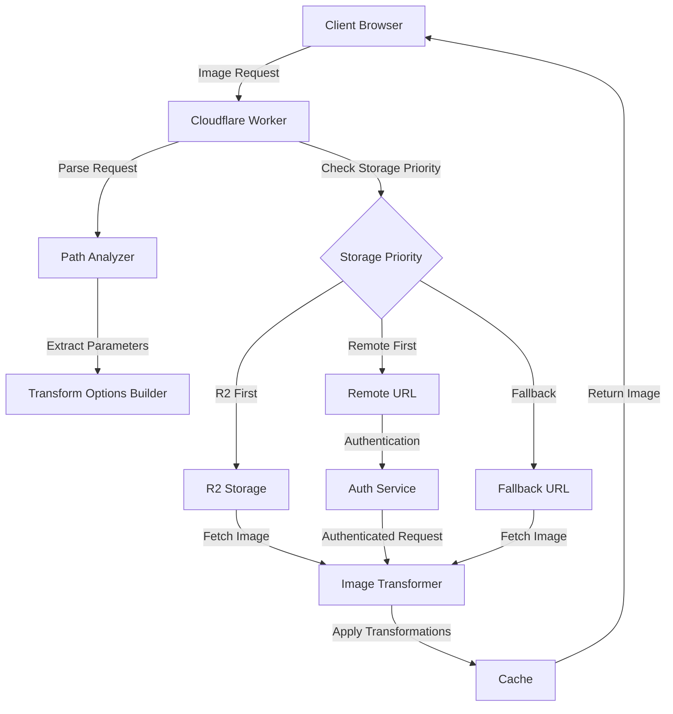

# Image Resizer 2

A streamlined Cloudflare Worker for image resizing that focuses on simplicity while maintaining essential functionality.



This service enhances your Cloudflare Workers setup with advanced image handling capabilities, including on-the-fly resizing, format conversion, optimization, and secure access to authenticated image origins.

## Features

- **Image Transformation**: Leverages Cloudflare's Image Resizing service via the `cf.image` object
- **Multiple Storage Options**: Supports R2, remote URLs, and fallbacks with a priority system and parallel fetching
- **Responsive Images**: Automatically adjusts sizes based on client hints and device detection
- **Caching**: Implements tiered caching strategies with intelligent TTL calculations and cache tag support
- **Debug Headers**: Provides detailed debugging information in response headers
- **Derivatives**: Template-based transformations for common use cases
- **Path Templates**: Maps URL path segments to derivative templates
- **Path Transformations**: Normalizes directory structures for flexible storage
- **Authenticated Origins**: Access images from origins that require authentication (bearer tokens, custom headers, signed URLs, or AWS/GCS signatures)
- **Comprehensive Logging**: Advanced logging system with configurable levels and conditional logging
- **Breadcrumb Tracing**: End-to-end request tracing with performance metrics for diagnostics
- **Interceptor Pattern**: Special handling for large images to prevent timeouts
- **Smart Transformations**: Automatic metadata fetching for smart cropping, aspect ratio transformations, and focal point handling
- **Akamai Compatibility**: Support for Akamai Image Manager URL parameters for seamless migration, including advanced features like blur, watermarking, mirror/flip, and conditional transformations
- **Service-Oriented Architecture**: Modular design with lazy service initialization and clear interfaces
- **Client Detection**: Advanced browser and device capability detection with request-scoped caching
- **Interactive Debug Reports**: Enhanced HTML debug reports with visualizations and performance metrics
- **Centralized Configuration**: Unified configuration service with environment-specific settings and feature flags
- **Performance Optimization**: Comprehensive optimizations for reduced cold start time and improved response times

## Project Components
- **image-resizer**: Transforms image URLs to use Cloudflare's Image Resizing

## Live Demo Examples

Below are examples using a sample image (13MB+ original size) through our image resizer. All these examples work without 524 timeout errors thanks to our interceptor pattern implementation:

### Original Image (Automatically Resized)


Demo URL: [https://images.erfi.dev/Granna_1.JPG](https://images.erfi.dev/Granna_1.JPG)

### Compact Parameter Examples

#### Using Aspect Ratio (r=) Parameter


Demo URL: [https://images.erfi.dev/Granna_1.JPG?r=1:1&width=400](https://images.erfi.dev/Granna_1.JPG?r=1:1&width=400)

#### Using Focal Point (p=) Parameter


Demo URL: [https://images.erfi.dev/Granna_1.JPG?r=16:9&p=0.3,0.7&width=600](https://images.erfi.dev/Granna_1.JPG?r=16:9&p=0.3,0.7&width=600)

#### Using Size Code (f=) Parameter


Demo URL: [https://images.erfi.dev/Granna_1.JPG?f=m](https://images.erfi.dev/Granna_1.JPG?f=m)

#### Compact Parameters in im= Format


Demo URL: [https://images.erfi.dev/Granna_1.JPG?im=r=4:3,p=0.5,0.4,f=l](https://images.erfi.dev/Granna_1.JPG?im=r=4:3,p=0.5,0.4,f=l)

### With Width Parameter


Demo URL: [https://images.erfi.dev/Granna_1.JPG?width=400](https://images.erfi.dev/Granna_1.JPG?width=400)

### Using WebP Format


Demo URL: [https://images.erfi.dev/Granna_1.JPG?format=webp&width=600](https://images.erfi.dev/Granna_1.JPG?format=webp&width=600)

### Using a Derivative (Thumbnail)


Demo URL: [https://images.erfi.dev/thumbnail/Granna_1.JPG](https://images.erfi.dev/thumbnail/Granna_1.JPG)

### Quality and Format Control


Demo URL: [https://images.erfi.dev/Granna_1.JPG?quality=50&width=500](https://images.erfi.dev/Granna_1.JPG?quality=50&width=500)

### Image Cropping with Central Focus


Demo URL: [https://images.erfi.dev/Granna_1.JPG?width=400&height=300&fit=crop&gravity=center](https://images.erfi.dev/Granna_1.JPG?width=400&height=300&fit=crop&gravity=center)

### Path Parameters (Alternative Syntax)


Demo URL: [https://images.erfi.dev/_width=300/_format=webp/Granna_1.JPG](https://images.erfi.dev/_width=300/_format=webp/Granna_1.JPG)

### Image Effects (Brightness, Contrast, Saturation)


Demo URL: [https://images.erfi.dev/Granna_1.JPG?width=400&brightness=10&contrast=15&saturation=-5](https://images.erfi.dev/Granna_1.JPG?width=400&brightness=10&contrast=15&saturation=-5)

### Advanced Gravity with Focus Point


Demo URL: [https://images.erfi.dev/Granna_1.JPG?width=400&height=400&fit=crop&gravity=auto](https://images.erfi.dev/Granna_1.JPG?width=400&height=400&fit=crop&gravity=auto)

### Smart Transformation with Aspect Ratio


Demo URL: [https://images.erfi.dev/Granna_1.JPG?smart=true&aspect=1:1&width=400](https://images.erfi.dev/Granna_1.JPG?smart=true&aspect=1:1&width=400)

### Background Color with Padding


Demo URL: [https://images.erfi.dev/Granna_1.JPG?width=400&height=400&fit=pad&background=lightblue](https://images.erfi.dev/Granna_1.JPG?width=400&height=400&fit=pad&background=lightblue)

### Sharpen Enhancement


Demo URL: [https://images.erfi.dev/Granna_1.JPG?width=400&sharpen=3](https://images.erfi.dev/Granna_1.JPG?width=400&sharpen=3)

### Multiple Derivatives (Banner Example)


Demo URL: [https://images.erfi.dev/banner/Granna_1.JPG](https://images.erfi.dev/banner/Granna_1.JPG)

### Debug Mode

[Debug HTML Report](https://images.erfi.dev/debug-report?url=https://images.erfi.dev/Granna_1.JPG&width=500)

Debug Header Example: Add `?debug=true` to any image URL

### Akamai Compatibility Examples

The Image Resizer supports two Akamai Image Manager parameter formats:

#### Dot Notation Format (im.X)


Demo URL: [https://images.erfi.dev/Granna_1.JPG?im.resize=width:400,height:300,mode:fit&im.quality=80](https://images.erfi.dev/Granna_1.JPG?im.resize=width:400,height:300,mode:fit&im.quality=80)

#### Equals Notation Format (im=X)
,xPosition=0.5,yPosition=0.5)

Demo URL: [https://images.erfi.dev/Granna_1.JPG?im=AspectCrop=(1,1),xPosition=0.5,yPosition=0.5](https://images.erfi.dev/Granna_1.JPG?im=AspectCrop=(1,1),xPosition=0.5,yPosition=0.5)

#### Advanced Features - Blur


Demo URL: [https://images.erfi.dev/Granna_1.JPG?im.blur=20&im.resize=width:400](https://images.erfi.dev/Granna_1.JPG?im.blur=20&im.resize=width:400)

#### Advanced Features - Mirror


Demo URL: [https://images.erfi.dev/Granna_1.JPG?im=Mirror,horizontal](https://images.erfi.dev/Granna_1.JPG?im=Mirror,horizontal)

#### Advanced Features - Conditional Transformations


Demo URL: [https://images.erfi.dev/Granna_1.JPG?im.if-dimension=width>800,im.resize=width:400&debug=true](https://images.erfi.dev/Granna_1.JPG?im.if-dimension=width>800,im.resize=width:400&debug=true)

## Architecture

This project implements a service-oriented architecture (SOA) for better modularity and maintainability:

- **Service Interfaces**: Clear contracts for all services with TypeScript interfaces
- **Service Container**: Central registry of all service instances with lazy loading
- **Command Pattern**: Encapsulated business logic in command objects
- **Configuration Service**: Centralized configuration management
- **Client Detection Service**: Browser and device capability detection with request-scoped caching
- **Cache Service**: Advanced caching strategies with tiered caching and intelligent TTL calculations
- **Debug Service**: Enhanced debugging tools and visualizations
- **Transformation Service**: Image transformation handling
- **Storage Service**: Multi-source storage management with parallel fetching
- **Interceptor Pattern**: Special handling for large images that automatically detects Cloudflare's image-resizing subrequests
- **Performance Optimization**: Comprehensive performance improvements across all components

## Project Structure

```
/
├── src/
│   ├── config.ts              # Configuration handling
│   ├── index.ts               # Main worker entry point
│   ├── transform.ts           # Image transformation logic
│   ├── storage.ts             # Storage utilities (R2, remote)
│   ├── cache.ts               # Caching utilities
│   ├── debug.ts               # Debug headers
│   ├── types.ts               # TypeScript type definitions
│   ├── services/              # Service-oriented architecture components
│   │   ├── interfaces.ts      # Service interfaces
│   │   ├── cacheService.ts    # Cache service implementation
│   │   ├── clientDetectionService.ts # Client detection service
│   │   ├── configurationService.ts # Configuration service
│   │   ├── debugService.ts    # Debug service implementation
│   │   ├── debugVisualization.ts # Debug visualization utilities
│   │   ├── serviceContainer.ts # Service container factory
│   │   ├── storageService.ts  # Storage service implementation
│   │   └── transformationService.ts # Transformation service
│   ├── domain/                # Domain layer
│   │   └── commands/          # Command pattern implementations
│   │       ├── command.ts     # Command interface
│   │       └── transformImageCommand.ts # Transform image command
│   └── utils/                 # Utility functions
│       ├── path.ts            # Path handling utilities
│       ├── errors.ts          # Error handling utilities
│       ├── auth.ts            # Authentication utilities
│       ├── detector.ts        # Client detection utilities
│       ├── logging.ts         # Centralized logging system
│       ├── wrangler-config.ts # Configuration loading from environment
│       └── akamai-compatibility.ts # Akamai parameter translation
├── test/                      # Tests
├── docs/                      # Documentation
│   ├── AKAMAI_COMPATIBILITY.md # Akamai compatibility documentation
│   ├── ARCHITECTURE.md        # Architecture documentation
│   ├── AUTHENTICATION.md      # Authentication documentation
│   ├── CROSS_ORIGIN_PATH_TRANSFORMS.md # Path mapping for different storage types
│   ├── LOGGING.md             # Logging and breadcrumb system documentation
│   ├── DIAGNOSING_TIMEOUTS.md # Guide for fixing 524 timeout errors
│   ├── INTERCEPTOR_PATTERN.md # Explanation of the Cloudflare subrequest handling
│   └── SETUP.md               # Setup documentation
├── public/                    # Static assets for watermarks
│   └── watermarks/           # Watermark images
└── wrangler.jsonc             # Cloudflare Workers configuration
```

## Getting Started

### Prerequisites

- Node.js (version 18 or later)
- Wrangler CLI (version 4.2.0 or later)

### Installation

1. Clone this repository
2. Install dependencies:

```bash
npm install
```

3. Configure your R2 bucket and other settings in `wrangler.jsonc`

### Development

Run the development server:

```bash
npm run dev
# or
wrangler dev
```

### Testing

Run tests:

```bash
npm test
# or
vitest run
```

Run a specific test:

```bash
npm run test:watch -- -t "test name"
```

### Deployment

Deploy to different environments:

```bash
# Development
npm run deploy:dev

# Staging
npm run deploy:staging

# Production
npm run deploy:prod
```

## Usage

The image resizer supports several ways to request transformed images:

### Basic Usage

```
https://your-worker.com/path/to/image.jpg
```

When no parameters are provided, the resizer automatically uses responsive sizing, optimal format, and appropriate quality based on client hints (equivalent to using all "auto" settings).

### With URL Parameters

```
https://your-worker.com/path/to/image.jpg?width=800&quality=80&format=webp
```

### With Path Parameters

```
https://your-worker.com/_width=800/_quality=80/path/to/image.jpg
```

### With Derivatives (Direct)

```
https://your-worker.com/thumbnail/path/to/image.jpg
```

### With Path Templates

```
https://your-worker.com/avatars/user1.jpg  # Applies the "avatar" template
https://your-worker.com/products/item.png  # Applies the "product" template
```

### With Path Transformations

```
https://your-worker.com/assets/logo.png  # Transformed to different paths based on storage type:
                                        # - R2: /img/logo.png
                                        # - Remote: /assets/logo.png
                                        # - Fallback: /public/logo.png

https://your-worker.com/content/blog.jpg  # Transformed to /content-images/blog.jpg for storage
```

See [Path Transformations](docs/storage/path-transforms.md) for more details.

### Available Transformation Options

- `width`: Width in pixels or `auto` for responsive sizing
- `height`: Height in pixels
- `fit`: Fit mode (`scale-down`, `contain`, `cover`, `crop`, `pad`)
- `quality`: Image quality (1-100) or `auto` for format-based quality
- `format`: Output format (`auto`, `webp`, `avif`, `jpeg`, `png`, `gif`)
- `gravity`: Focus area (`auto`, `center`, `face`, `top`, `bottom`, etc.)
- `background`: Background color for padding (CSS color)
- `dpr`: Device pixel ratio
- `metadata`: Metadata handling (`keep`, `copyright`, `none`)
- `derivative`: Predefined transformation template
- `sharpen`: Sharpening level (0.0-10.0)
- `brightness`: Brightness adjustment (-100 to 100)
- `contrast`: Contrast adjustment (-100 to 100)
- `saturation`: Saturation adjustment (-100 to 100, -100=grayscale)
- `blur`: Blur effect (0.5-100.0)
- `smart`: Enable smart transformations that automatically fetch and use image metadata
- `aspect`: Desired aspect ratio in format `width:height` (automatically crops to this ratio)
- `focal`: Custom focal point in format `x,y` with values from 0-1 (for smart cropping)

### Compact Parameter Options

For URL brevity and improved readability, the following compact parameters are supported:

- `r=16:9`: Shorthand for `aspect=16:9` (sets aspect ratio)
- `p=0.5,0.5`: Shorthand for `focal=0.5,0.5` (sets focal point for cropping)
- `f=m`: Shorthand for `width=700` using size codes (see size code table below)

These compact parameters can be used in standard URL parameters and within Akamai compatibility `im=` parameters (e.g., `im=AspectCrop=(1,1),r=16:9,p=0.5,0.5,f=m`)

#### Size Code Table

| Size Code | Width (px) | Description |
|-----------|------------|-------------|
| `xxu`     | 40         | Extra extra ultra small |
| `xu`      | 80         | Extra ultra small |
| `u`       | 160        | Ultra small |
| `xxxs`    | 300        | Triple extra small |
| `xxs`     | 400        | Double extra small |
| `xs`      | 500        | Extra small |
| `s`       | 600        | Small |
| `m`       | 700        | Medium |
| `l`       | 750        | Large |
| `xl`      | 900        | Extra large |
| `xxl`     | 1100       | Double extra large |
| `xxxl`    | 1400       | Triple extra large |
| `sg`      | 1600       | Small giant |
| `g`       | 2000       | Giant |
| `xg`      | 3000       | Extra giant |
| `xxg`     | 4000       | Double extra giant |

For a complete list, see the [Transformation Guide](docs/TRANSFORMATION.md).

### Built-in Derivatives

- `thumbnail`: Small preview (320×150px)
- `avatar`: Square profile picture with face detection (180×180px)
- `banner`: Wide header image (1600×400px)
- `product`: Product image with white background (800×800px)
- `og`: Open Graph/social media preview image (1200×630px)
- `twitter`: Twitter card image (1200×600px)
- `mobile`: Mobile-optimized image (480px width)
- `desktop`: Desktop-optimized image (1440px width)

## Testing with Different Storage Sources

You can dynamically control the storage priority order (R2, remote, fallback) without modifying the code:

```bash
# To use remote sources only
wrangler dev --var STORAGE_PRIORITY=remote,fallback

# To use fallback only
wrangler dev --var STORAGE_PRIORITY=fallback

# To try different priority order
wrangler dev --var STORAGE_PRIORITY=fallback,remote,r2
```

This is particularly useful for:
- Testing remote sources when R2 is unavailable
- Comparing performance between storage options
- Debugging storage-related issues

## Debug Mode

Add `?debug=true` to any URL to see detailed debug headers, or visit `/debug-report` for a comprehensive HTML report.

Debug behavior is fully configurable via the `debug` section in wrangler.jsonc environment settings:

```javascript
"debug": {
  "enabled": true,               // Master toggle for debug headers
  "headers": ["ir", "cache"],    // Categories of headers to include 
  "allowedEnvironments": [],     // Restrict debug to specific environments
  "verbose": true,               // Enable verbose debug information
  "includePerformance": true,    // Include performance timing headers
  "forceDebugHeaders": false,    // Override environment restrictions
  "prefix": "X-",                // Prefix for debug headers
  "specialHeaders": {            // Non-prefixed legacy headers
    "x-processing-mode": true
  }
}
```

## Auto Transformation Features

The image resizer supports automatic parameter selection, which is used by default when no parameters are specified:

- `width=auto`: Omits the width parameter to preserve original width or uses responsive sizing based on client hints and device type
- `height=auto`: Omits the height parameter to preserve aspect ratio
- `quality=auto`: Selects quality based on format and network conditions:
  - Standard: 85 for WebP, 80 for AVIF, config default for others
  - Low network: 75 for WebP, 70 for AVIF, 75 for others (with Save-Data header or low bandwidth)
- `format=auto`: Chooses best format based on client capabilities:
  - AVIF for browsers that support it
  - WebP for browsers that support it
  - Original format or JPEG as fallback

Client hints used for responsive decisions:
- `Sec-CH-Viewport-Width`, `Viewport-Width`, `Width`
- `Sec-CH-DPR`, `DPR`
- `Save-Data` 
- `Downlink`, `RTT` (network quality)
- `CF-Device-Type` (Cloudflare device detection)

## Cloudflare Image Resizing Integration

The resizer implements an interceptor pattern to handle Cloudflare's two-stage image processing:

1. Initial request: User requests an image with transformation parameters
2. Cloudflare subrequest: Cloudflare's Image Resizing service makes a separate request to get the original image
3. Subrequest detection: Worker detects the "via: image-resizing" header on subrequests
4. Direct service: For subrequests, the original image is served directly without transformations
5. Transformed result: User receives the final transformed image

This pattern ensures proper integration with Cloudflare's Image Resizing service by appropriately handling both initial requests and Cloudflare's internal subrequests. For detailed information about how this pattern works and how it prevents timeout errors, see [Interceptor Pattern Documentation](docs/INTERCEPTOR_PATTERN.md).

## Environment Variables

- `ENVIRONMENT`: Current environment (`development`, `staging`, `production`)
- `DEBUG`: Enable debug mode (`true`/`false`)
- `REMOTE_URL`: Base URL for remote images
- `FALLBACK_URL`: Base URL for fallback images
- `DERIVATIVES`: JSON string of custom derivatives
- `STORAGE_PRIORITY`: Comma-separated list of storage priorities (e.g., "r2,remote,fallback")
- `ENABLE_AKAMAI_COMPATIBILITY`: Enable Akamai Image Manager parameter support (`true`/`false`)
- `ENABLE_AKAMAI_ADVANCED_FEATURES`: Enable advanced Akamai features like blur, mirror, composite, and conditional transformations (`true`/`false`)

### Cache Configuration

- `CACHE_METHOD`: Caching method (`cf`, `cache-api`, `none`)
- `CACHE_EVERYTHING`: Whether to cache all content types (`true`/`false`)
- `CACHE_TTL_OK`: Cache TTL for successful responses (in seconds)
- `CACHE_TTL_CLIENT_ERROR`: Cache TTL for client error responses (in seconds)
- `CACHE_TTL_SERVER_ERROR`: Cache TTL for server error responses (in seconds)
- `CACHE_USE_TTL_BY_STATUS`: Use status-code specific TTLs (`true`/`false`)
- `CACHE_TAGS_ENABLED`: Enable cache tagging (`true`/`false`)
- `CACHE_TAGS_PREFIX`: Prefix for all cache tags (e.g., "img-prod-")
- `CACHE_TAGS_CUSTOM`: Comma-separated list of custom tags (e.g., "site1,v2")
- `CACHE_TAGS_PARSE_METADATA`: Extract tags from metadata headers (`true`/`false`)

For detailed information about the cache tag system, see [CACHE_TAGS.md](docs/CACHE_TAGS.md).

### Logging Configuration

- `LOGGING_LEVEL`: Minimum log level (`DEBUG`, `INFO`, `WARN`, `ERROR`)
- `LOGGING_INCLUDE_TIMESTAMP`: Whether to include timestamps (`true`/`false`)
- `LOGGING_ENABLE_STRUCTURED_LOGS`: Whether to output logs in JSON format (`true`/`false`)
- `LOGGING_BREADCRUMBS_ENABLED`: Whether to enable breadcrumb tracing (`true`/`false`)
- `LOGGING_USE_PINO`: Use Pino logger instead of built-in logger (`true`/`false`)
- `LOGGING_PRETTY_PRINT`: Format logs in a human-readable format (`true`/`false`)
- `LOGGING_COLORIZE`: Use colors in pretty-printed logs (`true`/`false`)

For detailed information about the logging system and breadcrumb tracing, see [LOGGING.md](docs/LOGGING.md).

If you're experiencing 524 timeout errors, see our [Diagnosing Timeouts](docs/DIAGNOSING_TIMEOUTS.md) guide.

### Authentication Settings

- `AUTH_ENABLED`: Enable authentication for origins (`true`/`false`)
- `AUTH_SECURITY_LEVEL`: How to handle auth errors (`strict`/`permissive`)
- `AUTH_CACHE_TTL`: TTL for authenticated requests (in seconds)
- `AUTH_USE_ORIGIN_AUTH`: Use Cloudflare's origin-auth feature (`true`/`false`)
- `AUTH_SHARE_PUBLICLY`: Share authenticated images publicly (`true`/`false`)

> **Note**: Basic authentication is deprecated in favor of Cloudflare's origin-auth feature and AWS S3/GCS authentication. The authentication system is now fully asynchronous to properly support AWS request signing.

For complete authentication documentation, see [Authentication](docs/storage/authentication.md).

## Documentation

> **Note:** Our documentation has been reorganized into a more navigable structure. Start with the [Documentation Home](docs/index.md) for a complete guide to all features.

### Core Documentation
- [Documentation Home](docs/index.md) - Main documentation index
- [Architecture](docs/core/architecture.md) - System architecture and design
- [Setup Guide](docs/core/setup.md) - Installation and configuration
- [Transformation Guide](docs/core/transformation.md) - Image transformation options
- [Performance Optimization](docs/PERFORMANCE_OPTIMIZATION.md) - Performance improvement strategies

### Feature Documentation
- [Client Detection](docs/client-detection/index.md) - Browser and device detection framework
- [Caching System](docs/caching/index.md) - Cache management and tiered caching
- [Storage Options](docs/storage/index.md) - Image storage configuration and parallel fetching
- [Authentication](docs/storage/authentication.md) - Secure access to origins

### Integrations
- [Akamai Compatibility](docs/integrations/akamai/index.md) - Migration from Akamai
- [Cloudflare Integration](docs/integrations/cloudflare/index.md) - Cloudflare integration features

### Debugging and Diagnostics
- [Debugging Overview](docs/debugging/index.md) - Debugging tools and techniques
- [Logging System](docs/debugging/logging.md) - Structured logging
- [Diagnosing Timeouts](docs/debugging/diagnosing-timeouts.md) - Solving timeout issues
- [Breadcrumb Tracing](docs/debugging/breadcrumbs.md) - Request flow tracking
- [Debug Headers](docs/debugging/debug-headers.md) - Using debug headers and reports
- [Performance Validation](docs/PERFORMANCE_VALIDATION_GUIDE.md) - Performance testing and validation

## License

MIT License