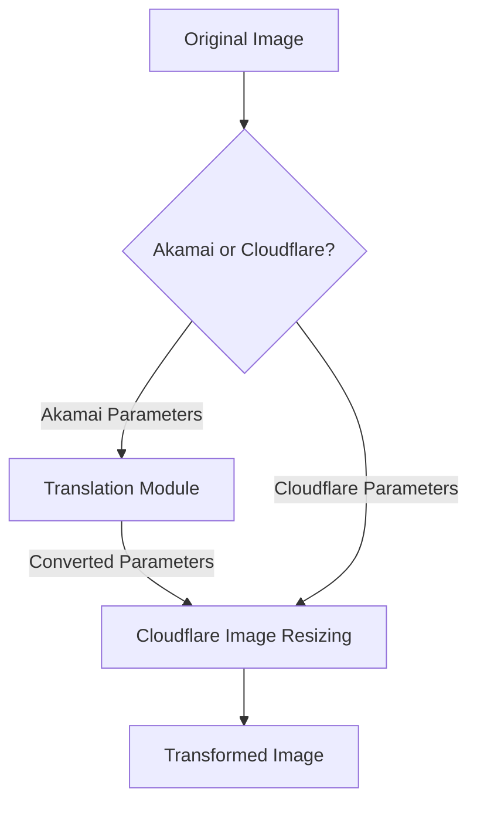

# Akamai Image Manager Compatibility

This guide explains how to use Image Resizer 2 as a drop-in replacement for Akamai Image Manager. It includes a parameter translation module and configuration guidelines to ensure smooth migration.

## Overview

Akamai Image Manager and Cloudflare Image Resizing are similar services with different parameter formats. Image Resizer 2 provides compatibility with Akamai Image Manager's URL format through a translation module that converts Akamai parameters to Cloudflare parameters.



## Parameter Mapping

The following table shows the mapping between Akamai Image Manager parameters and Cloudflare Image Resizing parameters:

| Akamai Parameter | Cloudflare Parameter | Description |
|------------------|----------------------|-------------|
| `im.resize=width:X` | `width=X` | Image width |
| `im.resize=height:X` | `height=X` | Image height |
| `im.resize=mode:fit` | `fit=contain` | Preserve aspect ratio, fit within dimensions |
| `im.resize=mode:stretch` | `fit=scale-down` | No enlargement, preserve aspect ratio |
| `im.resize=mode:fill` | `fit=cover` | Fill area, crop if needed |
| `im.resize=mode:crop` | `fit=crop` | Crop to fit dimensions |
| `im.resize=mode:pad` | `fit=pad` | Pad to fit dimensions |
| `im.resize=aspect:W:H` | (width/height calculation) | Maintain aspect ratio |
| `im.aspectCrop=width:X,height:Y` | Simulated via fit, width, height & gravity | Crop or expand image to specific aspect ratio |
| `im.aspectCrop=hoffset:X,voffset:Y` | `gravity=[position]` | Control aspect crop positioning |
| `im.aspectCrop=allowExpansion:true` | `background=transparent` | Add transparent pixels instead of cropping |
| `im.quality=X` | `quality=X` | Image quality (1-100) |
| `im.quality=low/medium/high` | `quality=50/75/90` | Named quality levels |
| `im.format=webp` | `format=webp` | Image format conversion |
| `im.format=jpeg/jpg` | `format=jpeg` | JPEG format |
| `im.format=png` | `format=png` | PNG format |
| `im.format=gif` | `format=gif` | GIF format |
| `im.format=auto` | `format=auto` | Auto format selection |
| `im.rotate=X` | `rotate=X` | Rotation in degrees (limited to 90/180/270) |
| `im.crop=X,Y,W,H` | `trim=top;right;bottom;left` | Crop specific area |
| `im.grayscale=true` | `saturation=0` | Convert to grayscale |
| `im.contrast=X` | `contrast=X` | Adjust contrast |
| `im.brightness=X` | `brightness=X` | Adjust brightness |
| `im.sharpen=X` | `sharpen=X` | Sharpen image |
| `im.background=X` | `background=X` | Background color |
| `im.metadata=none/copyright/keep` | `metadata=none/copyright/keep` | Metadata handling |
| `im.frame=X` | `anim=false` | Disable animation/GIF frame selection |

## Unsupported Features

The following Akamai Image Manager features are not directly supported in Cloudflare Image Resizing:

| Akamai Feature | Limitation in Cloudflare | Workaround |
|----------------|--------------------------|------------|
| `im.composite` | No direct compositing support | Use pre-composited images |
| `im.text` | No text overlay support | Add text in original image |
| `im.watermark` | No built-in watermarking | Use pre-watermarked images or Workers for dynamic watermarking |
| `im.overlay` | No image overlay support | Pre-composite images |
| `im.pathgen` | No dynamic path generation | Standardize on fixed path patterns |
| `im.policies` | No policy-based transformations | Use derivatives templates |
| `im.colorspace=cmyk` | Limited colorspace support | Convert to RGB before serving |
| `im.clienthints` with custom policies | Limited client hints support | Use standard responsive settings |
| Complex blend modes | Limited blend mode support | Pre-process images with required blend modes |
| Arbitrary angle rotations | Only 90° increment rotations | Pre-rotate images to required angle |
| Region-specific optimizations | No region-specific optimizations | Use standard quality settings |
| Multiple image transforms in sequence | No transform chaining | Apply all transformations in a single step |
| Custom ICC profiles | Limited ICC profile support | Convert to sRGB color space |

> **Note:** The Akamai `im.aspectCrop` feature, which was initially a limitation, is now fully supported through our compatibility module via a combination of Cloudflare parameters.

## Implementation

### Enabling Akamai Compatibility

In your wrangler.jsonc file, set the `ENABLE_AKAMAI_COMPATIBILITY` environment variable:

```json
"vars": {
  "ENABLE_AKAMAI_COMPATIBILITY": "true"
}
```

This flag can be set independently for each environment:

```json
"env": {
  "staging": {
    "vars": {
      "ENABLE_AKAMAI_COMPATIBILITY": "true"
    }
  },
  "production": {
    "vars": {
      "ENABLE_AKAMAI_COMPATIBILITY": "false"
    }
  }
}
```

### Advanced Feature Support

### Aspect Crop

Akamai's Aspect Crop is a powerful feature that changes the height or width of an image to a specific aspect ratio, either by cropping the image or by expanding the canvas with transparent pixels. Our compatibility module implements full support for this feature, including:

1. **Aspect Ratio Conversion**: Crops or expands images to achieve the specified aspect ratio
2. **Customizable Positioning**: Controls which part of the image is preserved when cropping
3. **Expansion Support**: Option to add transparent pixels instead of cropping

#### Implementation Details

We map Akamai's Aspect Crop parameters to Cloudflare's image resizing functionality as follows:

- **width, height**: Used to calculate the target aspect ratio (width:height)
- **hoffset, voffset**: Mapped to Cloudflare's gravity parameter to control positioning
- **allowExpansion**: When true, adds transparent pixels instead of cropping

#### Examples

1. **Basic Aspect Crop (16:9 ratio)**
   ```
   im.aspectCrop=width:16,height:9
   ```

2. **Aspect Crop with Positioning (keep the top of the image)**
   ```
   im.aspectCrop=width:16,height:9,hoffset:0.5,voffset:0
   ```

3. **Aspect Crop with Expansion (add transparent pixels)**
   ```
   im.aspectCrop=width:16,height:9,allowExpansion:true
   ```

4. **Complete Example with Positioning and Expansion**
   ```
   im.aspectCrop=width:16,height:9,hoffset:0.25,voffset:0.25,allowExpansion:true
   ```

#### Gravity Mapping

Akamai's hoffset and voffset parameters (ranging from 0 to 1) are mapped to Cloudflare's gravity parameter as follows:

| Horizontal Offset | Vertical Offset | Resulting Gravity  |
|-------------------|-----------------|-------------------|
| 0-0.25            | 0-0.25          | north-west       |
| 0-0.25            | 0.25-0.75       | west             |
| 0-0.25            | 0.75-1          | south-west       |
| 0.25-0.75         | 0-0.25          | north            |
| 0.25-0.75         | 0.25-0.75       | center           |
| 0.25-0.75         | 0.75-1          | south            |
| 0.75-1            | 0-0.25          | north-east       |
| 0.75-1            | 0.25-0.75       | east             |
| 0.75-1            | 0.75-1          | south-east       |

## URL Format Support

The compatibility module supports three different Akamai URL formats:

1. **Query Parameters**
   ```
   https://example.com/images/test.jpg?im.resize=width:800,height:600&im.quality=85
   ```

2. **Path Segment Parameters with im-**
   ```
   https://example.com/images/im-resize=width:800/im-quality=85/test.jpg
   ```

3. **Path Segment Parameters with im()**
   ```
   https://example.com/images/im(resize=width:800,quality=85)/test.jpg
   ```

All formats are automatically detected and converted to Cloudflare's query parameter format.

## Debugging

When Akamai compatibility mode is enabled and used, the worker adds a special debug header:

```
X-Debug-Akamai-Compatibility: used
```

This header is only visible when debug mode is enabled.

The debug report page also indicates whether Akamai compatibility is enabled:

```
https://example.com/debug-report
```

## Migration Strategy

When migrating from Akamai Image Manager to Cloudflare Image Resizing, consider the following approach:

1. **Enable compatibility mode** in a staging environment
2. **Test thoroughly** with various URL formats and parameters
3. **Identify unsupported features** using the table above and create workarounds
4. **Deploy to production** with compatibility mode enabled
5. **Monitor usage** and resolve any issues
6. **Update image URLs** in your content over time to use native Cloudflare format
7. **Eventually disable** compatibility mode once all URLs are migrated

## Performance Considerations

The Akamai compatibility layer adds a small processing overhead for parameter translation. For optimal performance:

1. **Use native Cloudflare parameters** for new content
2. **Cache aggressively** to minimize the translation overhead
3. **Consider pre-processing** images that use unsupported features
4. **Monitor server timing headers** to identify performance bottlenecks

## Testing

The compatibility module includes comprehensive tests covering:

- Detection of Akamai format URLs
- Parameter translation for all supported features
- Path format parsing and normalization
- URL conversion to Cloudflare format
- Integration with the main image processing pipeline

Run tests with:

```bash
npm test -- akamai-compatibility
```

## Limitations

Be aware of the following limitations when using the Akamai compatibility module:

1. **Feature gap**: Some advanced Akamai features have no direct equivalent in Cloudflare
2. **Edge cases**: Complex parameter combinations may not translate perfectly
3. **Processing overhead**: The translation step adds a small processing cost
4. **Manual migration**: URLs should be migrated to native format over time
5. **Debug verbosity**: Akamai parameter translation is only visible in debug headers