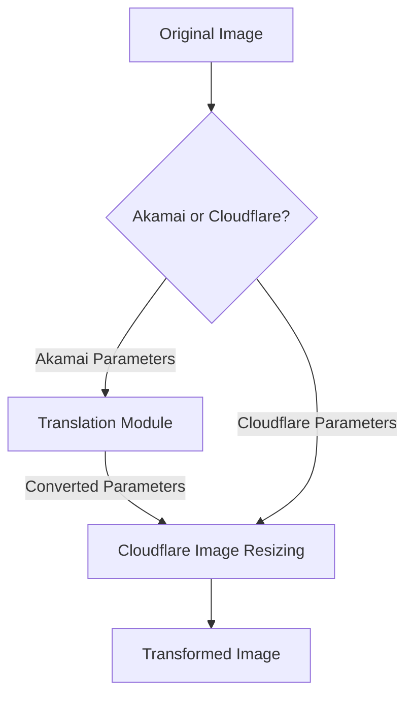

# Akamai Image Manager Compatibility

This guide explains how to use Image Resizer 2 as a drop-in replacement for Akamai Image Manager. It includes a parameter translation module and configuration guidelines to ensure smooth migration.

## Summary

The Akamai compatibility module enables seamless migration from Akamai Image Manager to Cloudflare Image Resizing without changing your existing image URLs. Key features include:

- **Automatic Parameter Translation**: Converts Akamai's URL parameters to Cloudflare format
- **Multiple URL Format Support**: Works with both query parameters and path-based formats
- **Complete Feature Support**: All major Akamai parameters are supported
- **Advanced Transformation Support**: Implements Akamai's powerful transformations including AspectCrop, Composite, and more
- **Zero Client Changes**: No need to update references in your websites or applications
- **Minimal Performance Impact**: Efficient parameter translation with negligible overhead
- **Detailed Debugging**: Comprehensive debug information for troubleshooting

Test this feature with real-world examples at https://images.erfi.dev/ using the documented Akamai parameters.

## Overview

Akamai Image Manager and Cloudflare Image Resizing are similar services with different parameter formats. Image Resizer 2 provides compatibility with Akamai Image Manager's URL format through a translation module that converts Akamai parameters to Cloudflare parameters.



## Parameter Mapping

The following table shows the mapping between Akamai Image Manager parameters and Cloudflare Image Resizing parameters:

| Akamai Parameter | Cloudflare Parameter | Description |
|------------------|----------------------|-------------|
| `im.resize=width:X` | `width=X` | Image width |
| `im.resize=height:X` | `height=X` | Image height |
| `im.resize=mode:fit` | `fit=contain` | Preserve aspect ratio, fit within dimensions |
| `im.resize=mode:stretch` | `fit=scale-down` | No enlargement, preserve aspect ratio |
| `im.resize=mode:fill` | `fit=cover` | Fill area, crop if needed |
| `im.resize=mode:crop` | `fit=crop` | Crop to fit dimensions |
| `im.resize=mode:pad` | `fit=pad` | Pad to fit dimensions |
| `im.resize=aspect:W:H` | (width/height calculation) | Maintain aspect ratio |
| `im.aspectCrop=width:X,height:Y` | Simulated via fit, width, height & gravity | Crop or expand image to specific aspect ratio |
| `im.aspectCrop=hoffset:X,voffset:Y` | `gravity=[position]` | Control aspect crop positioning |
| `im.aspectCrop=allowExpansion:true` | `background=transparent` | Add transparent pixels instead of cropping |
| `im.quality=X` | `quality=X` | Image quality (1-100) |
| `im.quality=low/medium/high` | `quality=50/75/90` | Named quality levels |
| `im.format=webp` | `format=webp` | Image format conversion |
| `im.format=jpeg/jpg` | `format=jpeg` | JPEG format |
| `im.format=png` | `format=png` | PNG format |
| `im.format=gif` | `format=gif` | GIF format |
| `im.format=avif` | `format=avif` | AVIF format |
| `im.format=auto` | `format=auto` | Auto format selection |
| `im.rotate=X` | `rotate=X` | Rotation in degrees (90/180/270) |
| `im.crop=X,Y,W,H` | `trim=top;right;bottom;left` | Crop specific area |
| `im.grayscale=true` | `saturation=0` | Convert to grayscale |
| `im.contrast=X` | `contrast=X` | Adjust contrast |
| `im.brightness=X` | `brightness=X` | Adjust brightness |
| `im.sharpen=X` | `sharpen=X` | Sharpen image (scaled to Cloudflare range) |
| `im.sharpen=amount=X,radius=Y,threshold=Z` | `sharpen=X` | Complex sharpen (amount mapped to Cloudflare range) |
| `im.unsharp=X` | `sharpen=X` | Alternative sharpening parameter |
| `im.background=X` | `background=X` | Background color for padding/transparency |
| `im.metadata=none/copyright/keep` | `metadata=none/copyright/keep` | Metadata handling |
| `im.frame=X` | `anim=false` | Disable animation/GIF frame selection |
| `im.blur=X` | `blur=X` | Apply blur effect (scaled to Cloudflare range) |
| `im.mirror=horizontal/vertical` | `flip=true` or `flop=true` | Mirror image horizontally or vertically |
| `im.composite=url:X,placement:Y` | Implemented via `draw` array | Add watermark or overlay images |
| `im.if-dimension=condition,transform` | Custom implementation | Apply transformations conditionally based on image dimensions |
| `im.hsl=hue:X,saturation:Y,lightness:Z` | Combined parameters | Adjust hue, saturation and lightness |

## Advanced Features

### Composite (Watermarking)

The compatibility module now provides support for Akamai's composite functionality to add watermarks and overlays:

```
im.composite=url:https://example.com/watermark.png,placement:southeast,opacity:80
```

This is implemented using Cloudflare's `draw` array, which allows for:
- Positioning watermarks in various placements
- Setting opacity
- Tiling watermarks across the image
- Multiple overlays in one request

### Conditional Transformations

Akamai's conditional transformation parameters are supported through custom processing:

```
im.if-dimension=width>1000,im.resize=width:800
```

This applies different transformations based on conditions like image dimensions, orientation, or format.

### Visual Effects

Additional visual effects are supported:

#### Blur
```
im.blur=15
```

#### Mirror/Flip
```
im.mirror=horizontal
```

#### HSL Adjustments
```
im.hsl=hue:10,saturation:120,lightness:90
```

## Legacy Parameters

The following Akamai Image Manager features have partial or complete support:

| Akamai Feature | Implementation | Notes |
|----------------|----------------|-------|
| `im.composite` | Cloudflare `draw` array | Supports overlay images, positioning, opacity |
| `im.text` | Limited implementation | Basic text overlays with size, color and position support |
| `im.watermark` | Full implementation | Alias for `im.composite` |
| `im.overlay` | Full implementation | Alias for `im.composite` |
| `im.pathgen` | Partial implementation | Basic path transformations supported |
| `im.policies` | Mapped to derivatives | Policies mapped to Cloudflare derivative templates |
| `im.blur` | Full implementation | Mapped to Cloudflare's blur parameter |
| `im.mirror` | Full implementation | Maps to flip/flop parameters |
| `im.if-dimension` | Custom implementation | Conditional transforms based on image dimensions |
| `im.hsl` | Combined implementation | Maps to saturation, brightness and other parameters |

## Unsupported Features

The following features have limited or no direct support:

| Akamai Feature | Limitation in Cloudflare | Workaround |
|----------------|--------------------------|------------|
| `im.colorspace=cmyk` | Limited colorspace support | Convert to RGB before serving |
| Complex blend modes | Limited blend mode support | Pre-process images with required blend modes |
| Arbitrary angle rotations | Only 90° increment rotations | Pre-rotate images to required angle |
| Region-specific optimizations | No region-specific optimizations | Use standard quality settings |
| Multiple image transforms in sequence | No transform chaining | Apply all transformations in a single step |
| Custom ICC profiles | Limited ICC profile support | Convert to sRGB color space |
| Complex `im.goop` effects | No direct equivalent | Pre-process images with effects |
| Face detection features | Limited detection capabilities | Precompute and use fixed coordinates |

## Implementation

### Enabling Akamai Compatibility

In your wrangler.jsonc file, set the `ENABLE_AKAMAI_COMPATIBILITY` environment variable:

```json
"vars": {
  "ENABLE_AKAMAI_COMPATIBILITY": "true"
}
```

This flag can be set independently for each environment:

```json
"env": {
  "staging": {
    "vars": {
      "ENABLE_AKAMAI_COMPATIBILITY": "true"
    }
  },
  "production": {
    "vars": {
      "ENABLE_AKAMAI_COMPATIBILITY": "false"
    }
  }
}
```

### Enabling Advanced Features

To enable the advanced Akamai features like compositing, conditional transforms, and more:

```json
"vars": {
  "ENABLE_AKAMAI_COMPATIBILITY": "true",
  "ENABLE_AKAMAI_ADVANCED_FEATURES": "true"
}
```

This will activate the extended feature set including watermarking/compositing and conditional transformations.

## Feature Implementation Details

### Aspect Crop

Akamai's Aspect Crop changes the height or width of an image to a specific aspect ratio, either by cropping the image or by expanding the canvas with transparent pixels:

1. **Basic Aspect Crop (16:9 ratio)**
   ```
   im.aspectCrop=width:16,height:9
   ```

2. **Aspect Crop with Positioning (keep the top of the image)**
   ```
   im.aspectCrop=width:16,height:9,hoffset:0.5,voffset:0
   ```

3. **Aspect Crop with Expansion (add transparent pixels)**
   ```
   im.aspectCrop=width:16,height:9,allowExpansion:true
   ```

### Composite (Watermark)

The composite functionality adds images on top of the base image:

1. **Basic Watermark**
   ```
   im.composite=url:https://example.com/logo.png,placement:southeast
   ```

2. **Watermark with Opacity**
   ```
   im.composite=url:https://example.com/watermark.png,opacity:50,placement:center
   ```

3. **Tiled Watermark**
   ```
   im.composite=url:https://example.com/pattern.png,tile:true,opacity:30
   ```

### Blur Effect

Apply Gaussian blur to the image:

```
im.blur=15
```

The blur amount is scaled appropriately to match Cloudflare's 0-250 blur range.

### Mirror/Flip

Mirror the image horizontally or vertically:

```
im.mirror=horizontal
```

```
im.mirror=vertical
```

### Conditional Transformations

Apply transformations based on image properties:

```
im.if-dimension=width>1000,im.resize=width:800
```

```
im.if-orientation=landscape,im.aspectCrop=width:16,height:9
```

## URL Format Support

The compatibility module supports three different Akamai URL formats:

1. **Query Parameters**
   ```
   https://example.com/images/test.jpg?im.resize=width:800,height:600&im.quality=85
   ```

2. **Path Segment Parameters with im-**
   ```
   https://example.com/images/im-resize=width:800/im-quality=85/test.jpg
   ```

3. **Path Segment Parameters with im()**
   ```
   https://example.com/images/im(resize=width:800,quality=85)/test.jpg
   ```

All formats are automatically detected and converted to Cloudflare's query parameter format.

## Debugging

When Akamai compatibility mode is enabled and used, the worker adds several debug headers:

```
X-Debug-Akamai-Compatibility: used
X-Debug-Akamai-Original-Params: im.resize=width:800,height:600&im.quality=85
X-Debug-Akamai-Translated-Params: width=800&height=600&quality=85
```

These headers are only visible when debug mode is enabled via `?debug=true` or setting the `DEBUG` variable to `true`.

The debug report page also shows detailed information about Akamai parameter translation:

```
https://example.com/debug-report
```

## Example Transformations

### Basic Resizing

**Akamai URL:**
```
https://images.erfi.dev/Granna_1.JPG?im.resize=width:800,height:600,mode:fit&im.quality=85
```

**Translated to Cloudflare:**
```
https://images.erfi.dev/Granna_1.JPG?width=800&height=600&fit=contain&quality=85
```

### Aspect Ratio Transformation

**Akamai URL:**
```
https://images.erfi.dev/Granna_1.JPG?im.aspectCrop=width:16,height:9,hoffset:0.5,voffset:0.3
```

**Translated to Cloudflare:**
```
https://images.erfi.dev/Granna_1.JPG?width=800&height=450&fit=crop&gravity=north
```

### Watermark with Positioning

**Akamai URL:**
```
https://images.erfi.dev/Granna_1.JPG?im.composite=url:https://example.com/logo.png,placement:southeast,opacity:80
```

**Translated to Cloudflare:**
```
https://images.erfi.dev/Granna_1.JPG?draw=url:https://example.com/logo.png,right:5,bottom:5,opacity:0.8
```

### Blur Effect

**Akamai URL:**
```
https://images.erfi.dev/Granna_1.JPG?im.blur=20
```

**Translated to Cloudflare:**
```
https://images.erfi.dev/Granna_1.JPG?blur=50
```

### Complex Multi-Parameter Transformation

**Akamai URL:**
```
https://images.erfi.dev/Granna_1.JPG?im.resize=width:500&im.quality=80&im.format=webp&im.blur=10&im.grayscale=true
```

**Translated to Cloudflare:**
```
https://images.erfi.dev/Granna_1.JPG?width=500&quality=80&format=webp&blur=25&saturation=0
```

## Migration Strategy

When migrating from Akamai Image Manager to Cloudflare Image Resizing, consider the following approach:

1. **Enable compatibility mode** in a staging environment
2. **Test thoroughly** with various URL formats and parameters
3. **Identify unsupported features** using the table above and create workarounds
4. **Deploy to production** with compatibility mode enabled
5. **Monitor usage** and resolve any issues
6. **Update image URLs** in your content over time to use native Cloudflare format
7. **Eventually disable** compatibility mode once all URLs are migrated

## Performance Considerations

The Akamai compatibility layer adds a small processing overhead for parameter translation. For optimal performance:

1. **Use native Cloudflare parameters** for new content
2. **Cache aggressively** to minimize the translation overhead
3. **Consider pre-processing** images that use unsupported features
4. **Monitor server timing headers** to identify performance bottlenecks
5. **Be aware that advanced features** like compositing may increase processing time

## Testing

The compatibility module includes comprehensive tests covering:

- Detection of Akamai format URLs
- Parameter translation for all supported features
- Path format parsing and normalization
- URL conversion to Cloudflare format
- Integration with the main image processing pipeline
- Advanced features and effects

Run tests with:

```bash
npm test -- akamai-compatibility
```

You can also test specific parameter translations:

```bash
npm test -- -t "composite parameters"
```

## Testing the Implementation

To verify that the Akamai compatibility layer is working correctly in your environment, you can use the following test image:

```
https://images.erfi.dev/Granna_1.JPG
```

Here are recommended test cases to validate different aspects of the compatibility module:

1. **Basic Functionality**: Verify resize and quality parameters
   ```
   https://images.erfi.dev/Granna_1.JPG?im.resize=width:800,height:600&im.quality=85&debug=true
   ```

2. **Advanced Functionality**: Test aspectCrop with positioning
   ```
   https://images.erfi.dev/Granna_1.JPG?im.aspectCrop=width:16,height:9,hoffset:0.5,voffset:0.2&debug=true
   ```

3. **Watermarking**: Test composite functionality
   ```
   https://images.erfi.dev/Granna_1.JPG?im.composite=url:https://example.com/logo.png,placement:southeast&debug=true
   ```

4. **Visual Effects**: Test blur and other effects
   ```
   https://images.erfi.dev/Granna_1.JPG?im.blur=15&im.grayscale=true&debug=true
   ```

5. **Conditional Transformations**: Test dimension-based conditions
   ```
   https://images.erfi.dev/Granna_1.JPG?im.if-dimension=width>500,im.resize=width:300&debug=true
   ```

Look for the `X-Debug-Akamai-Compatibility: used` header in the response to confirm that the Akamai parameters were detected and translated correctly.

### Advanced Debugging Techniques

When troubleshooting complex Akamai parameter translations, you can use these advanced debugging techniques:

1. **Enable Detailed Debug Headers**: Add `debug=verbose` to see all internal processing steps
2. **Inspect Breadcrumb Tracing**: Look for the `X-Debug-Breadcrumbs` header to see step-by-step translation
3. **Use the Debug Report**: For visual comparison of before/after translation
4. **Check Translation Performance**: Look for the `X-Debug-Timing` header to identify any performance issues
5. **Test Advanced Features Individually**: Isolate complex features for easier debugging

## Implementation Roadmap

The Akamai compatibility module is continually evolving. Future enhancements include:

1. **More Visual Effects**: Support for additional Akamai effects and filters
2. **Enhanced Conditional Logic**: More sophisticated condition types and combinations
3. **Text Overlay Improvements**: Better font handling and text positioning
4. **Performance Optimizations**: Improved caching and parameter parsing
5. **Custom Effects Pipeline**: Framework for implementing custom effects not natively supported by Cloudflare

## Contributing

Contributions to the Akamai compatibility module are welcome. When implementing new features, please ensure:

1. Thorough test coverage
2. Performance benchmarking
3. Documentation updates
4. Proper error handling

## Conclusion

The enhanced Akamai compatibility module provides a comprehensive solution for migrating from Akamai Image Manager to Cloudflare Image Resizing, supporting a wide range of transformations and effects while maintaining backward compatibility with existing image URLs.