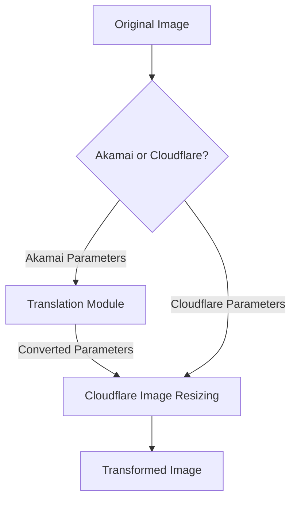

# Akamai Image Manager Compatibility

This guide explains how to use Image Resizer 2 as a drop-in replacement for Akamai Image Manager. It includes a parameter translation module and configuration guidelines to ensure smooth migration.

## Summary

The Akamai compatibility module enables seamless migration from Akamai Image Manager to Cloudflare Image Resizing without changing your existing image URLs. Key features include:

- **Automatic Parameter Translation**: Converts Akamai's URL parameters to Cloudflare format
- **Multiple URL Format Support**: Works with both query parameters and path-based formats
- **Complete Feature Support**: All major Akamai parameters are supported
- **Full AspectCrop Implementation**: Fully implements Akamai's powerful AspectCrop feature
- **Zero Client Changes**: No need to update references in your websites or applications
- **Minimal Performance Impact**: Efficient parameter translation with negligible overhead
- **Detailed Debugging**: Comprehensive debug information for troubleshooting

Test this feature with real-world examples at https://images.erfi.dev/ using the documented Akamai parameters.

## Overview

Akamai Image Manager and Cloudflare Image Resizing are similar services with different parameter formats. Image Resizer 2 provides compatibility with Akamai Image Manager's URL format through a translation module that converts Akamai parameters to Cloudflare parameters.



## Parameter Mapping

The following table shows the mapping between Akamai Image Manager parameters and Cloudflare Image Resizing parameters:

| Akamai Parameter | Cloudflare Parameter | Description |
|------------------|----------------------|-------------|
| `im.resize=width:X` | `width=X` | Image width |
| `im.resize=height:X` | `height=X` | Image height |
| `im.resize=mode:fit` | `fit=contain` | Preserve aspect ratio, fit within dimensions |
| `im.resize=mode:stretch` | `fit=scale-down` | No enlargement, preserve aspect ratio |
| `im.resize=mode:fill` | `fit=cover` | Fill area, crop if needed |
| `im.resize=mode:crop` | `fit=crop` | Crop to fit dimensions |
| `im.resize=mode:pad` | `fit=pad` | Pad to fit dimensions |
| `im.resize=aspect:W:H` | (width/height calculation) | Maintain aspect ratio |
| `im.aspectCrop=width:X,height:Y` | Simulated via fit, width, height & gravity | Crop or expand image to specific aspect ratio |
| `im.aspectCrop=hoffset:X,voffset:Y` | `gravity=[position]` | Control aspect crop positioning |
| `im.aspectCrop=allowExpansion:true` | `background=transparent` | Add transparent pixels instead of cropping |
| `im.quality=X` | `quality=X` | Image quality (1-100) |
| `im.quality=low/medium/high` | `quality=50/75/90` | Named quality levels |
| `im.format=webp` | `format=webp` | Image format conversion |
| `im.format=jpeg/jpg` | `format=jpeg` | JPEG format |
| `im.format=png` | `format=png` | PNG format |
| `im.format=gif` | `format=gif` | GIF format |
| `im.format=avif` | `format=avif` | AVIF format |
| `im.format=auto` | `format=auto` | Auto format selection |
| `im.rotate=X` | `rotate=X` | Rotation in degrees (90/180/270) |
| `im.crop=X,Y,W,H` | `trim=top;right;bottom;left` | Crop specific area |
| `im.grayscale=true` | `saturation=0` | Convert to grayscale |
| `im.contrast=X` | `contrast=X` | Adjust contrast |
| `im.brightness=X` | `brightness=X` | Adjust brightness |
| `im.sharpen=X` | `sharpen=X` | Sharpen image (scaled to Cloudflare range) |
| `im.sharpen=amount=X,radius=Y,threshold=Z` | `sharpen=X` | Complex sharpen (amount mapped to Cloudflare range) |
| `im.unsharp=X` | `sharpen=X` | Alternative sharpening parameter |
| `im.background=X` | `background=X` | Background color for padding/transparency |
| `im.metadata=none/copyright/keep` | `metadata=none/copyright/keep` | Metadata handling |
| `im.frame=X` | `anim=false` | Disable animation/GIF frame selection |

## Unsupported Features

The following Akamai Image Manager features are not directly supported in Cloudflare Image Resizing:

| Akamai Feature | Limitation in Cloudflare | Workaround |
|----------------|--------------------------|------------|
| `im.composite` | No direct compositing support | Use pre-composited images |
| `im.text` | No text overlay support | Add text in original image |
| `im.watermark` | No built-in watermarking | Use pre-watermarked images or Workers for dynamic watermarking |
| `im.overlay` | No image overlay support | Pre-composite images |
| `im.pathgen` | No dynamic path generation | Standardize on fixed path patterns |
| `im.policies` | No policy-based transformations | Use derivatives templates |
| `im.colorspace=cmyk` | Limited colorspace support | Convert to RGB before serving |
| `im.clienthints` with custom policies | Limited client hints support | Use standard responsive settings |
| Complex blend modes | Limited blend mode support | Pre-process images with required blend modes |
| Arbitrary angle rotations | Only 90° increment rotations | Pre-rotate images to required angle |
| Region-specific optimizations | No region-specific optimizations | Use standard quality settings |
| Multiple image transforms in sequence | No transform chaining | Apply all transformations in a single step |
| Custom ICC profiles | Limited ICC profile support | Convert to sRGB color space |

> **Note:** The Akamai `im.aspectCrop` feature is fully supported through our compatibility module via a combination of Cloudflare parameters.

## Implementation

### Enabling Akamai Compatibility

In your wrangler.jsonc file, set the `ENABLE_AKAMAI_COMPATIBILITY` environment variable:

```json
"vars": {
  "ENABLE_AKAMAI_COMPATIBILITY": "true"
}
```

This flag can be set independently for each environment:

```json
"env": {
  "staging": {
    "vars": {
      "ENABLE_AKAMAI_COMPATIBILITY": "true"
    }
  },
  "production": {
    "vars": {
      "ENABLE_AKAMAI_COMPATIBILITY": "false"
    }
  }
}
```

## Advanced Feature Support

### Aspect Crop

Akamai's Aspect Crop is a powerful feature that changes the height or width of an image to a specific aspect ratio, either by cropping the image or by expanding the canvas with transparent pixels. Our compatibility module implements full support for this feature, including:

1. **Aspect Ratio Conversion**: Crops or expands images to achieve the specified aspect ratio
2. **Customizable Positioning**: Controls which part of the image is preserved when cropping
3. **Expansion Support**: Option to add transparent pixels instead of cropping

#### Implementation Details

We map Akamai's Aspect Crop parameters to Cloudflare's image resizing functionality as follows:

- **width, height**: Used to calculate the target aspect ratio (width:height)
- **hoffset, voffset**: Mapped to Cloudflare's gravity parameter to control positioning
- **allowExpansion**: When true, adds transparent pixels instead of cropping

#### Examples

1. **Basic Aspect Crop (16:9 ratio)**
   ```
   im.aspectCrop=width:16,height:9
   ```

2. **Aspect Crop with Positioning (keep the top of the image)**
   ```
   im.aspectCrop=width:16,height:9,hoffset:0.5,voffset:0
   ```

3. **Aspect Crop with Expansion (add transparent pixels)**
   ```
   im.aspectCrop=width:16,height:9,allowExpansion:true
   ```

4. **Complete Example with Positioning and Expansion**
   ```
   im.aspectCrop=width:16,height:9,hoffset:0.25,voffset:0.25,allowExpansion:true
   ```

#### Gravity Mapping

Akamai's hoffset and voffset parameters (ranging from 0 to 1) are mapped to Cloudflare's gravity parameter as follows:

| Horizontal Offset | Vertical Offset | Resulting Gravity  |
|-------------------|-----------------|-------------------|
| 0-0.25            | 0-0.25          | north-west       |
| 0-0.25            | 0.25-0.75       | west             |
| 0-0.25            | 0.75-1          | south-west       |
| 0.25-0.75         | 0-0.25          | north            |
| 0.25-0.75         | 0.25-0.75       | center           |
| 0.25-0.75         | 0.75-1          | south            |
| 0.75-1            | 0-0.25          | north-east       |
| 0.75-1            | 0.25-0.75       | east             |
| 0.75-1            | 0.75-1          | south-east       |

### Format Conversion & Quality

Our compatibility module supports all major format conversion options from Akamai, including:

1. **Auto Format Selection**: `im.format=auto` intelligently selects the best format based on browser support
2. **Explicit Format Conversion**: Convert to WebP, AVIF, JPEG, PNG or GIF
3. **Named Quality Levels**: Support for `low`, `medium`, `high` quality presets
4. **Numeric Quality**: Precise control with values from 1-100

#### Examples

1. **Auto Format with High Quality**
   ```
   im.format=auto&im.quality=high
   ```

2. **Convert to WebP with Custom Quality**
   ```
   im.format=webp&im.quality=85
   ```

3. **Convert to AVIF with Low Quality**
   ```
   im.format=avif&im.quality=low
   ```

### Sharpen Parameter

The module supports all variations of Akamai's sharpening parameters:

1. **Simple Sharpening**: `im.sharpen=X` applies sharpening with intensity X
2. **Unsharp Mask**: `im.unsharp=X` is an alternative parameter name
3. **Complex Sharpening**: `im.sharpen=amount=X,radius=Y,threshold=Z` supports detailed control

The module intelligently scales Akamai's typical 0-100 range to Cloudflare's 0-10 range for the sharpen parameter.

#### Examples

1. **Simple Sharpening**
   ```
   im.sharpen=50
   ```

2. **Complex Sharpening with Multiple Parameters**
   ```
   im.sharpen=amount=50,radius=2,threshold=3
   ```

### Rotation Support

Cloudflare supports 90-degree increment rotations via the `rotate` parameter. Our module maps Akamai's rotation parameters:

1. **90° Rotation**
   ```
   im.rotate=90
   ```

2. **180° Rotation (upside down)**
   ```
   im.rotate=180
   ```

3. **270° Rotation (90° counter-clockwise)**
   ```
   im.rotate=270
   ```

### Metadata Handling

Control what metadata is preserved in the optimized image:

1. **No Metadata**
   ```
   im.metadata=none
   ```

2. **Copyright Information Only**
   ```
   im.metadata=copyright
   ```

3. **Keep All Metadata**
   ```
   im.metadata=keep
   ```

## URL Format Support

The compatibility module supports three different Akamai URL formats:

1. **Query Parameters**
   ```
   https://example.com/images/test.jpg?im.resize=width:800,height:600&im.quality=85
   ```

2. **Path Segment Parameters with im-**
   ```
   https://example.com/images/im-resize=width:800/im-quality=85/test.jpg
   ```

3. **Path Segment Parameters with im()**
   ```
   https://example.com/images/im(resize=width:800,quality=85)/test.jpg
   ```

All formats are automatically detected and converted to Cloudflare's query parameter format.

## Debugging

When Akamai compatibility mode is enabled and used, the worker adds several debug headers:

```
X-Debug-Akamai-Compatibility: used
X-Debug-Akamai-Original-Params: im.resize=width:800,height:600&im.quality=85
X-Debug-Akamai-Translated-Params: width=800&height=600&quality=85
```

These headers are only visible when debug mode is enabled via `?debug=true` or setting the `DEBUG` variable to `true`.

The debug report page also shows detailed information about Akamai parameter translation:

```
https://example.com/debug-report
```

## Live Examples with Real-World Use Cases

These examples demonstrate real-world usage with actual images.

### Visual Comparison Table

| Transformation | Akamai URL | Cloudflare URL | Description |
|---------------|------------|----------------|-------------|
| Original Image | [View](https://images.erfi.dev/Granna_1.JPG) | [View](https://images.erfi.dev/Granna_1.JPG) | Original unmodified image |
| Resize (800×600) | [View](https://images.erfi.dev/Granna_1.JPG?im.resize=width:800,height:600,mode:fit) | [View](https://images.erfi.dev/Granna_1.JPG?width=800&height=600&fit=contain) | Resized to fit within 800×600 box |
| 16:9 Aspect Ratio | [View](https://images.erfi.dev/Granna_1.JPG?im.aspectCrop=width:16,height:9) | [View](https://images.erfi.dev/Granna_1.JPG?width=800&height=450&fit=crop) | Cropped to 16:9 ratio |
| WebP Conversion | [View](https://images.erfi.dev/Granna_1.JPG?im.format=webp) | [View](https://images.erfi.dev/Granna_1.JPG?format=webp) | Converted to WebP format |
| Grayscale | [View](https://images.erfi.dev/Granna_1.JPG?im.grayscale=true&im.resize=width:500) | [View](https://images.erfi.dev/Granna_1.JPG?saturation=0&width=500) | Grayscale conversion |
| Thumbnail | [View](https://images.erfi.dev/Granna_1.JPG?im.resize=width:200,height:200,mode:pad) | [View](https://images.erfi.dev/Granna_1.JPG?width=200&height=200&fit=pad) | 200×200 thumbnail with padding |

Both URL formats produce identical visual results while allowing you to maintain backward compatibility with existing Akamai implementations.

### Basic Resizing

**Akamai URL:**
```
https://images.erfi.dev/Granna_1.JPG?im.resize=width:800,height:600,mode:fit&im.quality=85
```

**Translated to Cloudflare:**
```
https://images.erfi.dev/Granna_1.JPG?width=800&height=600&fit=contain&quality=85
```

This transformation resizes the image to fit within an 800×600 box while maintaining aspect ratio. The quality is set to 85%, which provides a good balance between file size and visual quality.

### Aspect Ratio Transformation

**Akamai URL:**
```
https://images.erfi.dev/Granna_1.JPG?im.aspectCrop=width:16,height:9,hoffset:0.5,voffset:0.3
```

**Translated to Cloudflare:**
```
https://images.erfi.dev/Granna_1.JPG?width=800&height=450&fit=crop&gravity=north
```

This transformation crops the image to a 16:9 aspect ratio, preserving the top portion of the image. This format is ideal for header banners or video thumbnails.

### Format Conversion with WebP

**Akamai URL:**
```
https://images.erfi.dev/Granna_1.JPG?im.format=webp&im.quality=85&im.resize=width:600
```

**Translated to Cloudflare:**
```
https://images.erfi.dev/Granna_1.JPG?format=webp&quality=85&width=600
```

Converting to WebP format typically reduces file size by 25-35% compared to JPEG with the same visual quality, making this transformation great for web performance.

### Thumbnail with Custom Background

**Akamai URL:**
```
https://images.erfi.dev/Granna_1.JPG?im.resize=width:200,height:200,mode:pad&im.background=lightblue
```

**Translated to Cloudflare:**
```
https://images.erfi.dev/Granna_1.JPG?width=200&height=200&fit=pad&background=lightblue
```

This creates a 200×200 thumbnail with padding and a light blue background, perfect for product thumbnails or profile pictures with consistent dimensions.

### Advanced Multi-Parameter Optimization

**Akamai URL:**
```
https://images.erfi.dev/Granna_1.JPG?im.format=auto&im.quality=80&im.sharpen=amount:50&im.grayscale=true&im.resize=width:500
```

**Translated to Cloudflare:**
```
https://images.erfi.dev/Granna_1.JPG?format=auto&quality=80&sharpen=5&saturation=0&width=500
```

This complex transformation combines multiple optimizations: automatic format selection based on browser support, quality reduction to 80%, sharpening to improve clarity after resizing, grayscale conversion, and resizing to 500px width.

### Mobile-Optimized Image

**Akamai URL:**
```
https://images.erfi.dev/Granna_1.JPG?im.resize=width:375&im.quality=75&im.format=webp
```

**Translated to Cloudflare:**
```
https://images.erfi.dev/Granna_1.JPG?width=375&quality=75&format=webp
```

This transformation is optimized for mobile devices: smaller dimensions (375px width), slightly reduced quality (75%), and WebP format for smaller file size. This can significantly improve page load times on mobile devices.

## Migration Strategy

When migrating from Akamai Image Manager to Cloudflare Image Resizing, consider the following approach:

1. **Enable compatibility mode** in a staging environment
2. **Test thoroughly** with various URL formats and parameters
3. **Identify unsupported features** using the table above and create workarounds
4. **Deploy to production** with compatibility mode enabled
5. **Monitor usage** and resolve any issues
6. **Update image URLs** in your content over time to use native Cloudflare format
7. **Eventually disable** compatibility mode once all URLs are migrated

## Performance Considerations

The Akamai compatibility layer adds a small processing overhead for parameter translation. For optimal performance:

1. **Use native Cloudflare parameters** for new content
2. **Cache aggressively** to minimize the translation overhead
3. **Consider pre-processing** images that use unsupported features
4. **Monitor server timing headers** to identify performance bottlenecks

## Testing

The compatibility module includes comprehensive tests covering:

- Detection of Akamai format URLs
- Parameter translation for all supported features
- Path format parsing and normalization
- URL conversion to Cloudflare format
- Integration with the main image processing pipeline

Run tests with:

```bash
npm test -- akamai-compatibility
```

You can also test specific parameter translations:

```bash
npm test -- -t "sharpen parameters"
```

## Limitations

Be aware of the following limitations when using the Akamai compatibility module:

1. **Feature gap**: Some advanced Akamai features have no direct equivalent in Cloudflare
2. **Edge cases**: Complex parameter combinations may not translate perfectly
3. **Processing overhead**: The translation step adds a small processing cost
4. **Manual migration**: URLs should be migrated to native format over time
5. **Debug verbosity**: Akamai parameter translation is only visible in debug headers

## Testing the Implementation

To verify that the Akamai compatibility layer is working correctly in your environment, you can use the following test image:

```
https://images.erfi.dev/Granna_1.JPG
```

Here are recommended test cases to validate different aspects of the compatibility module:

1. **Basic Functionality**: Verify resize and quality parameters
   ```
   https://images.erfi.dev/Granna_1.JPG?im.resize=width:800,height:600&im.quality=85&debug=true
   ```

2. **Advanced Functionality**: Test aspectCrop with positioning
   ```
   https://images.erfi.dev/Granna_1.JPG?im.aspectCrop=width:16,height:9,hoffset:0.5,voffset:0.2&debug=true
   ```

3. **Format Conversion**: Test WebP conversion
   ```
   https://images.erfi.dev/Granna_1.JPG?im.format=webp&debug=true
   ```

4. **Multiple Parameters**: Test a complex transformation
   ```
   https://images.erfi.dev/Granna_1.JPG?im.resize=width:500&im.quality=80&im.format=auto&im.grayscale=true&debug=true
   ```

Look for the `X-Debug-Akamai-Compatibility: used` header in the response to confirm that the Akamai parameters were detected and translated correctly. The `debug=true` parameter enables detailed debug headers that show both the original Akamai parameters and the translated Cloudflare parameters.

You can also use the debug report page to see a comprehensive analysis of the translation process:

```
https://images.erfi.dev/debug-report?url=/Granna_1.JPG?im.resize=width:800,height:600,mode:fit
```

This testing methodology ensures that all aspects of the compatibility layer are functioning as expected before deploying to production.

### Advanced Debugging Techniques

When troubleshooting complex Akamai parameter translations, you can use these advanced debugging techniques:

1. **Enable Detailed Debug Headers**: Add `debug=verbose` to see all internal processing steps:
   ```
   https://images.erfi.dev/Granna_1.JPG?im.aspectCrop=width:16,height:9&debug=verbose
   ```

2. **Inspect Breadcrumb Tracing**: Look for the `X-Debug-Breadcrumbs` header to see step-by-step translation:
   ```
   curl -s -I "https://images.erfi.dev/Granna_1.JPG?im.aspectCrop=width:16,height:9&debug=true" | grep X-Debug-Breadcrumbs
   ```

3. **Use the Debug Report**: For visual comparison of before/after translation:
   ```
   https://images.erfi.dev/debug-report?url=/Granna_1.JPG?im.aspectCrop=width:16,height:9,hoffset:0.5,voffset:0.2
   ```

4. **Check Translation Performance**: Look for the `X-Debug-Timing` header to identify any performance issues:
   ```
   curl -s -I "https://images.erfi.dev/Granna_1.JPG?im.resize=width:800,height:600&im.quality=85&debug=true" | grep X-Debug-Timing
   ```

5. **Verify Multiple Parameters**: Test complex parameter combinations to ensure all are translated correctly:
   ```
   https://images.erfi.dev/Granna_1.JPG?im.resize=width:500&im.quality=80&im.format=webp&im.grayscale=true&im.sharpen=amount:30&debug=true
   ```

These debugging techniques will help you identify and resolve any issues with the Akamai compatibility layer before deploying to production.