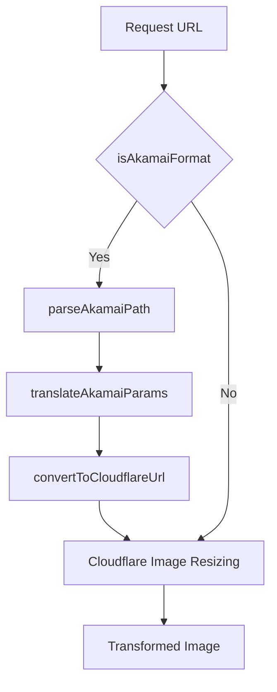

# Akamai Image Manager Compatibility Implementation

This document provides detailed information about the implementation of Akamai Image Manager compatibility in the Image Resizer 2 project.

## Implementation Overview

The Akamai compatibility module enables seamless migration from Akamai Image Manager to Cloudflare Image Resizing by:

1. Detecting Akamai-style URL parameters 
2. Translating them to equivalent Cloudflare parameters
3. Supporting various Akamai URL formats (query parameters and path-based formats)
4. Implementing advanced features like Aspect Crop

## Architecture

The implementation consists of several key components:



### Key Functions

1. **isAkamaiFormat**: Detects if a URL uses Akamai Image Manager parameters
2. **parseAkamaiPath**: Extracts parameters from path-based Akamai URLs
3. **translateAkamaiParams**: Converts Akamai parameters to Cloudflare equivalents
4. **convertToCloudflareUrl**: Produces a URL with Cloudflare parameters

## Feature Implementation

### Basic Parameter Translation

The `translateAkamaiParams` function maps Akamai parameters to their Cloudflare equivalents:

```typescript
export function translateAkamaiParams(url: URL): TransformOptions {
  const cfParams: TransformOptions = {};
  
  // Parse Akamai im.resize parameter
  const imResize = url.searchParams.get('im.resize');
  if (imResize) {
    const resizeParams = parseImResize(imResize);
    
    // Map width and height directly
    if (resizeParams.width) cfParams.width = parseInt(resizeParams.width.toString());
    if (resizeParams.height) cfParams.height = parseInt(resizeParams.height.toString());
    
    // Map resize mode to fit parameter
    if (resizeParams.mode) {
      switch(resizeParams.mode) {
        case 'fit': cfParams.fit = 'contain'; break;
        case 'stretch': cfParams.fit = 'scale-down'; break;
        case 'fill': cfParams.fit = 'cover'; break;
        case 'crop': cfParams.fit = 'crop'; break;
        case 'pad': cfParams.fit = 'pad'; break;
      }
    }
  }
  
  // Additional parameter translations...
  
  return cfParams;
}
```

### Aspect Crop Implementation

The Aspect Crop feature is implemented through a combination of Cloudflare parameters:

```typescript
// Handle aspectCrop from Akamai
const imAspectCrop = url.searchParams.get('im.aspectCrop');
if (imAspectCrop) {
  try {
    // Parse aspect crop parameters
    const aspectCropParams: Record<string, string | number | boolean> = {};
    
    // Parse parameters...
    
    // Calculate aspect ratio
    const aspectWidth = typeof aspectCropParams.width === 'number' ? aspectCropParams.width : 1;
    const aspectHeight = typeof aspectCropParams.height === 'number' ? aspectCropParams.height : 1;
    
    // Set the target aspect ratio
    const targetAspect = aspectWidth / aspectHeight;
    
    // Configure dimensions based on aspect ratio...
    
    // Handle crop positioning using gravity
    const hoffset = typeof aspectCropParams.hoffset === 'number' ? aspectCropParams.hoffset : 0.5;
    const voffset = typeof aspectCropParams.voffset === 'number' ? aspectCropParams.voffset : 0.5;
    
    // Map offsets to gravity...
    
    // Handle allowExpansion parameter
    if (aspectCropParams.allowExpansion === true) {
      cfParams.background = 'transparent';
      // Adjust dimensions...
    }
  } catch (error) {
    console.warn('Failed to parse im.aspectCrop parameter:', error);
  }
}
```

### URL Path Parameter Handling

The module supports Akamai's path-based parameter formats:

```typescript
export function parseAkamaiPath(path: string, baseUrl?: string): URL {
  // Create a URL object
  const url = baseUrl ? new URL(path, baseUrl) : new URL(path, 'https://example.com');
  
  // Path with im-param=value format
  const imParamRegex = /\/im-([\w.]+)=([^/]+)/g;
  let match;
  
  // Find all im-param=value patterns
  while ((match = imParamRegex.exec(pathname)) !== null) {
    const [fullMatch, param, value] = match;
    url.searchParams.set(`im.${param}`, value);
    // Extract and process parameters...
  }
  
  // Path with im(...) format
  const imGroupRegex = /\/im\(([^)]+)\)/g;
  while ((match = imGroupRegex.exec(pathname)) !== null) {
    // Extract and process parameters...
  }
  
  return url;
}
```

## Integration with Main Handler

The Akamai compatibility module is integrated into the main request handler:

```typescript
// Check for Akamai compatibility mode
if (config.features?.enableAkamaiCompatibility) {
  // First check for Akamai parameters in the URL
  const isAkamai = isAkamaiFormat(url);
  
  // If Akamai format is detected, convert parameters to Cloudflare format
  if (isAkamai) {
    // Log the original URL for debugging
    if (config.debug.enabled) {
      console.log('Detected Akamai URL format:', url.toString());
    }
    
    // Convert the URL parameters
    const convertedUrl = convertToCloudflareUrl(url);
    
    // Create a new request with the converted URL
    url = new URL(convertedUrl.toString());
    
    // Log the converted URL for debugging
    if (config.debug.enabled) {
      console.log('Converted to Cloudflare format:', url.toString());
    }
  }
}
```

## Configuration

The Akamai compatibility feature can be enabled/disabled through configuration:

```typescript
// In wrangler.jsonc
"vars": {
  "ENABLE_AKAMAI_COMPATIBILITY": "true"
}

// In config.ts
features: {
  enableAkamaiCompatibility: true
}
```

## Debugging

Debugging information is provided through:

1. **Console Logging**: Original and converted URLs are logged when in debug mode
2. **Response Headers**: `X-Debug-Akamai-Compatibility: used` header when the feature is active
3. **Debug Report**: Akamai compatibility status is included in the debug HTML report

## Testing

The implementation includes comprehensive tests:

1. **Unit Tests**: Test each component function individually
2. **Integration Tests**: Test end-to-end functionality with real URLs
3. **Edge Cases**: Test various parameter combinations and formats

## Future Improvements

Future enhancements to the Akamai compatibility module could include:

1. **Better path transformation**: Improve handling of complex URL paths
2. **Enhanced quoted value support**: Better parsing of quoted values in parameters
3. **More comprehensive feature parity**: Support for additional Akamai features
4. **Performance optimizations**: Streamline parameter parsing and conversion

## Conclusion

The Akamai compatibility module provides a robust solution for migrating from Akamai Image Manager to Cloudflare Image Resizing. It supports key features like Aspect Crop while maintaining high performance and reliability.

By translating parameters at the edge, it enables a seamless transition with no changes required to existing URLs, allowing for a gradual migration strategy.