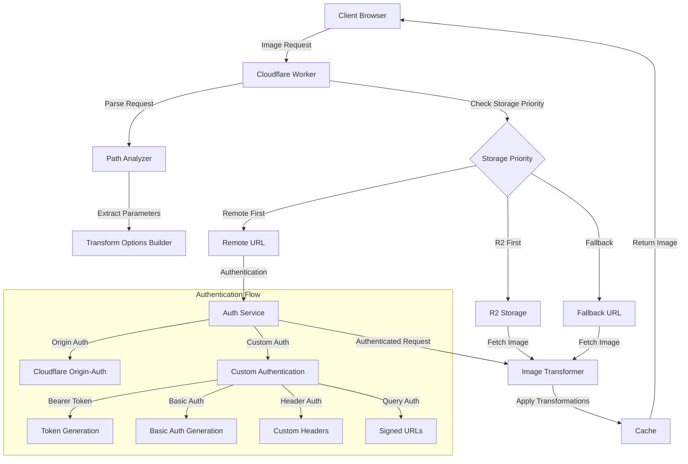
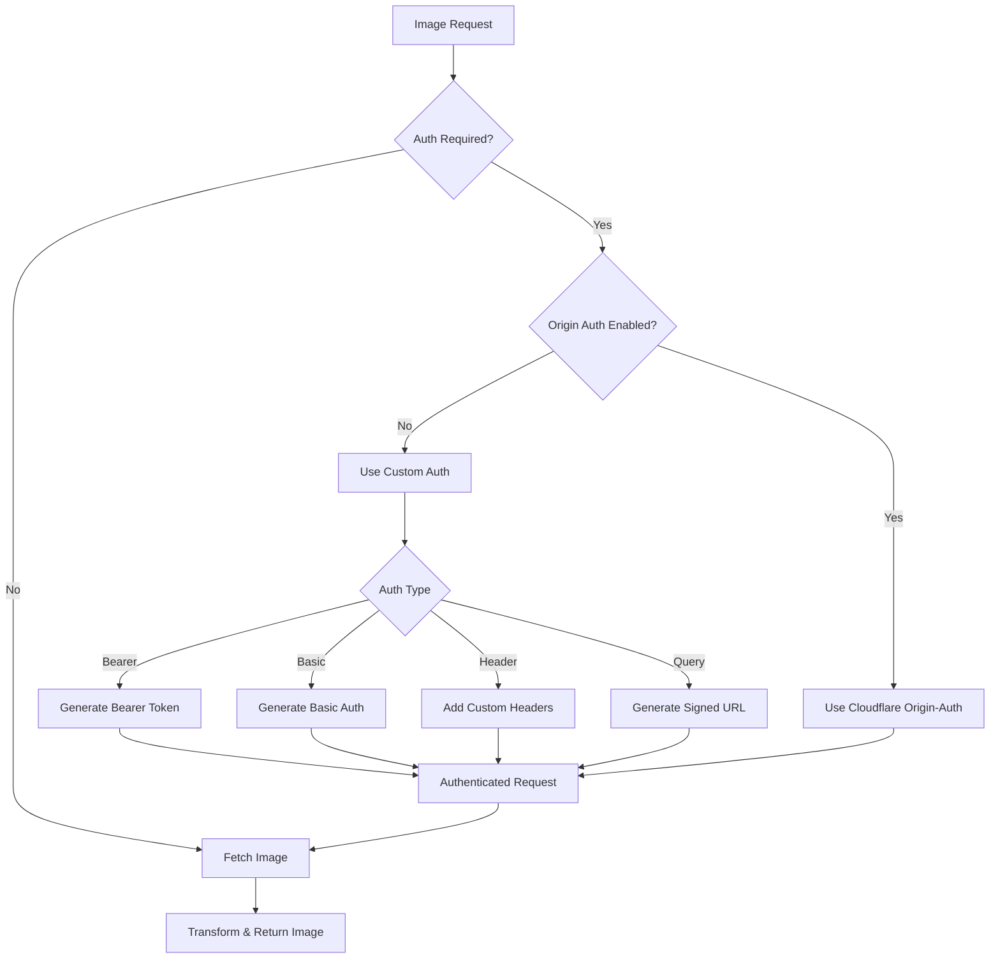

# Image Resizer 2 Architecture

This document outlines the architecture of the Image Resizer service, providing developers with a clear understanding of how the different components work together.

## Architectural Overview

The Image Resizer service is built on Cloudflare Workers and leverages Cloudflare's Image Resizing service to transform images on the fly. The service is designed to be simple, efficient, and flexible.

## Core Components

### 1. Request Handler (`index.ts`)

The entry point for all requests. Responsible for:
- Initializing configuration
- Routing requests to appropriate handlers
- Error handling and response generation

### 2. Configuration Manager (`config.ts`)

Manages all configuration settings from:
- Environment variables
- Default configurations
- Environment-specific overrides (development, staging, production)

### 3. Path Analysis (`utils/path.ts`)

Extracts transformation parameters from the URL:
- Query parameters (`?width=800&height=600`)
- Path parameters (`/_width=800/_height=600/image.jpg`)
- Path templates (`/thumbnail/image.jpg`)
- Derivatives and preset handling

### 4. Storage Service (`storage.ts`)

Handles image retrieval from multiple sources:
- R2 buckets (Cloudflare's object storage)
- Remote URLs
- Fallback URLs
- Implements priority order for sources

### 5. Authentication Service (`utils/auth.ts`)

Secures access to protected image origins:
- Cloudflare's origin-auth feature integration
- Custom authentication implementation:
  - Bearer token authentication
  - Basic authentication
  - Custom header authentication
  - Signed URL authentication
- Secrets management via Wrangler

### 6. Image Transformation (`transform.ts`)

Applies transformations to images by:
- Building transformation options from request parameters
- Constructing the `cf.image` object
- Handling format conversion, resizing, quality settings, etc.

### 7. Caching Service (`cache.ts`)

Optimizes performance through intelligent caching:
- Configurable TTL based on status codes
- Cache tag support for purging
- Cloudflare Cache API integration

### 8. Debug Tools (`debug.ts`)

Provides debugging capabilities:
- Response headers for troubleshooting
- Performance metrics
- Configuration information

## Data Flow

1. **Request Ingestion**
   - Client makes a request for an image with transformation parameters
   - Worker receives the request and initializes the configuration

2. **Parameter Extraction**
   - Path analyzer extracts transformation parameters from URL
   - Path templates and derivatives are resolved

3. **Storage Selection**
   - Based on configuration priorities, the system selects whether to fetch from R2, remote URL, or fallback

4. **Authentication**
   - If the source requires authentication, the auth service applies the appropriate authentication method
   - Secrets are retrieved from environment variables or Wrangler secrets

5. **Image Retrieval**
   - The storage service fetches the original image from the selected source

6. **Transformation**
   - The transform service applies requested transformations using Cloudflare's Image Resizing service

7. **Caching & Response**
   - The transformed image is cached according to the caching policy
   - Debug headers are added if enabled
   - The response is sent back to the client

## Authentication Flow

### Secret Management

Sensitive authentication credentials are stored as Wrangler secrets using the following pattern:

- `AUTH_TOKEN_SECRET_[ORIGIN_ID]`: Bearer token secrets
- `AUTH_BASIC_USERNAME_[ORIGIN_ID]`: Basic auth usernames
- `AUTH_BASIC_PASSWORD_[ORIGIN_ID]`: Basic auth passwords
- `AUTH_API_KEY_[ORIGIN_ID]`: API keys for header auth
- `AUTH_SIGNING_SECRET_[ORIGIN_ID]`: Signing secrets for query params

For each image request requiring authentication:

1. The system identifies which origin the image belongs to
2. It retrieves the appropriate secret from the environment
3. Authentication is applied according to the configured method
4. The authenticated request is used to fetch the image

## Configuration Management

Configuration follows a layered approach:

1. **Base defaults**: Defined in `defaultConfig` in `config.ts`
2. **Environment overrides**: Development, staging, production-specific settings
3. **Environment variables**: Values from Cloudflare environment
4. **Wrangler secrets**: For sensitive authentication credentials

This provides a flexible system where configurations can be defined at different levels according to their sensitivity and specificity.