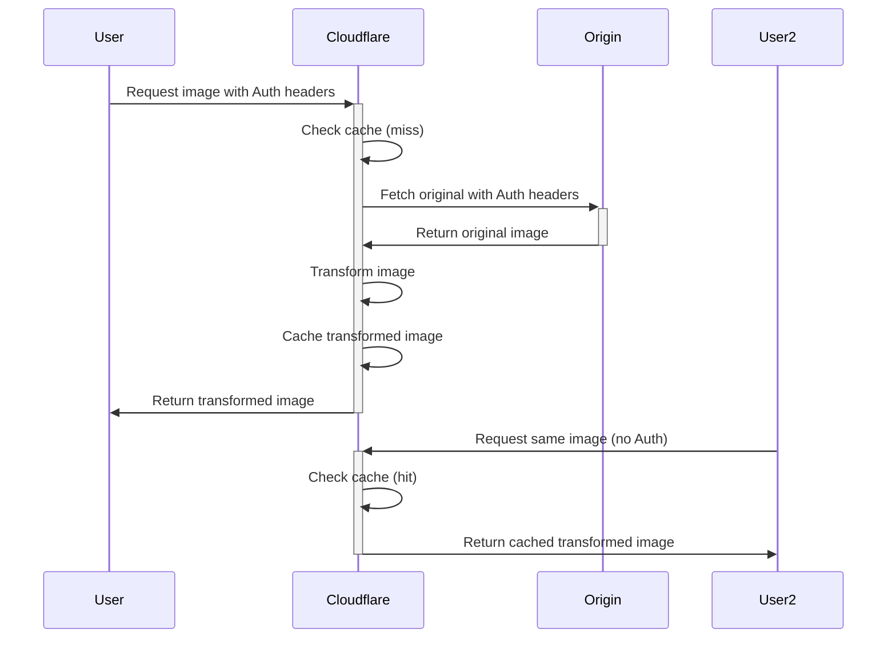

# Authentication Guide

This guide explains how to configure and use the authentication features of Image Resizer to access protected image origins.

## Authentication Overview

Image Resizer supports accessing images from origins that require authentication. This is useful for:

- Private S3 buckets or other authenticated storage
- Images behind API gateways requiring API keys
- Content protected by authentication systems
- CDNs with token-based security

The system supports two primary authentication methods:

1. **Cloudflare's Origin-Auth** (recommended)
2. **Custom Authentication** (alternative implementation)

## Cloudflare Origin-Auth

This is the recommended approach for accessing authenticated origins, providing better performance and compatibility with Cloudflare's infrastructure.

### How Origin-Auth Works

When using Cloudflare's `origin-auth` feature:

1. Cloudflare passes specific authentication headers from the original request to your origin when fetching the original image
2. It then caches the transformed image in Cloudflare's public cache (with the `share-publicly` option)
3. Subsequent requests receive the cached image without requiring re-authentication



### Supported Headers

With `origin-auth`, Cloudflare automatically passes these headers to your origin:

- `Authorization` - For bearer tokens and Basic Auth
- `Cookie` - For cookie-based authentication
- AWS S3: `x-amz-content-sha256`, `x-amz-date`
- Azure Storage: `x-ms-date`, `x-ms-version`
- SecureAuth: `x-sa-date`
- Cloudflare Access: `cf-access-client-id`, `cf-access-client-secret`

### Configuration

To enable Origin-Auth:

```javascript
// wrangler.jsonc
{
  "vars": {
    "AUTH_ENABLED": "true",
    "AUTH_USE_ORIGIN_AUTH": "true",
    "AUTH_SHARE_PUBLICLY": "true"
  }
}
```

With this configuration, authentication headers from the original request will be passed through to your origin.

## Custom Authentication

Image Resizer also provides its own authentication implementation that supports:

1. **Bearer Token Authentication** - For JWT or similar token-based systems
2. **Basic Authentication** - For username/password credentials
3. **Custom Header Authentication** - For API keys or custom headers
4. **Query Parameter Authentication** - For signed URLs or token parameters

### Security Levels Explained

The `AUTH_SECURITY_LEVEL` setting determines how authentication failures are handled:

- **Strict Mode** (`AUTH_SECURITY_LEVEL="strict"`)
  - More secure; enforces authentication requirements strictly
  - If authentication fails (e.g., missing credentials, invalid token), the request fails with an error
  - Recommended for staging and production environments
  - Use when you want to ensure no unauthorized access is allowed

- **Permissive Mode** (`AUTH_SECURITY_LEVEL="permissive"`)
  - More flexible; allows continuation even when auth fails
  - If authentication fails, the system attempts the request without authentication
  - Only useful during development or testing
  - Can help debug issues without being blocked by auth failures
  - **WARNING**: Not recommended for production unless there's a specific need to prioritize availability over security

### Configuration Steps

1. **Enable Authentication**

   In your `wrangler.jsonc`:

   ```javascript
   {
     "vars": {
       "AUTH_ENABLED": "true",
       "AUTH_USE_ORIGIN_AUTH": "false",  // Use custom auth instead of origin-auth
       "AUTH_SECURITY_LEVEL": "strict",
       "AUTH_CACHE_TTL": "3600"
     }
   }
   ```

2. **Configure Authentication for Storage Endpoints**

   Configure authentication for remote and fallback URLs directly:

   ```javascript
   {
     "vars": {
       // ... other settings ...
       
       /* Remote URL Auth Configuration */
       "REMOTE_AUTH_ENABLED": "true",
       "REMOTE_AUTH_TYPE": "aws-s3", // Options: aws-s3, bearer, header, query
       "REMOTE_AUTH_REGION": "us-east-1",  // For AWS/GCS auth
       "REMOTE_AUTH_SERVICE": "s3",        // "s3" for AWS/R2, "storage" for GCS
       
       /* Fallback URL Auth Configuration */
       "FALLBACK_AUTH_ENABLED": "false",
       "FALLBACK_AUTH_TYPE": "bearer"
     }
   }
   ```

   > **Note**: The new configuration ties auth directly to storage endpoints rather than using domain pattern matching, making it more intuitive and reliable.

3. **Configure Authentication Parameters**

   Specify additional parameters for your authentication methods:

   ```javascript
   {
     "vars": {
       // ... other settings ...
       
       /* For AWS S3/GCS Authentication */
       "REMOTE_AUTH_ACCESS_KEY_VAR": "AWS_ACCESS_KEY_ID",     // Env var name for access key
       "REMOTE_AUTH_SECRET_KEY_VAR": "AWS_SECRET_ACCESS_KEY", // Env var name for secret key
       
       /* AWS/GCS Credentials */
       "AWS_ACCESS_KEY_ID": "",      // Set this with your S3/GCS access key
       "AWS_SECRET_ACCESS_KEY": "",  // Set this with your S3/GCS secret key
       
       /* For Bearer Token Auth */
       "AUTH_TOKEN_HEADER_NAME": "Authorization",
       "AUTH_TOKEN_EXPIRATION": "3600"
     }
   }
   ```

4. **Set Authentication Parameters**

   Configure non-sensitive authentication parameters:

   ```javascript
   {
     "vars": {
       // ... other settings ...
       
       /* Auth parameter settings */
       "AUTH_TOKEN_HEADER_NAME": "Authorization",  // Header for bearer tokens
       "AUTH_TOKEN_PARAM_NAME": "token",           // Parameter for signed URLs
       "AUTH_TOKEN_EXPIRATION": "3600",            // Token lifetime in seconds
       "AUTH_SIGNED_EXPIRATION": "86400"           // Signed URL lifetime
     }
   }
   ```

5. **Store Secrets Securely**

   Use Wrangler secrets for sensitive credentials:

   ```bash
   # For bearer token authentication
   wrangler secret put AUTH_TOKEN_SECRET_SECURE
   
   # For basic authentication
   wrangler secret put AUTH_BASIC_USERNAME_BASIC
   wrangler secret put AUTH_BASIC_PASSWORD_BASIC
   
   # For header-based authentication
   wrangler secret put AUTH_API_KEY_API
   
   # For signed URL authentication
   wrangler secret put AUTH_SIGNING_SECRET_SIGNED
   ```

   Note the naming convention: `AUTH_[TYPE]_[PARAMETER]_[ORIGIN_ID]`

6. **Local Development**

   For local development, create a `.dev.vars` file:

   ```
   AUTH_TOKEN_SECRET_SECURE=your-dev-token-secret-here
   AUTH_BASIC_USERNAME_BASIC=your-dev-username-here
   AUTH_BASIC_PASSWORD_BASIC=your-dev-password-here
   AUTH_API_KEY_API=your-dev-api-key-here
   AUTH_SIGNING_SECRET_SIGNED=your-dev-signing-secret-here
   ```

## Authentication Types Reference

### AWS S3/GCS Authentication

Sends signed authentication headers for S3/R2/GCS compatible storage.

```javascript
{
  "REMOTE_AUTH_ENABLED": "true",
  "REMOTE_AUTH_TYPE": "aws-s3",
  "REMOTE_AUTH_REGION": "us-east-1",    // "auto" or appropriate region
  "REMOTE_AUTH_SERVICE": "s3",          // "s3" for AWS/R2, "storage" for GCS
  "AWS_ACCESS_KEY_ID": "your-access-key",
  "AWS_SECRET_ACCESS_KEY": "your-secret-key"
}
```

> **Important**: Requires `AUTH_USE_ORIGIN_AUTH` set to `true` to work properly.

### Bearer Token Authentication

Sends an `Authorization: Bearer <token>` header with each request.

```javascript
{
  "REMOTE_AUTH_ENABLED": "true",
  "REMOTE_AUTH_TYPE": "bearer",
  "AUTH_TOKEN_HEADER_NAME": "Authorization",
  "AUTH_TOKEN_EXPIRATION": "3600"
}
```

Secret: `AUTH_TOKEN_SECRET_SECURE` (for token-based auth that requires a secret)

### Basic Authentication

> **Note**: Basic authentication is no longer directly supported. For services requiring Basic Auth, use Cloudflare's origin-auth feature by setting `AUTH_USE_ORIGIN_AUTH: "true"` and include the Authorization header in your original request.

### Header Authentication

Sends custom headers with each request.

```javascript
{
  "AUTH_TYPE_API": "header"
}
```

Secret: `AUTH_API_KEY_API`

### Query Parameter Authentication

Generates signed URLs with authentication query parameters.

```javascript
{
  "AUTH_TYPE_SIGNED": "query",
  "AUTH_TOKEN_PARAM_NAME": "token",
  "AUTH_SIGNED_EXPIRATION": "86400"
}
```

Secret: `AUTH_SIGNING_SECRET_SIGNED`

## Understanding Auth Settings

The image-resizer authentication system has two levels of configuration:

### 1. Global Auth Settings

These settings affect the overall auth behavior:

```javascript
"AUTH_ENABLED": "true",          // Master switch for authentication
"AUTH_SECURITY_LEVEL": "strict", // strict or permissive
"AUTH_CACHE_TTL": "3600",        // TTL for authenticated content
"AUTH_USE_ORIGIN_AUTH": "true",  // Use Cloudflare's origin-auth feature
"AUTH_SHARE_PUBLICLY": "true"    // Cache authenticated content publicly
```

### 2. Endpoint-Specific Auth Settings

These settings control authentication for specific storage endpoints:

```javascript
/* Remote URL Authentication */
"REMOTE_AUTH_ENABLED": "true",   // Enable auth for remote URL
"REMOTE_AUTH_TYPE": "aws-s3",    // Auth type for remote URL
// Type-specific settings...

/* Fallback URL Authentication */
"FALLBACK_AUTH_ENABLED": "false", // Enable auth for fallback URL
"FALLBACK_AUTH_TYPE": "bearer",   // Auth type for fallback URL
// Type-specific settings...
```

### Global vs. Endpoint Auth

- **Global auth** (`AUTH_ENABLED`) must be enabled for any authentication to work
- **Endpoint auth** (`REMOTE_AUTH_ENABLED`, `FALLBACK_AUTH_ENABLED`) enables auth for specific endpoints
- It's possible to have global auth enabled but endpoint auth disabled for some endpoints
- For S3/GCS auth to work, both global auth and the specific endpoint auth must be enabled

## Authentication Configuration Changes

### From Domain-Based to Endpoint-Based Auth

The authentication system has been updated from a domain-based approach to an endpoint-based approach:

**Old approach (domain-based):**
- Defined domains that require authentication (`AUTH_DOMAIN_*`)
- Assigned auth types to domains (`AUTH_TYPE_*`)
- Authentication was matched based on URL domain patterns

**New approach (endpoint-based):**
- Auth is tied directly to storage endpoints (remote and fallback)
- Configuration is more intuitive with `REMOTE_AUTH_*` and `FALLBACK_AUTH_*` settings
- No need to manage complex domain patterns

This change makes configuration more straightforward and eliminates confusion about which auth method applies to which endpoint.

### Basic Auth Removal

Basic authentication has been removed as a separate implementation. Instead:

1. For S3/GCS authentication, use the `aws-s3` auth type with origin-auth
2. For other services requiring Basic Auth, use Cloudflare's origin-auth feature with the Authorization header

### AWS S3/GCS Authentication Improvement

The AWS S3/GCS authentication now:

1. Uses aws4fetch library for proper request signing
2. Supports both S3/R2 and GCS (via S3-compatible API)
3. Works in an async context
4. Properly includes all required headers for authentication

## Security Considerations

1. **Cache Visibility**: When using `sharePublicly: true`, transformed images will be publicly cached. Do not use this for sensitive images that should only be accessible to specific users.

2. **Public Access**: Only use authenticated origins for images that can be publicly shared once transformed. The authentication is only used to fetch the original image from the origin.

3. **Secret Management**: Always use Wrangler secrets for storing sensitive credentials. Never store them in your code or configuration files.

4. **URL Signing Expiry**: For signed URLs, set a reasonable expiry time that balances security with usability.

5. **AWS Credentials**: For AWS S3/GCS authentication, ensure credentials have minimal required permissions (read-only access to the specific bucket/path).

## Troubleshooting

### Common Issues

1. **Authentication Failures**

   If images cannot be accessed from authenticated origins:

   - Check if the secret is correctly set in Wrangler secrets
   - Verify the origin ID in your configuration matches the secret name
   - Check if the domain pattern matches the requested image URL
   - Try setting `AUTH_SECURITY_LEVEL` to "permissive" for testing

2. **Origin-Auth Not Working**

   If Cloudflare's origin-auth is not passing through headers:

   - Verify `AUTH_USE_ORIGIN_AUTH` is set to "true"
   - Check if the header is one of the supported headers listed above
   - Review Cloudflare logs for any issues

3. **Debug Headers**

   Enable debug headers to see authentication information:

   ```javascript
   {
     "vars": {
       "DEBUG": "true",
       "DEBUG_HEADERS": "auth,request"
     }
   }
   ```

   Then check response headers for authentication debugging information.