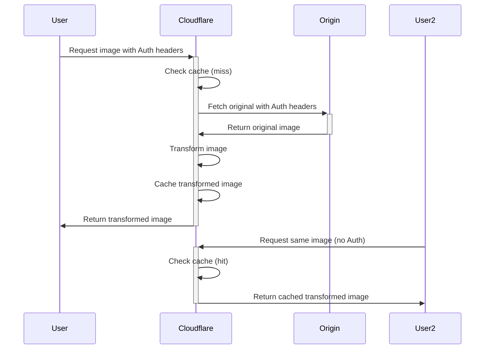

# Authentication Guide

This guide explains how to configure and use the authentication features of Image Resizer to access protected image origins.

## Authentication Overview

Image Resizer supports accessing images from origins that require authentication. This is useful for:

- Private S3 buckets or other authenticated storage
- Images behind API gateways requiring API keys
- Content protected by authentication systems
- CDNs with token-based security

The system supports two primary authentication methods:

1. **Cloudflare's Origin-Auth** (recommended)
2. **Custom Authentication** (alternative implementation)

## Cloudflare Origin-Auth

This is the recommended approach for accessing authenticated origins, providing better performance and compatibility with Cloudflare's infrastructure.

### How Origin-Auth Works

When using Cloudflare's `origin-auth` feature:

1. Cloudflare passes specific authentication headers from the original request to your origin when fetching the original image
2. It then caches the transformed image in Cloudflare's public cache (with the `share-publicly` option)
3. Subsequent requests receive the cached image without requiring re-authentication



### Supported Headers

With `origin-auth`, Cloudflare automatically passes these headers to your origin:

- `Authorization` - For bearer tokens and Basic Auth
- `Cookie` - For cookie-based authentication
- AWS S3: `x-amz-content-sha256`, `x-amz-date`
- Azure Storage: `x-ms-date`, `x-ms-version`
- SecureAuth: `x-sa-date`
- Cloudflare Access: `cf-access-client-id`, `cf-access-client-secret`

### Configuration

To enable Origin-Auth:

```javascript
// wrangler.jsonc
{
  "vars": {
    "AUTH_ENABLED": "true",
    "AUTH_USE_ORIGIN_AUTH": "true",
    "AUTH_SHARE_PUBLICLY": "true"
  }
}
```

With this configuration, authentication headers from the original request will be passed through to your origin.

## Custom Authentication

Image Resizer also provides its own authentication implementation that supports:

1. **Bearer Token Authentication** - For JWT or similar token-based systems
2. **Basic Authentication** - For username/password credentials
3. **Custom Header Authentication** - For API keys or custom headers
4. **Query Parameter Authentication** - For signed URLs or token parameters

### Security Considerations

Our custom authentication implementation offers two security levels:

- **Strict Mode** (`AUTH_SECURITY_LEVEL="strict"`) - Fails if authentication cannot be properly applied
- **Permissive Mode** (`AUTH_SECURITY_LEVEL="permissive"`) - Falls back to unauthenticated requests if auth fails

### Configuration Steps

1. **Enable Authentication**

   In your `wrangler.jsonc`:

   ```javascript
   {
     "vars": {
       "AUTH_ENABLED": "true",
       "AUTH_USE_ORIGIN_AUTH": "false",  // Use custom auth instead of origin-auth
       "AUTH_SECURITY_LEVEL": "strict",
       "AUTH_CACHE_TTL": "3600"
     }
   }
   ```

2. **Define Authentication Domains**

   Configure the domains that require authentication:

   ```javascript
   {
     "vars": {
       // ... other settings ...
       
       /* Auth domain settings */
       "AUTH_DOMAIN_SECURE": "secure.example.com",
       "AUTH_DOMAIN_BASIC": "basic-auth.example.com", 
       "AUTH_DOMAIN_API": "api.example.com",
       "AUTH_DOMAIN_SIGNED": "signed.example.com"
     }
   }
   ```

3. **Configure Authentication Types**

   Specify the authentication method for each domain:

   ```javascript
   {
     "vars": {
       // ... other settings ...
       
       /* Auth type settings */
       "AUTH_TYPE_SECURE": "bearer",   // Bearer token auth
       "AUTH_TYPE_BASIC": "basic",     // Basic auth
       "AUTH_TYPE_API": "header",      // Header-based auth
       "AUTH_TYPE_SIGNED": "query"     // Query parameter auth
     }
   }
   ```

4. **Set Authentication Parameters**

   Configure non-sensitive authentication parameters:

   ```javascript
   {
     "vars": {
       // ... other settings ...
       
       /* Auth parameter settings */
       "AUTH_TOKEN_HEADER_NAME": "Authorization",  // Header for bearer tokens
       "AUTH_TOKEN_PARAM_NAME": "token",           // Parameter for signed URLs
       "AUTH_TOKEN_EXPIRATION": "3600",            // Token lifetime in seconds
       "AUTH_SIGNED_EXPIRATION": "86400"           // Signed URL lifetime
     }
   }
   ```

5. **Store Secrets Securely**

   Use Wrangler secrets for sensitive credentials:

   ```bash
   # For bearer token authentication
   wrangler secret put AUTH_TOKEN_SECRET_SECURE
   
   # For basic authentication
   wrangler secret put AUTH_BASIC_USERNAME_BASIC
   wrangler secret put AUTH_BASIC_PASSWORD_BASIC
   
   # For header-based authentication
   wrangler secret put AUTH_API_KEY_API
   
   # For signed URL authentication
   wrangler secret put AUTH_SIGNING_SECRET_SIGNED
   ```

   Note the naming convention: `AUTH_[TYPE]_[PARAMETER]_[ORIGIN_ID]`

6. **Local Development**

   For local development, create a `.dev.vars` file:

   ```
   AUTH_TOKEN_SECRET_SECURE=your-dev-token-secret-here
   AUTH_BASIC_USERNAME_BASIC=your-dev-username-here
   AUTH_BASIC_PASSWORD_BASIC=your-dev-password-here
   AUTH_API_KEY_API=your-dev-api-key-here
   AUTH_SIGNING_SECRET_SIGNED=your-dev-signing-secret-here
   ```

## Authentication Types Reference

### Bearer Token Authentication

Sends an `Authorization: Bearer <token>` header with each request.

```javascript
{
  "AUTH_TYPE_SECURE": "bearer",
  "AUTH_TOKEN_HEADER_NAME": "Authorization",
  "AUTH_TOKEN_EXPIRATION": "3600"
}
```

Secret: `AUTH_TOKEN_SECRET_SECURE`

### Basic Authentication

Sends an `Authorization: Basic <credentials>` header with each request.

```javascript
{
  "AUTH_TYPE_BASIC": "basic"
}
```

Secrets:
- `AUTH_BASIC_USERNAME_BASIC`
- `AUTH_BASIC_PASSWORD_BASIC`

### Header Authentication

Sends custom headers with each request.

```javascript
{
  "AUTH_TYPE_API": "header"
}
```

Secret: `AUTH_API_KEY_API`

### Query Parameter Authentication

Generates signed URLs with authentication query parameters.

```javascript
{
  "AUTH_TYPE_SIGNED": "query",
  "AUTH_TOKEN_PARAM_NAME": "token",
  "AUTH_SIGNED_EXPIRATION": "86400"
}
```

Secret: `AUTH_SIGNING_SECRET_SIGNED`

## Security Considerations

1. **Cache Visibility**: When using `sharePublicly: true`, transformed images will be publicly cached. Do not use this for sensitive images that should only be accessible to specific users.

2. **Public Access**: Only use authenticated origins for images that can be publicly shared once transformed. The authentication is only used to fetch the original image from the origin.

3. **Secret Management**: Always use Wrangler secrets for storing sensitive credentials. Never store them in your code or configuration files.

4. **URL Signing Expiry**: For signed URLs, set a reasonable expiry time that balances security with usability.

## Troubleshooting

### Common Issues

1. **Authentication Failures**

   If images cannot be accessed from authenticated origins:

   - Check if the secret is correctly set in Wrangler secrets
   - Verify the origin ID in your configuration matches the secret name
   - Check if the domain pattern matches the requested image URL
   - Try setting `AUTH_SECURITY_LEVEL` to "permissive" for testing

2. **Origin-Auth Not Working**

   If Cloudflare's origin-auth is not passing through headers:

   - Verify `AUTH_USE_ORIGIN_AUTH` is set to "true"
   - Check if the header is one of the supported headers listed above
   - Review Cloudflare logs for any issues

3. **Debug Headers**

   Enable debug headers to see authentication information:

   ```javascript
   {
     "vars": {
       "DEBUG": "true",
       "DEBUG_HEADERS": "auth,request"
     }
   }
   ```

   Then check response headers for authentication debugging information.