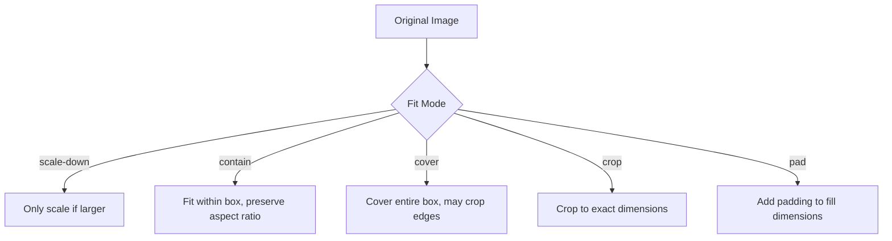

# Image Transformation Guide

This guide provides a comprehensive overview of all supported image transformation options in Image Resizer 2.

## Transformation Basics

Image Resizer 2 leverages Cloudflare's Image Resizing service to transform images on the fly. It supports a wide range of transformations including:

- Resizing and cropping
- Format conversion
- Quality adjustments
- Visual effects
- Metadata handling

All transformations are applied via URL parameters, path parameters, or predefined transformation templates (derivatives).

## Transformation Parameters

### Basic Dimensions

| Parameter | Description | Example | Default |
|-----------|-------------|---------|---------|
| `width` | Maximum width in pixels | `width=800` | Original width |
| `height` | Maximum height in pixels | `height=600` | Original height |
| `dpr` | Device Pixel Ratio (for retina displays) | `dpr=2` | 1 |

### Fit Modes

The `fit` parameter determines how the image is resized to fit the requested dimensions:

| Value | Description | Example |
|-------|-------------|---------|
| `scale-down` | Resize only if image is larger than given dimensions | `fit=scale-down` |
| `contain` | Resize to fit entirely within dimensions (may leave letterboxing) | `fit=contain` |
| `cover` | Resize to cover entire dimensions (may crop) | `fit=cover` |
| `crop` | Crop to fit exact dimensions | `fit=crop` |
| `pad` | Resize to fit within dimensions and add padding | `fit=pad` |



### Format Conversion

| Parameter | Description | Example | Default |
|-----------|-------------|---------|---------|
| `format` | Output image format | `format=webp` | Original format |

Supported values:
- `auto` - Automatically select best format based on browser support
- `webp` - Google WebP format
- `avif` - AVIF format (high compression)
- `jpeg` - JPEG format
- `png` - PNG format
- `gif` - GIF format (static only unless `anim=true`)

### Quality Settings

| Parameter | Description | Example | Default |
|-----------|-------------|---------|---------|
| `quality` | Image quality (1-100) | `quality=80` | 85 |

You can also use named quality levels:
- `quality=high` (90)
- `quality=medium` (75)
- `quality=low` (50)

### Image Adjustments

| Parameter | Description | Example | Default |
|-----------|-------------|---------|---------|
| `brightness` | Adjust brightness (0.0-2.0) | `brightness=1.2` | 1.0 |
| `contrast` | Adjust contrast (0.0-2.0) | `contrast=1.2` | 1.0 |
| `gamma` | Adjust gamma (0.0-2.0) | `gamma=1.2` | 1.0 |
| `saturation` | Adjust saturation (0.0-2.0, 0=grayscale) | `saturation=0` | 1.0 |
| `sharpen` | Apply sharpening (0.0-10.0) | `sharpen=1.5` | 0 |

### Cropping and Positioning

| Parameter | Description | Example | Default |
|-----------|-------------|---------|---------|
| `gravity` | Focal point for cropping | `gravity=auto` | center |
| `trim` | Crop off pixels from sides | `trim=20;30;20;0` | none |
| `crop` | Crop to region | `crop=200,300,400,500` | none |

Gravity options:
- `auto` - Smart detection of focal point
- `center`, `top`, `bottom`, `left`, `right` - Fixed positions
- `0.5x0.5` - Coordinates from 0.0 to 1.0 (x,y)

### Rotation and Flipping

| Parameter | Description | Example | Default |
|-----------|-------------|---------|---------|
| `rotate` | Rotate the image (90, 180, or 270 degrees) | `rotate=90` | 0 |
| `flip` | Flip the image | `flip=h` | none |

Flip options:
- `h` - Horizontal flip
- `v` - Vertical flip
- `hv` - Both horizontal and vertical flip

### Background Options

| Parameter | Description | Example | Default |
|-----------|-------------|---------|---------|
| `background` | Background color for transparent areas | `background=white` | transparent |

The background parameter accepts any CSS color format:
- Named colors: `red`, `blue`, `transparent`
- Hex: `%23FF0000` (encoded `#FF0000`)
- RGB: `rgb%28255%2C0%2C0%29` (encoded `rgb(255,0,0)`)

### Metadata Handling

| Parameter | Description | Example | Default |
|-----------|-------------|---------|---------|
| `metadata` | Control EXIF metadata retention | `metadata=copyright` | `copyright` |

Options:
- `none` - Remove all metadata
- `copyright` - Keep only copyright info
- `keep` - Preserve all metadata

### Animation Control

| Parameter | Description | Example | Default |
|-----------|-------------|---------|---------|
| `anim` | Control animation in GIFs and WebP | `anim=false` | true |

## URL Formats

Image Resizer 2 supports multiple ways to specify transformation parameters:

### Query Parameters

The most straightforward way to specify transformations:

```
https://example.com/images/photo.jpg?width=800&height=600&quality=80
```

### Path Parameters

Parameters can be specified in the path using the underscore prefix format:

```
https://example.com/images/_width=800/_height=600/_quality=80/photo.jpg
```

### Derivatives (Transformation Templates)

Predefined sets of transformations can be applied using derivatives:

```
https://example.com/images/thumbnail/photo.jpg
```

Which might apply the following transformations:
```javascript
{
  width: 320,
  height: 150,
  quality: 85,
  fit: 'scale-down',
  metadata: 'none',
  sharpen: 1
}
```

## Built-in Derivatives

Image Resizer 2 comes with several built-in derivatives for common use cases:

| Derivative | Description | Parameters |
|------------|-------------|------------|
| `thumbnail` | Small preview | width=320, height=150, fit=scale-down |
| `avatar` | Profile picture | width=180, height=180, fit=cover, gravity=face |
| `banner` | Wide header image | width=1600, height=400, fit=cover |
| `product` | Product image | width=800, height=800, fit=contain, background=white |
| `header` | Header image | width=1600, height=73, fit=scale-down |

## Auto-optimization Features

When no parameters are specified, Image Resizer 2 applies intelligent auto-optimization:

### Responsive Width

When `width=auto` is used (or implied by not specifying a width):

1. If client hints are available, it uses the viewport width
2. Otherwise, it uses device type detection to infer a reasonable width:
   - Mobile: 480px
   - Tablet: 768px
   - Desktop: 1440px

### Automatic Format Selection

When `format=auto` is used (or implied):

1. If the browser supports AVIF, it uses AVIF
2. If the browser supports WebP, it uses WebP
3. Otherwise, it uses JPEG or the original format

### Quality Selection

When `quality=auto` is used (or implied):

1. It selects format-specific quality settings:
   - WebP: 85
   - AVIF: 80
   - JPEG: 85
   - PNG: 90
2. It adjusts quality based on network conditions:
   - Low bandwidth: Reduced quality
   - Save-Data header: Reduced quality

## Client Hints

Image Resizer 2 uses the following client hints to optimize images:

- `Viewport-Width` or `Sec-CH-Viewport-Width`
- `DPR` or `Sec-CH-DPR`
- `Save-Data`
- `ECT` (Effective Connection Type)
- `Downlink` (Connection speed)

## Transformation Examples

### Basic Resizing

```
https://example.com/images/photo.jpg?width=800&height=600&fit=contain
```

### Cropping to Square

```
https://example.com/images/photo.jpg?width=500&height=500&fit=cover&gravity=auto
```

### Converting to WebP with Quality Adjustment

```
https://example.com/images/photo.jpg?format=webp&quality=80
```

### Creating a Grayscale Image

```
https://example.com/images/photo.jpg?saturation=0&contrast=1.1
```

### Full Example with Multiple Parameters

```
https://example.com/images/photo.jpg?width=800&height=600&fit=cover&gravity=auto&format=webp&quality=85&sharpen=1&metadata=none
```

## Performance Tips

1. **Specify Dimensions**: Always specify width and height to avoid unnecessary resizing
2. **Use Modern Formats**: Use `format=auto` to leverage WebP and AVIF when supported
3. **Appropriate Quality**: Don't use quality=100 unless necessary; 80-85 is usually sufficient
4. **Derivatives for Common Cases**: Create derivatives for recurring transformation needs
5. **Cache Control**: Use appropriate Cache-Control headers to optimize caching