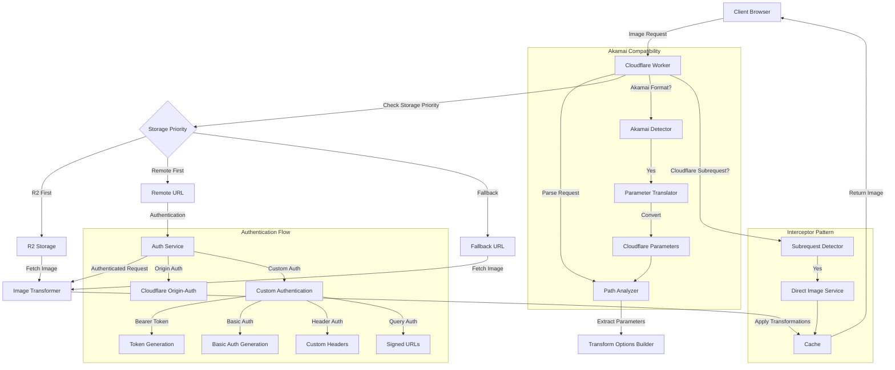
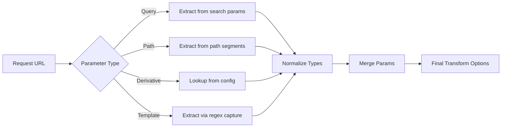
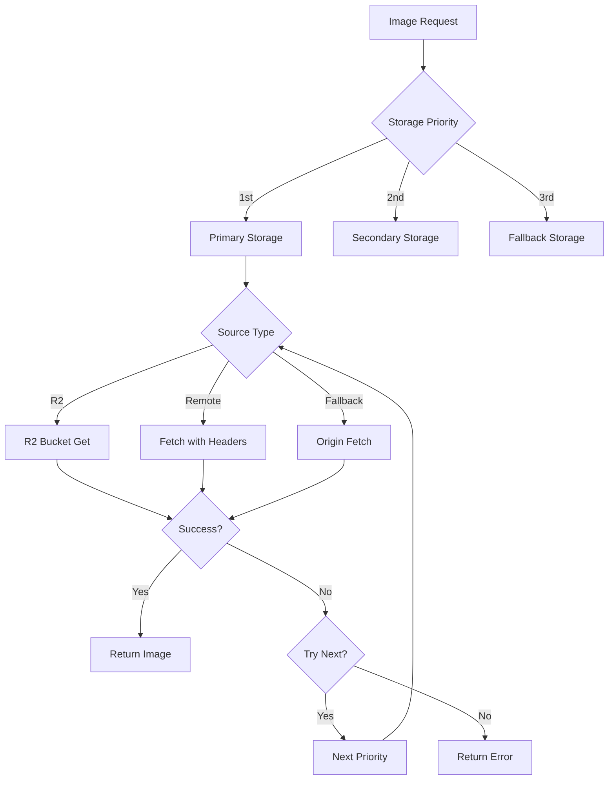
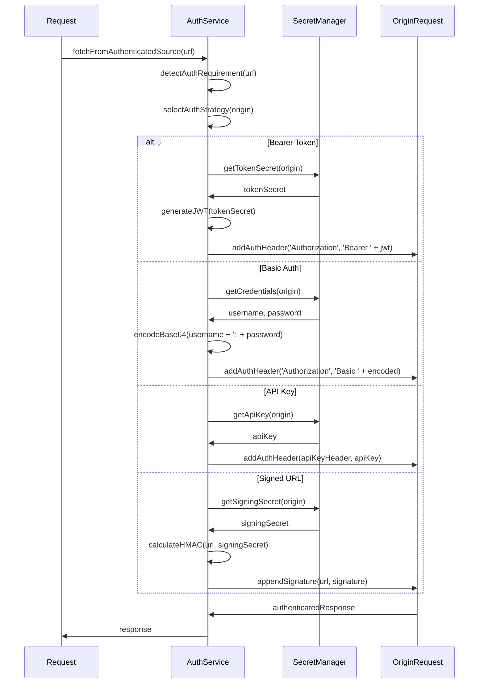
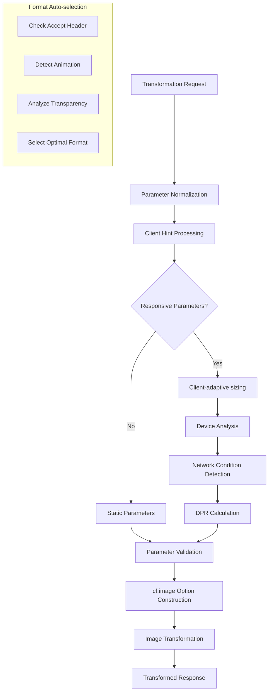
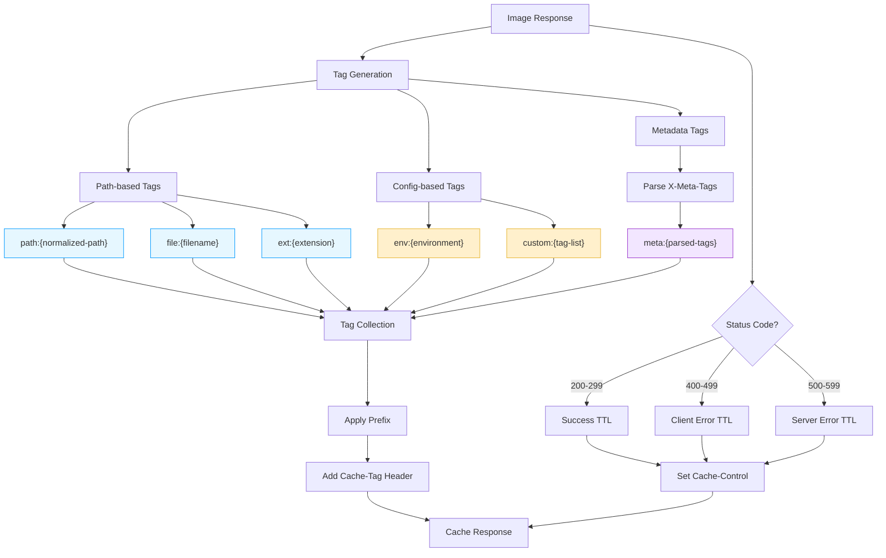
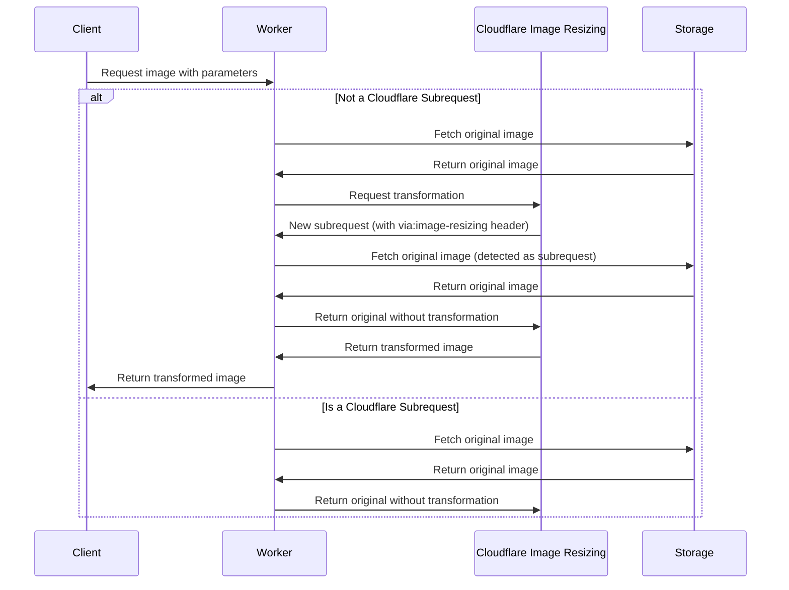
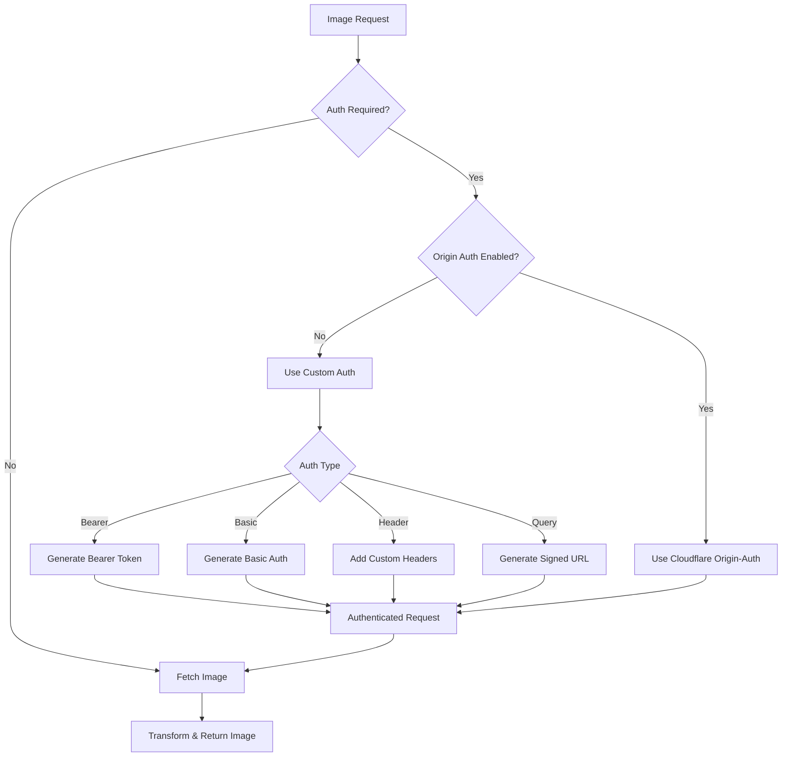

# Image Resizer 2 Architecture

This document details the technical architecture of the Image Resizer service, outlining implementation specifics for developers working with the codebase.

For more information on related topics, see:
- [Setup Guide](setup.md)
- [Configuration Reference](configuration-reference.md)
- [Transformation Guide](transformation.md)
- [Client Detection Framework](../client-detection/index.md)
- [Caching System](../caching/index.md)

## Architecture Overview

Built on Cloudflare Workers, the Image Resizer integrates with Cloudflare's Image Resizing API to perform on-demand image transformations. The architecture prioritizes performance, scalability, and edge processing capabilities.

## Core Components

### 1. Request Handler (`index.ts`)

Central request handler implementing the FetchEvent lifecycle:
- Initializes configuration with environment-specific settings
- Establishes logger instances with configurable verbosity
- Routes request flow between component modules
- Implements comprehensive error handling and status code mapping
- Captures performance metrics for monitoring
- Detects Akamai parameter formats and invokes translation
- Parses path/query parameters for transform instructions

Technical implementation:
- Breadcrumb tracing via correlation IDs for request flow monitoring
- Custom error classes with appropriate HTTP status mapping
- Dynamic storage selection based on configured priority chain
- Dual parameter parsing for standard and Akamai formats

### 2. Configuration Manager (`config.ts`)

Hierarchical configuration system that integrates settings from:
- Environment variables (highest precedence)
- Environment-specific config (development/staging/production)
- Base default configuration (lowest precedence)

Technical implementation:
- Deep recursive merging with type preservation
- TypeScript interfaces for type-safe configuration access
- Runtime environment detection for automatic switching
- Strongly-typed getter methods with default fallbacks
- JSON schema validation for configuration integrity
- Environment variable type coercion (string→number, string→boolean)

### 3. Path Analysis (`utils/path.ts`)

URL parameter extraction engine supporting multiple syntaxes:
- Standard query parameters (`?width=800&height=600`)
- Path segment parameters (`/_width=800/_height=600/image.jpg`)
- Named derivatives (`/thumbnail/image.jpg`)
- Template-based transformations

Implementation details:
- Regular expression-based parameter extraction
- Multi-format parameter normalization
- Automatic type inference and conversion
- Derivative resolution via config lookup
- Path transformation mapping for storage backends

### 4. Storage Service (`storage.ts`)

Multi-source storage interface implementing prioritized access to:
- Cloudflare R2 object storage (direct bucket access)
- Remote HTTP endpoints (authenticated URLs)
- Fallback origins (alternate endpoints)
- Prioritized retrieval chain with failover support

Technical capabilities:
- HTTP/2 content negotiation with Accept headers
- Byte range request forwarding with Range headers
- Conditional fetch support (ETag/If-Modified-Since)
- Integrated authentication for protected sources
- Progressive fallback with structured error recovery
- Binary metadata extraction and propagation
- Request timing instrumentation
- Storage-specific path transformation

### 5. Authentication Service (`utils/auth.ts`)

Security layer for accessing protected image origins:
- Native integration with Cloudflare origin-auth
- Pluggable authentication strategies:
  - JWT/Bearer token implementation
  - Basic auth with base64 encoding
  - Custom header injection (API keys)
  - Query parameter signing (HMAC)
- Secrets loaded from Wrangler configuration

For detailed authentication setup, see [Authentication Documentation](../storage/authentication.md).

Technical implementation:

### 6. Image Transformation (`transform.ts`)

Core transformation engine that:
- Normalizes parameter input from multiple sources
- Builds Cloudflare-compatible transformation options
- Handles edge processing via the `cf.image` API
- Applies derivative template expansion
- Implements client-aware responsive sizing

For detailed transformation options, see [Transformation Guide](transformation.md).

Technical implementation details:

Advanced optimization techniques:
- MIME type-based format selection using Accept headers
- Responsive dimensions based on viewport and DPR
- Network-aware quality adjustment (Save-Data, RTT, Downlink)
- Device-specific transformation templates
- Automatic orientation correction (EXIF)

For more information about client detection and optimization, see:
- [Client Detection Framework](../client-detection/index.md)
- [Cascade System](../client-detection/cascade-system.md)
- [Browser Compatibility](../client-detection/browser-compatibility.md)

### 7. Caching Service (`cache.ts`)

Multi-layer caching implementation with:
- HTTP status-based TTL configuration
- Tag-based cache invalidation system
- Dual caching strategy (Cloudflare and Cache API)
- Fine-grained debug bypass controls

For detailed caching configuration, see [Cache Tags Documentation](../caching/cache-tags.md).

Cache tag implementation details:

Technical implementation:
- Automated cache tag generation based on URL structure
- Environment-specific tag prefixing for isolation
- HTTP header-based tag extraction from upstream responses
- Configurable TTL mapping by status code ranges
- Cache-Control header manipulation and validation

### 8. Debug Tools (`debug.ts`)

Provides debugging capabilities:
- Response headers for troubleshooting
- Performance metrics
- Configuration information
- HTML debug reports

Debug features:
- Configurable debug header visibility
- Environment-specific debug settings
- Detailed performance metrics
- Configuration visibility
- Request and response details

For more information, see:
- [Debug Headers Documentation](../debugging/debug-headers.md)
- [Diagnosing Timeouts](../debugging/diagnosing-timeouts.md)
- [Logging System](../debugging/logging.md)
- [Breadcrumb Tracing](../debugging/breadcrumbs.md)

### 9. Akamai Compatibility (`utils/akamai-compatibility.ts`)

Enables seamless migration from Akamai Image Manager:
- Detects Akamai-style URL parameters
- Translates parameters to Cloudflare Image Resizing format
- Supports advanced Akamai features
- Maintains backward compatibility

Supported Akamai parameters:
- `im.resize` for basic resizing
- `im.crop` for cropping
- `im.quality` for quality adjustment
- Advanced features like blur, mirror/flip, composite, and conditional transforms
- Translation of Akamai-specific parameters to Cloudflare equivalents

For more information, see:
- [Akamai Basic Features](../integrations/akamai/basic-features.md)
- [Akamai Advanced Features](../integrations/akamai/advanced-features.md)
- [Akamai Implementation](../integrations/akamai/implementation.md)
- [Akamai Demos](../integrations/akamai/demos.md)

### 10. Logging System (`utils/logging.ts`)

Provides comprehensive logging capabilities:
- Multiple log levels (DEBUG, INFO, WARN, ERROR)
- Structured logging in JSON format
- Request breadcrumb tracking
- Performance metrics
- Configurable log formats and destinations

Breadcrumb implementation:
- Tracks key events throughout the request lifecycle
- Records timing information for performance analysis
- Maintains context between components
- Enables detailed debugging of request flow

For more information, see:
- [Logging System Documentation](../debugging/logging.md)
- [Breadcrumb Reference](../debugging/breadcrumbs.md)

## Data Flow

1. **Request Ingestion**
   - Client makes a request for an image with transformation parameters
   - Worker receives the request and initializes the configuration and loggers
   - For debug requests, the system generates an HTML report
   - For Akamai-compatible URLs, parameters are translated

2. **Parameter Extraction**
   - Path analyzer extracts transformation parameters from URL
   - Path templates and derivatives are resolved
   - Query parameters are merged with path parameters

3. **Storage Selection**
   - Based on configuration priorities, the system selects whether to fetch from R2, remote URL, or fallback
   - The chosen storage provider attempts to retrieve the image
   - If a storage provider fails, the system falls back to the next provider in the priority list

4. **Authentication**
   - If the source requires authentication, the auth service applies the appropriate authentication method
   - Secrets are retrieved from environment variables or Wrangler secrets
   - The system handles authentication failures according to the security level setting

5. **Image Retrieval**
   - The storage service fetches the original image from the selected source
   - Content type, size, and other metadata are extracted
   - For Cloudflare subrequests, the original image is returned directly

6. **Transformation**
   - The transform service builds transformation options from parameters and client hints
   - Cloudflare's Image Resizing service applies the transformations
   - Format conversion, resizing, and quality adjustments are applied

7. **Caching & Response**
   - The transformed image is cached according to the caching policy
   - Cache tags are added for purging
   - Debug headers are added if enabled
   - The response is sent back to the client

## Interceptor Pattern

The interceptor pattern handles Cloudflare's two-stage image processing. For a detailed explanation, see [Interceptor Pattern Documentation](../integrations/cloudflare/interceptor-pattern.md).

1. Initial request: User requests an image with transformation parameters
2. Cloudflare subrequest: Cloudflare's Image Resizing service makes a separate request for the original
3. Subrequest detection: Worker detects the "via: image-resizing" header on subrequests
4. Direct service: For subrequests, the original image is served directly without transformations
5. Transformed result: User receives the final transformed image

This pattern prevents infinite loops and optimizes performance for large images.

## Authentication Flow

### Secret Management

Sensitive authentication credentials are stored as Wrangler secrets using the following pattern:

- `AUTH_TOKEN_SECRET_[ORIGIN_ID]`: Bearer token secrets
- `AUTH_BASIC_USERNAME_[ORIGIN_ID]`: Basic auth usernames
- `AUTH_BASIC_PASSWORD_[ORIGIN_ID]`: Basic auth passwords
- `AUTH_API_KEY_[ORIGIN_ID]`: API keys for header auth
- `AUTH_SIGNING_SECRET_[ORIGIN_ID]`: Signing secrets for query params

For each image request requiring authentication:

1. The system identifies which origin the image belongs to
2. It retrieves the appropriate secret from the environment
3. Authentication is applied according to the configured method
4. The authenticated request is used to fetch the image

## Configuration Management

Configuration follows a layered approach:

1. **Base defaults**: Defined in `defaultConfig` in `config.ts`
2. **Environment overrides**: Development, staging, production-specific settings
3. **Environment variables**: Values from Cloudflare environment
4. **Wrangler secrets**: For sensitive authentication credentials

This provides a flexible system where configurations can be defined at different levels according to their sensitivity and specificity.

## Error Handling

The system implements a comprehensive error handling strategy:

- Custom error types for different error scenarios
- Appropriate HTTP status codes for different error conditions
- Informative error messages for debugging
- Fallback mechanisms for handling storage failures
- Security-conscious error reporting

Error types include:

- **ValidationError**: For invalid parameters or paths
- **NotFoundError**: For missing images
- **StorageError**: For storage access issues
- **TransformError**: For image transformation problems
- **AuthError**: For authentication failures
- **UnexpectedError**: For unknown error conditions

## Performance Considerations

The system is designed for optimal performance:

- **Caching Strategy**: Efficient caching with appropriate TTLs
- **Parallel Processing**: Where possible, operations are performed in parallel
- **Early Returns**: System returns as soon as possible for special cases
- **Cloudflare Integration**: Tight integration with Cloudflare services
- **Resource Optimization**: Minimal memory and CPU usage
- **Timeout Prevention**: Interceptor pattern prevents 524 timeout errors
- **Responsive Sizing**: Optimal image sizes based on client capabilities
- **Format Optimization**: Best format selection for browser support and performance

## Security Features

Security is a primary concern in the design:

- **Authenticated Origins**: Secure access to protected image sources
- **Secret Management**: Secure handling of authentication credentials
- **Configurable Security Level**: Strict or permissive authentication enforcement
- **Input Validation**: Thorough validation of all user inputs
- **Error Information**: Careful control of error information exposure
- **Cache Security**: Configurable public caching of authenticated content
- **Cloudflare Origin-Auth**: Support for Cloudflare's secure origin authentication