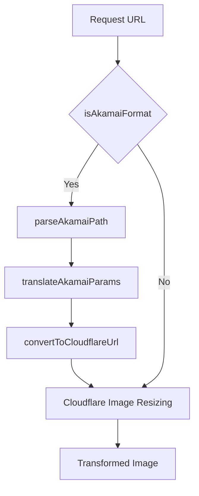

# Akamai Image Manager Compatibility Implementation

This document provides detailed information about the implementation of Akamai Image Manager compatibility in the Image Resizer 2 project. It explains the technical architecture, code organization, and integration points.

## Quick Navigation

- [Back to Documentation Home](../../index.md)
- [Akamai Integration](index.md)
- [Basic Features](basic-features.md)
- [Advanced Features](advanced-features.md)
- [Demos](demos.md)
- [Core Architecture](../../core/architecture.md)

## Implementation Overview

The Akamai compatibility module enables seamless migration from Akamai Image Manager to Cloudflare Image Resizing by:

1. Detecting Akamai-style URL parameters 
2. Translating them to equivalent Cloudflare parameters
3. Supporting various Akamai URL formats (query parameters and path-based formats)
4. Implementing advanced features like Aspect Crop

## Architecture

The implementation consists of several key components:



### Key Functions

1. **isAkamaiFormat**: Detects if a URL uses Akamai Image Manager parameters (either `im.X` or `im=X` formats)
2. **parseAkamaiPath**: Extracts parameters from path-based Akamai URLs
3. **translateAkamaiParams**: Converts Akamai parameters to Cloudflare equivalents
4. **convertToCloudflareUrl**: Produces a URL with Cloudflare parameters

## Supported Parameter Formats

The module now supports two distinct parameter formats used by Akamai Image Manager:

### 1. Dot Notation Format (`im.X`)

The traditional format used in many Akamai implementations:

```
https://example.com/image.jpg?im.resize=width:200,height:300&im.quality=80
```

### 2. Equals Notation Format (`im=X`)

The newer format that matches Akamai's official documentation:

```
https://example.com/image.jpg?im=AspectCrop=(1,1),xPosition=.5,yPosition=.5
```

## Feature Implementation

### Basic Parameter Translation

The `translateAkamaiParams` function maps Akamai parameters to their Cloudflare equivalents:

```typescript
export function translateAkamaiParams(url: URL): TransformOptions {
  const cfParams: TransformOptions = {};
  
  // Check for the newer im= parameter format first
  const imParameter = url.searchParams.get('im');
  if (imParameter) {
    logger.debug('Processing Akamai im= parameter format', { imParameter });
    const parsedParams = parseImParameter(imParameter);
    
    // Merge the parsed parameters into our Cloudflare parameters
    Object.assign(cfParams, parsedParams);
  }
  
  // Parse Akamai im.resize parameter (for backward compatibility)
  const imResize = url.searchParams.get('im.resize');
  if (imResize) {
    const resizeParams = parseImResize(imResize);
    
    // Map width and height directly
    if (resizeParams.width) cfParams.width = parseInt(resizeParams.width.toString());
    if (resizeParams.height) cfParams.height = parseInt(resizeParams.height.toString());
    
    // Map resize mode to fit parameter
    if (resizeParams.mode) {
      switch(resizeParams.mode) {
        case 'fit': cfParams.fit = 'contain'; break;
        case 'stretch': cfParams.fit = 'scale-down'; break;
        case 'fill': cfParams.fit = 'cover'; break;
        case 'crop': cfParams.fit = 'crop'; break;
        case 'pad': cfParams.fit = 'pad'; break;
      }
    }
  }
  
  // Additional parameter translations...
  
  return cfParams;
}
```

### New `im=` Parameter Format Parser

The `parseImParameter` function detects and handles the `im=` format:

```typescript
function parseImParameter(imParameter: string): TransformOptions {
  const cfParams: TransformOptions = {};
  
  if (!imParameter) {
    return cfParams;
  }
  
  try {
    // First identify the transformation type
    let transformationType = '';
    let transformationParams = '';
    
    // Check if the parameter has a transformation type prefix
    const eqIndex = imParameter.indexOf('=');
    const openParenIndex = imParameter.indexOf('(');
    const commaIndex = imParameter.indexOf(',');
    
    if (openParenIndex > 0 && (eqIndex < 0 || openParenIndex < eqIndex)) {
      // Format: AspectCrop(1,1)... or similar
      transformationType = imParameter.substring(0, openParenIndex).trim();
      transformationParams = imParameter.substring(openParenIndex);
    } else if (commaIndex > 0 && (eqIndex < 0 || commaIndex < eqIndex)) {
      // Format: Resize,width=250,height=125... or similar
      transformationType = imParameter.substring(0, commaIndex).trim();
      transformationParams = imParameter.substring(commaIndex + 1);
    } else if (eqIndex > 0) {
      // Format: transform=AspectCrop... or similar
      transformationType = imParameter.substring(0, eqIndex).trim();
      transformationParams = imParameter.substring(eqIndex + 1);
    } else {
      // No recognizable format, use the whole string
      transformationType = imParameter.trim();
      transformationParams = '';
    }
    
    // Handle specific transformation types
    switch (transformationType.toLowerCase()) {
    case 'aspectcrop':
      return parseAspectCropParameter(transformationParams);
    case 'resize':
      return parseResizeParameter(transformationParams);
    case 'crop':
      return parseCropParameter(transformationParams);
    // Additional transformations...
    }
  } catch (error) {
    logger.error('Failed to parse im= parameter', { error });
  }
  
  return cfParams;
}
```

### AspectCrop Parameter Implementation

The AspectCrop feature is now supported in both formats:

#### `im.aspectCrop` Format

```typescript
// Handle aspectCrop from Akamai
const imAspectCrop = url.searchParams.get('im.aspectCrop');
if (imAspectCrop) {
  try {
    // Parse aspect crop parameters
    const aspectCropParams: Record<string, string | number | boolean> = {};
    
    // Handle both comma and semicolon separators
    const separator = imAspectCrop.includes(',') ? ',' : ';';
    
    imAspectCrop.split(separator).forEach(pair => {
      // Handle both colon and equals separators
      const keyValSeparator = pair.includes(':') ? ':' : '=';
      const [key, value] = pair.split(keyValSeparator).map(s => s.trim());
      
      // Parse parameters...
    });
    
    // Calculate aspect ratio
    const aspectWidth = typeof aspectCropParams.width === 'number' ? aspectCropParams.width : 1;
    const aspectHeight = typeof aspectCropParams.height === 'number' ? aspectCropParams.height : 1;
    
    // Set the target aspect ratio
    const targetAspect = aspectWidth / aspectHeight;
    
    // Set dimensions based on aspect ratio...
  } catch (error) {
    logger.error('Failed to parse im.aspectCrop parameter', { error });
  }
}
```

#### `im=AspectCrop` Format

```typescript
function parseAspectCropParameter(params: string): TransformOptions {
  const cfParams: TransformOptions = {};
  
  try {
    // Extract the aspect ratio from parentheses: AspectCrop=(width,height)
    let aspectWidth = 1;
    let aspectHeight = 1;
    
    const aspectMatch = params.match(/\(([0-9.]+),([0-9.]+)\)/);
    if (aspectMatch && aspectMatch.length >= 3) {
      aspectWidth = parseFloat(aspectMatch[1]);
      aspectHeight = parseFloat(aspectMatch[2]);
    }
    
    // Extract position parameters
    let xPosition = 0.5; // Default center
    let yPosition = 0.5; // Default center
    
    // Look for xPosition parameter
    const xPosMatch = params.match(/xPosition=([0-9.]+)/i);
    if (xPosMatch && xPosMatch.length >= 2) {
      xPosition = parseFloat(xPosMatch[1]);
    }
    
    // Look for yPosition parameter
    const yPosMatch = params.match(/yPosition=([0-9.]+)/i);
    if (yPosMatch && yPosMatch.length >= 2) {
      yPosition = parseFloat(yPosMatch[1]);
    }
    
    // Set the target aspect ratio for width and height
    const targetAspect = aspectWidth / aspectHeight;
    
    // For AspectCrop, we set default dimensions to maintain the aspect ratio
    cfParams.width = 800;
    cfParams.height = Math.round(800 / targetAspect);
    
    // Set fit=crop for AspectCrop
    cfParams.fit = 'crop';
    
    // Set gravity based on the positions
    cfParams.gravity = { x: xPosition, y: yPosition };
  } catch (error) {
    logger.error('Failed to parse AspectCrop parameters', { error });
  }
  
  return cfParams;
}
```

### URL Path Parameter Handling

The module supports Akamai's path-based parameter formats:

```typescript
export function parseAkamaiPath(path: string): { cleanPath: string; parameters: Record<string, string> } {
  // Create result object
  const parameters: Record<string, string> = {};
  
  // Clone the pathname to work with
  let cleanPath = path;
  
  // Path with im-param=value format
  const imParamRegex = /\/im-([\w.]+)=([^/]+)/g;
  let match;
  
  // Find all im-param=value patterns
  while ((match = imParamRegex.exec(path)) !== null) {
    const [fullMatch, param, value] = match;
    parameters[param] = value;
    cleanPath = cleanPath.replace(fullMatch, '');
  }
  
  // Path with im(...) format
  const imGroupRegex = /\/im\(([^)]+)\)/g;
  while ((match = imGroupRegex.exec(path)) !== null) {
    const [fullMatch, paramsGroup] = match;
    
    // Split the parameter group by commas
    const params = paramsGroup.split(/,(?=(?:[^"]*"[^"]*")*[^"]*$)/);
    
    for (const param of params) {
      // Handle param=value format
      const [key, value] = param.split('=');
      if (key && value) {
        parameters[key.trim()] = value.trim().replace(/"/g, '');
      }
    }
    
    cleanPath = cleanPath.replace(fullMatch, '');
  }
  
  return { cleanPath, parameters };
}
```

## Transformation Types Support

The module now supports a comprehensive list of Akamai Image Manager transformations, including:

| Transformation Type | `im.X` Format | `im=X` Format | Example |
|---------------------|---------------|--------------|---------|
| Resize | ✅ | ✅ | `im.resize=width:200` or `im=Resize,width=200` |
| AspectCrop | ✅ | ✅ | `im.aspectCrop=width:1,height:1` or `im=AspectCrop=(1,1)` |
| Crop | ✅ | ✅ | `im.crop=50,50,200,200` or `im=Crop,width=200,height=200` |
| Rotate | ✅ | ✅ | `im.rotate=90` or `im=Rotate,degrees=90` |
| Blur | ✅ | ✅ | `im.blur=10` or `im=Blur=10` |
| Grayscale | ✅ | ✅ | `im.grayscale=true` or `im=Grayscale` |
| Mirror | ✅ | ✅ | `im.mirror=horizontal` or `im=Mirror,horizontal` |
| Composite | ✅ | ✅ | `im.composite=url:/watermark.png` or `im=Composite,image=(url=/watermark.png)` |
| BackgroundColor | ✅ | ✅ | `im.background=ff0000` or `im=BackgroundColor,color=ff0000` |
| Contrast | ✅ | ✅ | `im.contrast=1.5` or `im=Contrast,contrast=1.5` |
| Brightness | ✅ | ✅ | `im.brightness=1.2` or `im=Brightness,brightness=1.2` |
| UnsharpMask | ✅ | ✅ | `im.sharpen=2.0` or `im=UnsharpMask,gain=2.0` |
| Quality | ✅ | ✅ | `im.quality=80` or `im=Quality=80` |
| Format | ✅ | ✅ | `im.format=webp` or `im=Format=webp` |
| Border | ✅ | ✅ | `im.border=5,000000` or `im=Border,width=5,color=000000` |

## Integration with Main Handler

The Akamai compatibility module is integrated into the main request handler:

```typescript
// Check for Akamai compatibility mode
if (config.features?.enableAkamaiCompatibility) {
  // First check for Akamai parameters in the URL
  const isAkamai = isAkamaiFormat(url);
  
  // If Akamai format is detected, convert parameters to Cloudflare format
  if (isAkamai) {
    // Log the original URL for debugging
    if (config.debug.enabled) {
      console.log('Detected Akamai URL format:', url.toString());
    }
    
    // Convert the URL parameters
    const convertedUrl = convertToCloudflareUrl(url);
    
    // Create a new request with the converted URL
    url = new URL(convertedUrl.toString());
    
    // Log the converted URL for debugging
    if (config.debug.enabled) {
      console.log('Converted to Cloudflare format:', url.toString());
    }
  }
}
```

## Configuration

The Akamai compatibility feature can be enabled/disabled through configuration:

```typescript
// In wrangler.jsonc
"vars": {
  "ENABLE_AKAMAI_COMPATIBILITY": "true",
  "ENABLE_AKAMAI_ADVANCED_FEATURES": "true"
}

// In config.ts
features: {
  enableAkamaiCompatibility: true,
  enableAkamaiAdvancedFeatures: true
}
```

## URL Format Examples

The implementation supports a variety of Akamai parameter formats:

### Dot Notation Examples

```
// Basic resize with dot notation
https://example.com/image.jpg?im.resize=width:400,height:300,mode:fit

// Multiple parameters with dot notation
https://example.com/image.jpg?im.resize=width:400&im.quality=80&im.format=webp

// AspectCrop with dot notation
https://example.com/image.jpg?im.aspectCrop=width:16,height:9,hoffset:0.5,voffset:0.5
```

### Equals Notation Examples

```
// AspectCrop with equals notation
https://example.com/image.jpg?im=AspectCrop=(16,9),xPosition=0.5,yPosition=0.5

// Resize with equals notation
https://example.com/image.jpg?im=Resize,width=400,height=300

// Resize with shorthand notation
https://example.com/image.jpg?im=Resize=(400,300)

// Blur with equals notation
https://example.com/image.jpg?im=Blur=5

// Grayscale with equals notation (no value needed)
https://example.com/image.jpg?im=Grayscale
```

## Debugging

Debugging information is provided through:

1. **Console Logging**: Original and converted URLs are logged when in debug mode
2. **Response Headers**: `X-Debug-Akamai-Compatibility: used` header when the feature is active
3. **Debug Report**: Akamai compatibility status is included in the debug HTML report

## Testing

The implementation includes comprehensive tests:

1. **Unit Tests**: Test each component function individually
2. **Integration Tests**: Test end-to-end functionality with real URLs
3. **Edge Cases**: Test various parameter combinations and formats
4. **Format Compatibility**: Test both `im.X` and `im=X` parameter formats

## Best Practices

When extending or modifying the Akamai compatibility module:

1. **Always add tests**: Ensure all new features have proper test coverage
2. **Maintain backward compatibility**: Don't break existing parameter translations
3. **Follow the parameter mapping pattern**: Use the established pattern for new parameters
4. **Support both parameter formats**: Ensure both `im.X` and `im=X` formats are supported
5. **Use defensive coding**: Handle edge cases and invalid inputs gracefully
6. **Add logging for debugging**: Include appropriate logging for troubleshooting

## Troubleshooting

### Parameter Translation Issues

If Akamai parameters aren't being translated correctly:

1. Check that the Akamai parameter is correctly formatted
2. Enable debug mode to see the detected parameters
3. Look for malformed or unusual character sequences
4. Verify the parameter is supported by the translation module
5. Check if the correct parameter format (`im.X` or `im=X`) is being used

### Integration Problems

When the module is not working as expected:

1. Verify that `ENABLE_AKAMAI_COMPATIBILITY` is set to "true"
2. Check the request logs for URL detection and translation
3. Look for any errors in the parameter translation process
4. Test with simple parameters first before trying complex combinations
5. Verify URL encoding/decoding is not affecting parameter detection

## Notes for Developers

- The module prioritizes the `im=X` format over the `im.X` format when both are present in a URL.
- Each transformation type has its own parser function to handle the specific format and parameters.
- The module uses regular expressions to parse complex parameters with parentheses and comma-separated values.
- All transformation functions include comprehensive error handling to prevent failures.
- Breadcrumb logging is used throughout for troubleshooting complex transformations.

## Related Resources

- [Basic Features](basic-features.md) - Fundamental Akamai parameter mapping
- [Advanced Features](advanced-features.md) - Complex Akamai feature implementations
- [Demos](demos.md) - Live examples showing Akamai compatibility in action
- [Core Architecture](../../core/architecture.md#9-akamai-compatibility-utilsakamai-compatibilityts) - How Akamai compatibility fits into the overall architecture
- [Transformation Guide](../../core/transformation.md) - Native Cloudflare transformation options
- [Akamai Image Manager Documentation](https://techdocs.akamai.com/imaging/docs/image-manager) - Original Akamai documentation

## Conclusion

The Akamai compatibility module provides a robust solution for migrating from Akamai Image Manager to Cloudflare Image Resizing. It supports both parameter formats (`im.X` and `im=X`) and a comprehensive set of transformation types, enabling a seamless transition with no changes required to existing URLs.

This implementation significantly enhances compatibility with Akamai Image Manager, making migration projects simpler and more reliable by supporting the same parameter formats found in production Akamai implementations.

---

*Last Updated: March 26, 2025*