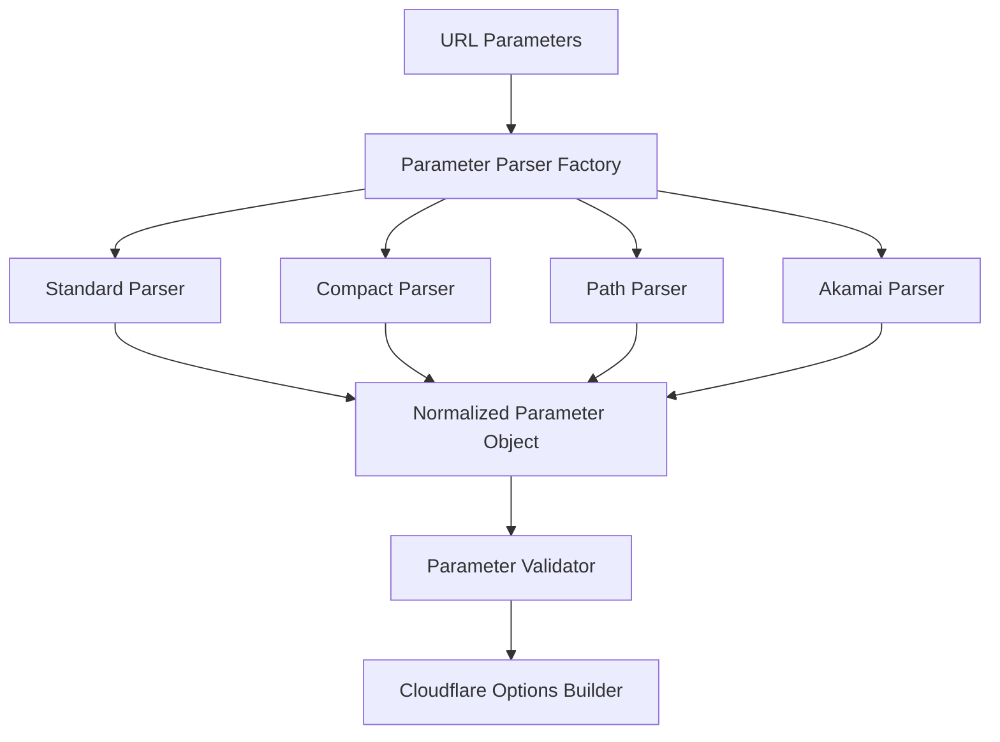

# Parameter Handling Modularization Plan

## Current State Analysis

The current parameter handling in Image Resizer 2 has grown organically to include multiple parameter formats:

1. Standard URL parameters (`width=800`)
2. Compact parameters (`r=16:9`, `p=0.5,0.6`, `f=m`)
3. Path parameters (`_width=800`)
4. Akamai dot notation (`im.resize=width:400`)
5. Akamai equals notation (`im=AspectCrop=(1,1)`)
6. Parameters nested inside `im=` value (`im=AspectCrop=(1,1),f=m,width=800`)

This has led to:
- Code duplication across `path.ts` and `akamai-compatibility.ts`
- Complex parameter extraction and normalization logic
- Multiple overlapping regex patterns
- Lack of clear separation between parameter formats
- Challenging testability due to intertwined responsibilities

## Comprehensive Parameter Reference

### Core Dimension Parameters

| Parameter | Compact Form | Description | Type | Example Values | Validation | Supports Auto |
|-----------|--------------|-------------|------|----------------|------------|--------------|
| `width` | `w` | Image output width in pixels | Number or String | `800`, `1200`, `auto` | > 0 | Yes |
| `height` | `h` | Image output height in pixels | Number or String | `600`, `900`, `auto` | > 0 | Yes |
| `aspect` | `r` | Desired aspect ratio | String | `16:9`, `4:3`, `1:1`, `16-9` | Format: `n:n` or `n-n` | No |
| `focal` | `p` | Focal point coordinates | String | `0.5,0.5`, `0.7,0.3` | Format: `x,y` where x,y ∈ [0,1] | No |

### Format and Quality Parameters

| Parameter | Compact Form | Description | Type | Example Values | Default |
|-----------|--------------|-------------|------|----------------|---------|
| `format` | - | Output image format | String | `webp`, `avif`, `jpeg`, `png`, `auto`, `json`, `baseline-jpeg` | `auto` |
| `quality` | - | Output image quality | Number or String | `85`, `auto`, `75`, `high`, `medium-high`, `medium-low`, `low` | `85` |
| `f` | - | Predefined format size | String | `m`, `l`, `xl`, See size map | - |
| `dpr` | - | Device pixel ratio | Number | `1`, `2`, `3` | `1` |
| `metadata` | - | Metadata handling | String | `none`, `copyright`, `keep` | `none` |
| `onerror` | - | Error handling behavior | String | `redirect` | - |

### Crop and Positioning Parameters

| Parameter | Compact Form | Description | Type | Example Values | Notes |
|-----------|--------------|-------------|------|----------------|-------|
| `fit` | - | Resizing mode | String | `cover`, `contain`, `crop`, `pad`, `scale-down` | - |
| `gravity` | - | Focus point placement | String or Object | `center`, `face`, `auto`, `left`, `right`, `top`, `bottom`, `{x: 0.7, y: 0.3}` | - |
| `allowExpansion` | - | Allow image enlargement | Boolean | `true`, `false` | Default: `false` |
| `trim` | - | Auto-crop transparent edges | Boolean or String or Object | `true`, `25;35;45;15`, `{top: 10, right: 20, bottom: 10, left: 20}` | - |
| `ctx` | `s` | Use context-aware processing | Boolean | `true`, `false` | Triggers metadata processing |

### Image Adjustments Parameters

| Parameter | Description | Type | Value Range | Notes |
|-----------|-------------|------|------------|-------|
| `brightness` | Adjust image brightness | Number | `0` to `10` | Default: `1` |
| `contrast` | Adjust image contrast | Number | `0` to `10` | Default: `1` |
| `saturation` | Adjust color saturation | Number | `0` to `10`, `0` for grayscale | Default: `1` |
| `blur` | Apply gaussian blur | Number | `1` to `250` | Blur radius |
| `sharpen` | Apply sharpening | Number or Boolean | `0` to `10`, `true` | Intensity |
| `gamma` | Adjust gamma | Number | `0.1` to `10` | Default: `1` |
| `background` | Background for transparent images | String | `#RRGGBB`, `transparent` | Used with `fit: pad` |
| `flip` | Flip image | String | `h`, `v`, `hv` | Horizontal/vertical |
| `flop` | Flip horizontally | Boolean | `true`, `false` | Alternative to flip=h |
| `rotate` | Rotate image | Number | `0`, `90`, `180`, `270` | Degrees clockwise |
| `strip` | Remove metadata | Boolean | `true`, `false` | Remove EXIF/metadata |
| `compression` | Compression method | String | `fast` | Only "fast" is supported |
| `origin-auth` | Authentication setting | String | `share-publicly` | For origin requests |
| `border` | Add border | Object | `{width: 5, color: "#000000"}` | Border properties |

### Animation Parameters

| Parameter | Description | Type | Values | Notes |
|-----------|-------------|------|--------|-------|
| `anim` | Control animation | Boolean | `true`, `false` | For GIF/animated WebP |
| `draw` | Image overlays (watermarks) | Array | See details below | Complex type |

#### Draw Parameter Details

The `draw` parameter accepts an array of objects with the following properties:

| Property | Description | Type | Notes |
|----------|-------------|------|-------|
| `url` | Image URL for overlay | String | Required |
| `width`, `height` | Dimensions | Number | Optional |
| `fit` | How overlay fits | String | `scale-down`, `contain`, `cover`, `crop`, `pad` |
| `gravity` | Focal point for overlay | String or Object | Same as main image gravity |
| `opacity` | Transparency | Number | 0-1 scale (0 = transparent, 1 = opaque) |
| `repeat` | Tiling behavior | Boolean or String | `true`, `x`, `y` |
| `top`, `right`, `bottom`, `left` | Position | Number | In pixels from edge |
| `background` | Background for transparent overlay | String | Hex code or rgba() |
| `rotate` | Rotation angle | Number | `0`, `90`, `180`, `270` |

Note: For the `draw` parameter, setting both `left` and `right`, or both `top` and `bottom` is an error. If no position is specified, the overlay image will be centered.

### Content-Specific Parameters

| Parameter | Description | Type | Values | Notes |
|-----------|-------------|------|--------|-------|
| `derivative` | Apply predefined transformations | String | `thumbnail`, `banner`, `preview` | Uses templates from config |
| `platform` | Target platform | String | `web`, `mobile`, `ios`, `android` | For metadata service |
| `content` | Content type hint | String | `portrait`, `product`, `banner` | For metadata service |
| `device` | Target device | String | `mobile`, `tablet`, `desktop` | For responsive sizing |

### Size Code Mapping (`f` parameter)

| Code | Width (px) | Code | Width (px) | Code | Width (px) |
|------|-----------|------|-----------|------|-----------|
| `xxu` | 40 | `xxxs` | 300 | `l` | 750 |
| `xu` | 80 | `xxs` | 400 | `xl` | 900 |
| `u` | 160 | `xs` | 500 | `xxl` | 1100 |
| | | `s` | 600 | `xxxl` | 1400 |
| | | `m` | 700 | `sg` | 1600 |
| | | | | `g` | 2000 |
| | | | | `xg` | 3000 |
| | | | | `xxg` | 4000 |

### Parameter Formats

The system supports three parameter formats, which are all normalized to Cloudflare Image Resizing format internally:

#### 1. Standard Cloudflare Parameters
These are the direct parameters used by Cloudflare Image Resizing and are the native format.

Example: `width=800&height=600&fit=cover`

#### 2. Path Parameters
An alternative format where parameters are included directly in the URL path, prefixed with an underscore.

Example: `/images/_width=300/_quality=80/example.jpg`

Any standard Cloudflare parameter can be used as a path parameter by prefixing it with an underscore. Path parameters and query parameters can be combined in the same URL.

#### 3. Compact Parameters
These are shorthand versions for common parameters, designed for URL brevity.

| Compact | Full Parameter | Example | Notes |
|---------|---------------|---------|-------|
| `w` | `width` | `w=800` | Width in pixels |
| `h` | `height` | `h=600` | Height in pixels |
| `r` | `aspect` | `r=16:9` | Aspect ratio |
| `p` | `focal` | `p=0.5,0.7` | Focal point coordinates |
| `f` | Size code | `f=m` | Predefined width (700px) |
| `s` | `ctx` | `s=true` | Context-aware processing |

#### 3. Akamai Image Manager Compatibility
These parameters follow Akamai's format and are translated to Cloudflare parameters.

| Akamai Format | Example | Translates To |
|---------------|---------|---------------|
| `im=AspectCrop(16,9)` | `im=AspectCrop(16,9)` | `aspect=16:9&ctx=true` |
| `im=AspectCrop=(1,1),xPosition=.5,yPosition=.5` | `im=AspectCrop=(1,1),xPosition=.5,yPosition=.5` | `aspect=1:1&focal=0.5,0.5&ctx=true` |
| `im=Resize,width=250,height=125` | `im=Resize,width=250,height=125` | `width=250&height=125&fit=scale-down` |
| `im=Resize=(250,125)` | `im=Resize=(250,125)` | `width=250&height=125&fit=scale-down` |
| `im=Crop,width=150,height=100` | `im=Crop,width=150,height=100` | `width=150&height=100&fit=crop` |
| `im=Crop,size=(150,100)` | `im=Crop,size=(150,100)` | `width=150&height=100&fit=crop` |
| `im=Crop,rect=(0,0,100,100)` | `im=Crop,rect=(0,0,100,100)` | `trim=0;100;100;0` |
| `im=Blur` | `im=Blur` | `blur=50` |
| `im=Blur=2` | `im=Blur=2` | `blur=50` (scaled appropriately) |
| `im=Rotate=90` | `im=Rotate=90` | `rotate=90` |
| `im=Rotate,degrees=90` | `im=Rotate,degrees=90` | `rotate=90` |
| `im=Contrast,contrast=0.5` | `im=Contrast,contrast=0.5` | `contrast=0.5` |
| `im=BackgroundColor,color=00ff00` | `im=BackgroundColor,color=00ff00` | `background=#00ff00` |
| `im=Mirror,horizontal` | `im=Mirror,horizontal` | `flip=h` |
| `im=Mirror,vertical` | `im=Mirror,vertical` | `flip=v` |
| `im=Grayscale` | `im=Grayscale` | `saturation=0` |
| `im=Composite,image=(url=...)` | `im=Composite,image=(url=https://example.com/logo.png)` | Complex `draw` array |
| `im=Composite,image=(url=...),placement=north` | `im=Composite,image=(url=...),placement=north` | `draw` with `top:5` position |
| `im=Quality=75` | `im=Quality=75` | `quality=75` |
| `im=Format=webp` | `im=Format=webp` | `format=webp` |
| `im=Append,image=(url=...)` | `im=Append,image=(url=...)` | Not directly supported |
| `im=FaceCrop` | `im=FaceCrop` | `gravity=face&fit=cover` |
| `im=FeatureCrop,width=500,height=200` | `im=FeatureCrop,width=500,height=200` | `width=500&height=200&gravity=auto&fit=cover` |
| `im=SmartCrop,width=500,height=200` | `im=SmartCrop,width=500,height=200` | `width=500&height=200&gravity=auto&fit=cover` |
| `im=UnsharpMask,gain=2.0,threshold=0.08` | `im=UnsharpMask,gain=2.0,threshold=0.08` | `sharpen=4` (scaled appropriately) |
| `im=HSL,saturation=1.5` | `im=HSL,saturation=1.5` | `saturation=1.5` |
| `im=Opacity=0.5` | `im=Opacity=0.5` | Not directly supported |

Note: There is no actual "im." dot-notation - this was only used in our implementation to demonstrate Akamai compatibility, but doesn't match Akamai's actual format.

## Parameter Processing Logic

### Processing Sequence

1. **Parameter Extraction**:
   - URL query parameters are parsed first (standard format)
   - Path parameters are extracted from URL segments prefixed with underscore
   - Akamai parameters are detected and translated to internal format
   - Compact parameters are expanded to their full equivalents

2. **Parameter Normalization**:
   - Size codes (`f=m`) are converted to pixel widths
   - Aspect ratios are normalized (handling both `16:9` and `16-9` formats)
   - `auto` values are handled specially for `width`, `height`, and `quality`
   - Shorthand parameters are expanded (e.g., `p=0.5,0.6` to `focal=0.5,0.6`)

3. **Parameter Resolution**:
   - Conflicting parameters are resolved based on priority
   - Explicitly requested dimensions (width/height) take precedence over context-based calculations
   - Derivative templates are applied (if `derivative` is specified)
   - Client-specific optimizations are applied based on browser/device

4. **Context-Aware Processing**:
   - When `ctx=true` (or compact `s=true`) or `aspect` is present, metadata processing is triggered
   - Original image dimensions and content are analyzed for optimal transformation
   - Aspect ratios and focal points are processed to ensure proper cropping
   - When explicitly requested dimensions (width/height) are provided, they take precedence over context-based calculations
   - When `ctx` is not present, sensible defaults are used based on original image dimensions

5. **Final Validation**:
   - Parameter values are validated against allowed ranges
   - Invalid values are corrected or removed
   - Default values are applied for missing required parameters

### Derivative Templates

Derivative templates define preset transformations for common use cases:

```javascript
derivatives: {
  thumbnail: {
    width: 300,
    height: 300,
    fit: 'cover',
    quality: 85,
    gravity: 'smart'
  },
  banner: {
    width: 1200,
    height: 400,
    fit: 'cover',
    gravity: 'face',
    quality: 90
  },
  // ... other derivatives
}
```

### Client Detection and Optimization

The system automatically optimizes images based on detected client capabilities:

1. **Format Selection**:
   - If client supports AVIF, use `format: 'avif'`
   - If client supports WebP, use `format: 'webp'`
   - Otherwise, use `format: 'jpeg'` or respect original format

2. **Quality Adjustment**:
   - Based on network conditions (via Save-Data header or Downlink header)
   - Device type (mobile gets lower quality than desktop)
   - Format-specific optimizations (AVIF uses lower quality values than JPEG)

3. **Size Calculation**:
   - Uses Client Hints headers when available
   - Falls back to device category detection
   - Applies appropriate DPR multiplier (up to 3x)

## Proposed Architecture

We propose a modular parameter handling system with clear separation of concerns:



### Core Components

#### 1. Parameter Interface

Create a common interface for all parameter types:

```typescript
export interface TransformParameter {
  name: string;           // Parameter name (e.g., 'width', 'aspect')
  aliasFor?: string;      // For compact parameters, the standard parameter name
  value: string | number; // Parameter value
  source: 'url' | 'path' | 'akamai' | 'compact' | 'derivative'; // Parameter source
  priority: number;       // Precedence when conflicting parameters exist
}

export interface TransformParameterDefinition {
  name: string;
  aliases?: string[];     // Alternative names ('r' for 'aspect')
  type: 'number' | 'string' | 'boolean' | 'enum' | 'size-code' | 'coordinate';
  validator?: (value: any) => boolean;
  formatter?: (value: any) => any; // Convert to Cloudflare format
  defaultValue?: any;
  allowedValues?: any[];  // For enum types
}
```

#### 2. Parameter Registry

Create a central registry of all supported parameters with their definitions:

```typescript
// parameters/registry.ts
export const parameterRegistry: Record<string, TransformParameterDefinition> = {
  width: {
    name: 'width',
    aliases: ['w'],
    type: 'number',
    validator: (value) => typeof value === 'number' && value > 0,
    defaultValue: null, // No default, use responsive logic or original dimensions
  },
  aspect: {
    name: 'aspect',
    aliases: ['r'],
    type: 'string',
    validator: (value) => /^\d+:\d+$|^\d+-\d+$/.test(value),
  },
  ctx: {
    name: 'ctx',
    aliases: ['s', 'smart'], // Support both new compact form and legacy parameter
    type: 'boolean',
    validator: (value) => typeof value === 'boolean' || value === 'true' || value === 'false',
  },
  // ...other parameters
};
```

#### 3. Parser Modules

Create dedicated parser modules for each parameter format:

- `parsers/StandardParser.ts` - Handles standard URL parameters
- `parsers/CompactParser.ts` - Handles compact parameters (r=, p=, f=)
- `parsers/PathParser.ts` - Handles path-based parameters (_width=800)
- `parsers/AkamaiParser.ts` - Handles Akamai notation parameters
- `parsers/NestedParser.ts` - Handles parameters inside im= value

Each parser implements a common interface:

```typescript
export interface ParameterParser {
  parse(input: string | URLSearchParams | Request): TransformParameter[];
  canParse(input: string | URLSearchParams | Request): boolean;
}
```

#### 4. Parameter Factory

Create a factory that selects the appropriate parser(s) based on the input:

```typescript
// parsers/ParameterParserFactory.ts
export class ParameterParserFactory {
  static getParsers(request: Request): ParameterParser[] {
    const parsers: ParameterParser[] = [];
    const url = new URL(request.url);
    
    // Always include the standard parser
    parsers.push(new StandardParser());
    
    // Check for path parameters
    if (url.pathname.includes('_')) {
      parsers.push(new PathParser());
    }
    
    // Check for Akamai parameters
    if (Array.from(url.searchParams.keys()).some(k => k.startsWith('im.'))) {
      parsers.push(new AkamaiDotParser());
    }
    
    // Check for compact parameters
    if (url.searchParams.has('r') || url.searchParams.has('p') || url.searchParams.has('f')) {
      parsers.push(new CompactParser());
    }
    
    // Check for im= parameter
    if (url.searchParams.has('im')) {
      parsers.push(new AkamaiEqualsParser());
      // Also check for nested parameters inside im=
      const imValue = url.searchParams.get('im');
      if (imValue && (imValue.includes('f=') || imValue.includes('r=') || imValue.includes('p='))) {
        parsers.push(new NestedParser());
      }
    }
    
    return parsers;
  }
}
```

#### 5. Parameter Merger & Validator

Create a component that merges and validates parameters from multiple parsers:

```typescript
// parameters/ParameterProcessor.ts
export class ParameterProcessor {
  private registry: Record<string, TransformParameterDefinition>;
  
  constructor(registry = parameterRegistry) {
    this.registry = registry;
  }
  
  process(parameters: TransformParameter[]): Record<string, any> {
    // Group by parameter name
    const paramsByName = this.groupByName(parameters);
    
    // Select highest priority parameter for each name
    const mergedParams = this.mergeByPriority(paramsByName);
    
    // Validate all parameters
    const validatedParams = this.validate(mergedParams);
    
    // Format parameters for Cloudflare
    return this.formatForCloudflare(validatedParams);
  }
  
  // Implementation details...
}
```

#### 6. Size Code Handler

Create a dedicated module for handling size codes:

```typescript
// parameters/SizeCodeHandler.ts
export class SizeCodeHandler {
  private sizeMap: Record<string, number>;
  
  constructor() {
    this.sizeMap = {
      'xxu': 40,
      'xu': 80,
      'u': 160,
      'xxxs': 300,
      'xxs': 400,
      'xs': 500,
      's': 600,
      'm': 700,
      'l': 750,
      'xl': 900,
      'xxl': 1100,
      'xxxl': 1400,
      'sg': 1600,
      'g': 2000,
      'xg': 3000,
      'xxg': 4000
    };
  }
  
  resolveSize(code: string): number | null {
    return this.sizeMap[code] || null;
  }
  
  getAllSizeCodes(): Record<string, number> {
    return { ...this.sizeMap };
  }
}
```

### Implementation Strategy

1. **Start with Parameter Registry**:
   - Create a comprehensive registry of all parameters
   - Document each parameter with its properties and validation rules

2. **Create the Parser Interface**:
   - Define the common interface for all parsers
   - Create base class with shared functionality

3. **Implement Parsers One by One**:
   - Start with StandardParser as the simplest case
   - Move to CompactParser, then AkamaiParsers
   - Each parser should be self-contained and well-tested

4. **Create the Parameter Processor**:
   - Implement merging logic with clear priority rules
   - Ensure validation is comprehensive

5. **Implement Strategy Pattern for Control Flow**:
   - Replace complex if-else chains with strategy pattern
   - Create dedicated processor classes for each parameter type
   - Use a registry to map parameter names to their appropriate processors
   - Allow dynamic registration of new parameter handlers

6. **Update Transformation Service**:
   - Replace direct parameter handling with the new modular system
   - Maintain backwards compatibility

### Control Flow Optimization

To replace the complex if-else chains currently used for parameter processing, we'll implement:

#### Strategy Pattern Implementation

```typescript
// Define processor interface
interface ParameterProcessor {
  canProcess(param: TransformParameter): boolean;
  process(param: TransformParameter, context: ProcessingContext): void;
  getPriority(): number;
}

// Example processors
class WidthProcessor implements ParameterProcessor {
  canProcess(param: TransformParameter): boolean {
    return param.name === 'width' || param.name === 'w';
  }
  
  process(param: TransformParameter, context: ProcessingContext): void {
    // Width-specific processing logic
    context.width = parseFloat(String(param.value));
  }
  
  getPriority(): number {
    return 100; // Higher priorities get processed first
  }
}

// Processor registry
class ProcessorRegistry {
  private processors: ParameterProcessor[] = [];
  
  register(processor: ParameterProcessor): void {
    this.processors.push(processor);
    // Sort by priority
    this.processors.sort((a, b) => b.getPriority() - a.getPriority());
  }
  
  getProcessorFor(param: TransformParameter): ParameterProcessor | null {
    return this.processors.find(p => p.canProcess(param)) || null;
  }
}

// Usage
const registry = new ProcessorRegistry();
registry.register(new WidthProcessor());
registry.register(new AspectProcessor());
registry.register(new ContextAwareProcessor());

// Process parameters
parameters.forEach(param => {
  const processor = registry.getProcessorFor(param);
  if (processor) {
    processor.process(param, context);
  }
});
```

#### Map-Based Lookup

For simpler cases, use map-based lookup instead of if-else chains:

```typescript
const processorMap = new Map<string, (param: TransformParameter, context: any) => void>([
  ['width', (param, ctx) => { ctx.width = parseFloat(String(param.value)); }],
  ['height', (param, ctx) => { ctx.height = parseFloat(String(param.value)); }],
  ['aspect', (param, ctx) => { 
    const [width, height] = param.value.split(':').map(Number);
    ctx.aspectRatio = width / height;
  }]
]);

// Process a parameter
const process = (param: TransformParameter, context: any): void => {
  const processor = processorMap.get(param.name);
  if (processor) {
    processor(param, context);
  }
};
```

This approach offers:
1. Better performance (O(1) lookup vs O(n) conditionals)
2. Easier maintainability and extension
3. Cleaner separation of concerns
4. Testability of individual processors in isolation

### Testing Strategy

1. **Unit Tests for Individual Parsers**:
   - Each parser should have comprehensive tests
   - Test both valid and invalid inputs
   - Test edge cases specific to each format

2. **Integration Tests for the Factory**:
   - Test parser selection logic
   - Ensure all relevant parsers are included

3. **End-to-End Tests**:
   - Test that complex URLs with multiple parameter formats are handled correctly
   - Compare output with existing implementation to ensure consistency

4. **Performance Tests**:
   - Ensure the new implementation doesn't introduce significant overhead
   - Benchmark parsing time for complex URLs

## Benefits of Modularization

1. **Clearer Code Organization**:
   - Separate modules for each parameter format
   - Clear separation of parsing, validation, and transformation

2. **Better Testability**:
   - Each parser can be tested independently
   - Easier to mock components for testing

3. **Easier Extension**:
   - Add new parameter formats by creating new parsers
   - Add new parameters by updating the registry

4. **Improved Maintainability**:
   - Better error handling and validation
   - Clearer code paths for each parameter type

5. **Better Documentation**:
   - Centralized parameter definitions
   - Clear documentation of parameter behavior and validation rules

## Cloudflare Options Builder

The options builder is responsible for constructing the final options object passed to Cloudflare's Image Resizing service. This component translates our normalized parameters into the format expected by Cloudflare's `cf.image` object.

### Key Considerations

1. **Automatic Feature Disabling**:
   - Explicitly disable Polish to prevent conflicts with Image Resizing:
     ```typescript
     // Disable Polish since it can interfere with Image Resizing
     fetchOptions.cf = {
       ...fetchOptions.cf,
       polish: 'off',
       mirage: false,
       image: transformOptions
     };
     ```

2. **Option Validation and Constraints**:
   - Ensure options adhere to Cloudflare's constraints:
     - Blur range must be 1-250
     - Rotate values must be 0, 90, 180, or 270
     - Supported formats are avif, webp, jpeg, png, and gif

3. **Handling Complex Types**:
   - Special handling for object parameters like `gravity` and `border`
   - Convert array parameters like `draw` to the required format

4. **Metadata Preservation**:
   - Metadata from the original request should be preserved when possible
   - Add metadata about the transformation for debugging and caching

### Implementation Structure

```typescript
// Example implementation of the Cloudflare options builder
export class CloudflareOptionsBuilder {
  /**
   * Build Cloudflare fetch options from normalized parameters
   */
  buildFetchOptions(
    normalizedParams: NormalizedParameters, 
    options: BuilderOptions = {}
  ): RequestInit {
    // Start with base options
    const fetchOptions: RequestInit = {
      method: 'GET',
      cf: {
        // Disable features that could interfere with Image Resizing
        polish: 'off',
        mirage: false,
        // Add image transform options
        image: this.buildImageOptions(normalizedParams)
      }
    };
    
    // Add caching options if provided
    if (options.cacheOptions) {
      fetchOptions.cf = {
        ...fetchOptions.cf,
        cacheEverything: options.cacheOptions.cacheEverything,
        cacheTtl: options.cacheOptions.cacheTtl
      };
    }
    
    return fetchOptions;
  }
  
  /**
   * Build the cf.image object from normalized parameters
   */
  private buildImageOptions(params: NormalizedParameters): Record<string, unknown> {
    // Convert and validate all parameters for cf.image
    // Apply constraints and transformations as needed
    
    // Return the final cf.image object
  }
}
```

## Implementation Timeline and Progress Tracking

### Timeline

1. **Phase 1: Parameter Registry and Interfaces** (1-2 days)
   - Create parameter definitions
   - Define interfaces for parsers and parameters
   - Create type definitions for all parameter types

2. **Phase 2: Basic Parsers** (2-3 days)
   - Implement StandardParser and CompactParser
   - Create tests for basic functionality
   - Ensure proper handling of composite types

3. **Phase 3: Advanced Parsers** (3-4 days)
   - Implement AkamaiParser and NestedParser
   - Add tests for complex parameter combinations
   - Add support for path parameters

4. **Phase 4: Parameter Processor** (2-3 days)
   - Implement merger and validator
   - Add comprehensive validation
   - Create conflict resolution rules

5. **Phase 5: Cloudflare Options Builder** (2 days)
   - Implement options builder for Cloudflare
   - Add feature disabling for polish and mirage
   - Add caching configuration integration

6. **Phase 6: Strategy Pattern Implementation** (2-3 days)
   - Create processor registry
   - Implement strategy-based parameter processors
   - Convert if-else chains to strategy patterns

7. **Phase 7: Integration** (3-4 days)
   - Update transformation service
   - Ensure backward compatibility
   - Add feature flag system for gradual rollout
   - Comprehensive testing
   - Performance benchmarking

Total estimated time: 15-21 days for full implementation.

### Progress Tracking System

To monitor implementation progress effectively, we'll use a progress tracking system with the following components:

#### 1. Task Status Board

```typescript
// tasks.ts - Centralized task tracking
export const ModularizationTasks = {
  PARAMETER_REGISTRY: {
    id: 'registry',
    name: 'Parameter Registry',
    status: 'pending', // 'pending', 'in-progress', 'completed', 'blocked'
    dependencies: [],
    completionPercentage: 0,
    assignee: '', // Developer assigned to the task
    notes: ''
  },
  PARSER_INTERFACE: {
    id: 'parser-interface',
    name: 'Parser Interface',
    status: 'pending',
    dependencies: ['registry'],
    completionPercentage: 0,
    assignee: '',
    notes: ''
  },
  STANDARD_PARSER: {
    id: 'standard-parser',
    name: 'Standard Parser Implementation',
    status: 'pending',
    dependencies: ['parser-interface'],
    completionPercentage: 0,
    assignee: '',
    notes: ''
  },
  // Additional tasks...
};
```

#### 2. Progress Reporting Script

```typescript
// progress.ts - Script for generating reports
import { ModularizationTasks } from './tasks';

function generateProgressReport(): void {
  let totalTasks = 0;
  let completedTasks = 0;
  let inProgressTasks = 0;
  let blockedTasks = 0;
  
  // Calculate metrics
  Object.values(ModularizationTasks).forEach(task => {
    totalTasks++;
    
    if (task.status === 'completed') {
      completedTasks++;
    } else if (task.status === 'in-progress') {
      inProgressTasks++;
    } else if (task.status === 'blocked') {
      blockedTasks++;
    }
  });
  
  // Generate summary
  const overallProgress = Math.round((completedTasks / totalTasks) * 100);
  
  console.log(`
📊 Parameter Modularization Progress
--------------------------------
🟢 Complete: ${completedTasks}/${totalTasks} (${Math.round((completedTasks/totalTasks)*100)}%)
🟠 In Progress: ${inProgressTasks}
🔴 Blocked: ${blockedTasks}
⚪ Pending: ${totalTasks - completedTasks - inProgressTasks - blockedTasks}

🏁 Overall Progress: ${overallProgress}%
  `);
  
  // Generate task details table
  console.log('Task Details:');
  console.log('-------------------------------------------------');
  console.log('| Task                   | Status      | Assigned |');
  console.log('-------------------------------------------------');
  
  Object.values(ModularizationTasks).forEach(task => {
    const statusEmoji = 
      task.status === 'completed' ? '✅' :
      task.status === 'in-progress' ? '⏳' :
      task.status === 'blocked' ? '❌' : '⏱️';
      
    console.log(`| ${task.name.padEnd(23)} | ${statusEmoji} ${task.status.padEnd(8)} | ${task.assignee || 'Unassigned'} |`);
  });
  
  console.log('-------------------------------------------------');
  
  // Identify any blocked tasks and their blockers
  const blockedTasksList = Object.values(ModularizationTasks).filter(t => t.status === 'blocked');
  if (blockedTasksList.length > 0) {
    console.log('\n⚠️ Blocked Tasks:');
    blockedTasksList.forEach(task => {
      const blockers = task.dependencies
        .map(depId => Object.values(ModularizationTasks).find(t => t.id === depId))
        .filter(dep => dep && dep.status !== 'completed');
        
      console.log(`  - ${task.name} blocked by: ${blockers.map(b => b.name).join(', ')}`);
    });
  }
}

// Run this daily or on-demand to track progress
generateProgressReport();
```

#### 3. Integration with Pull Requests

Each PR will include progress updates by:

1. Updating the task status in the `tasks.ts` file
2. Including the progress report in the PR description
3. Tagging blockers when dependencies are not met

#### 4. Milestone Tracking

Major milestones to track:

- [ ] Parameter Registry Complete
- [ ] Basic Parsers Implemented
- [ ] Advanced Parsers Implemented
- [ ] Parameter Processor Working
- [ ] Strategy Pattern Applied
- [ ] Cloudflare Options Builder Completed
- [ ] End-to-End Tests Passing
- [ ] Performance Benchmarks Within Target Range

This progress tracking system will provide visibility into implementation status, help identify potential blockages early, and facilitate resource allocation across the project phases.

## Risk Mitigation

1. **Performance Impact**:
   - Benchmark existing implementation
   - Compare with new implementation
   - Optimize hot paths if needed
   - Monitor memory usage during parameter processing

2. **Backwards Compatibility**:
   - Maintain feature parity with current implementation
   - Comprehensive testing with existing URL formats
   - Create comparison tools between old and new implementation
   - Implement gradual rollout strategy with feature flags

3. **Complexity**:
   - Start with simplest parsers first
   - Clear documentation of parser responsibilities
   - Regular code reviews to prevent scope creep
   - Containerize each component to minimize dependencies

## Aspect Ratio Cropping

Aspect ratio cropping is a complex and important feature that requires special handling. It integrates with the metadata service to determine optimal cropping parameters based on the original image dimensions and focal points.

### Aspect Ratio Parameter Processing

When aspect ratio (`aspect` or `r`) parameters are specified, the following steps occur:

1. **Parameter Normalization**: Convert both formats (`16:9` and `16-9`) to a standard format.
2. **Metadata Service Integration**: When `aspect` is present, the `smart` parameter is automatically set to `true` to trigger metadata processing.
3. **Focal Point Handling**: Focal points can be specified via `focal` or `p` parameters with values like `0.5,0.7` (horizontal,vertical).
4. **Akamai AspectCrop Compatibility**: The system handles Akamai-style parameters such as `im=AspectCrop=(16,9),xPosition=.5,yPosition=.5`.

### Aspect Ratio Cropping Logic

The aspect ratio cropping logic works as follows:

1. **Dimension Analysis**:
   - Compare the original image's aspect ratio to the target aspect ratio
   - Calculate the significant difference threshold (>1%)

2. **Cropping Strategy**:
   - For wider images than the target ratio: Preserve height, crop width
   - For taller images than the target ratio: Preserve width, crop height
   - When explicit width is specified: Calculate height based on target ratio

3. **Expansion Handling**:
   - `allowExpansion=true`: Preserve original dimensions and add padding
   - `allowExpansion=false` (default): Crop to achieve target ratio

4. **Dimension Precedence**:
   - Explicitly provided `width` parameter takes precedence over context-aware calculations
   - When `width` is specified, it's used as a constraint for aspect ratio calculations
   - Without explicit dimensions, the system uses original image dimensions as the basis for transformations
   - Sensible defaults (e.g., 800px width) are used when no dimensions are available
   
5. **Focal Point Application**:
   - Default focal point: Center (0.5,0.5)
   - Explicit focal points override defaults
   - Content type hints can adjust focal points (e.g., portraits focus higher)
   
6. **Smart Cropping Decision**:
   - For portraits: Focus on the upper third (voffset=0.33)
   - For landscapes: Focus slightly above center (voffset=0.4)
   - For products: Center focus (voffset=0.5)

### Implementation Details

The AspectCrop implementation involves:

1. **Parameter Translation**:
   ```javascript
   // Set aspect parameter in the format expected by our system
   cfParams.aspect = `${aspectWidth}:${aspectHeight}`;
   
   // Set focal point in the format expected by our system
   cfParams.focal = `${xPosition},${yPosition}`;
   
   // Set allowExpansion flag if specified
   cfParams.allowExpansion = allowExpansion;
   
   // Set ctx=true to trigger metadata processing
   cfParams.ctx = true;
   ```

2. **Metadata Processing with Strategy Pattern**:
   ```javascript
   // Define dimension calculation strategies
   const dimensionStrategies = [
     // Strategy 1: Use explicit width if provided (highest priority)
     {
       name: 'explicit-width',
       canApply: (opts) => {
         const reqWidth = opts.width !== undefined ? parseInt(String(opts.width), 10) : null;
         return reqWidth !== null && !isNaN(reqWidth) && reqWidth > 0;
       },
       calculate: (opts, originalWidth, originalHeight, targetRatio) => {
         const width = parseInt(String(opts.width), 10);
         const height = Math.round(width / targetRatio);
         return { width, height, source: 'explicit-width' };
       }
     },
     
     // Strategy 2: Wider original image, preserve height
     {
       name: 'wider-original',
       canApply: (opts, originalRatio, targetRatio) => originalRatio > targetRatio,
       calculate: (opts, originalWidth, originalHeight, targetRatio) => {
         const height = originalHeight;
         const width = Math.round(originalHeight * targetRatio);
         return { width, height, source: 'wider-original' };
       }
     },
     
     // Strategy 3: Taller original image, preserve width
     {
       name: 'taller-original',
       canApply: (opts, originalRatio, targetRatio) => originalRatio <= targetRatio,
       calculate: (opts, originalWidth, originalHeight, targetRatio) => {
         const width = originalWidth;
         const height = Math.round(originalWidth / targetRatio);
         return { width, height, source: 'taller-original' };
       }
     },
     
     // Strategy 4: Default fallback for any situation (lowest priority)
     {
       name: 'default-fallback',
       canApply: () => true, // Always applicable as a last resort
       calculate: (opts, originalWidth, originalHeight, targetRatio) => {
         const width = 800; // Sensible default
         const height = Math.round(width / targetRatio);
         return { width, height, source: 'default-fallback' };
       }
     }
   ];
   
   // Find the first applicable strategy
   const strategy = dimensionStrategies.find(s => 
     s.canApply(options, originalRatio, targetRatio)
   );
   
   // Calculate dimensions using the selected strategy
   const result = strategy.calculate(
     options, 
     originalWidth, 
     originalHeight, 
     targetRatio
   );
   
   newWidth = result.width;
   newHeight = result.height;
   
   logger.debug('Applied dimension calculation strategy', {
     strategy: result.source,
     width: newWidth,
     height: newHeight,
     targetRatio
   });
   
   // Additional validation to ensure dimensions are positive
   if (newWidth <= 0 || newHeight <= 0) {
     // Fallback to default if somehow we got invalid dimensions
     newWidth = 800;
     newHeight = Math.round(800 / targetRatio);
     logger.debug('Corrected invalid dimensions with defaults', {
       width: newWidth,
       height: newHeight
     });
   }
   ```

3. **Focal Point Calculation** (Strategy Implementation):
   ```javascript
   // Define a map of content type strategies for focal point calculation
   const contentTypeFocalPoints = {
     'portrait': 0.33,   // For portraits, focus on the upper third
     'landscape': 0.4,   // For landscapes, focus slightly above center
     'product': 0.5,     // For products, center focus
     'banner': 0.5,      // For banners, center focus
     'profile': 0.25     // For profile pictures, focus on upper quarter
   };
   
   // Define aspect ratio-based fallback strategies
   const aspectRatioFocalPoints = [
     { test: ratio => ratio < 0.8, offset: 0.33 },              // Portrait orientation
     { test: ratio => ratio >= 0.8 && ratio <= 1.2, offset: 0.5 }, // Square-ish orientation
     { test: ratio => ratio > 1.2, offset: 0.4 }                // Landscape orientation
   ];
   
   // First try content type-based focal point
   if (options.contentType && contentTypeFocalPoints[options.contentType]) {
     result.aspectCrop.voffset = contentTypeFocalPoints[options.contentType];
   } else {
     // Fall back to aspect ratio-based focal point
     const strategy = aspectRatioFocalPoints.find(s => s.test(originalRatio));
     result.aspectCrop.voffset = strategy ? strategy.offset : 0.5; // Default to center if no match
   }
   ```

### Modularization Approach

In the proposed modular architecture, aspect ratio handling will be encapsulated in:

1. **AspectProcessor Class**: Handles aspect ratio calculations and transformations
2. **FocalPointProcessor Class**: Manages focal point optimization
3. **AspectCropValidator Class**: Validates aspect parameters and formats
4. **Metadata Integration**: Connects with metadata service for smart cropping decisions

This modularization will make it easier to test, maintain, and extend the aspect ratio cropping functionality.

## Metadata Format Handling

The `format=json` parameter triggers special processing for metadata extraction and analysis. This functionality is essential for smart cropping, aspect ratio transformations, and client-side decision-making.

### Metadata Response Processing

When `format=json` is specified, the system takes these steps:

1. **Original Request Interception**: The `metadataHandler` intercepts the request before normal image processing.
2. **Metadata Extraction**: The handler fetches and processes the original image's metadata.
3. **JSON Response Generation**: Instead of returning an image, the system returns a JSON object containing image metadata.

### Metadata Format Structure

The JSON metadata response contains:

```javascript
{
  // Original image dimensions and format
  width: 2000,
  height: 1500,
  format: "jpeg",
  
  // Original file information
  original: {
    width: 2000,
    height: 1500,
    file_size: 1254678,
    format: "jpeg"
  },
  
  // EXIF data if available
  exif: {
    // Various EXIF fields...
  },
  
  // For animated images
  frames: 1,
  animated: false,
  
  // Color information (if requested)
  color: {
    dominant: "#3a7bd5",
    palette: ["#3a7bd5", "#d53a3a", "#3ad55b"]
  }
}
```

### Performance Optimization

For metadata requests, the system implements several optimizations:

1. **Animation Disabling**: Setting `anim=false` to avoid processing all frames in animated images.
2. **Minimal Processing**: Skip unnecessary transformations when only metadata is needed.
3. **Metadata Caching**: Cache metadata responses to improve performance for repeated requests.

### Usage Scenarios

The metadata format is used in various scenarios:

1. **Client-Side Decision Making**: Clients can query image dimensions before deciding on transforms.
2. **Smart Cropping**: The metadata service uses this data for aspect ratio decisions.
3. **Image Analysis**: Applications can analyze image properties without downloading the full image.
4. **Responsive Image Selection**: Choose appropriate dimensions based on original image size.

### Modularization Approach

In the proposed architecture, metadata handling will be separated into:

1. **MetadataHandler Class**: Dedicated handler for `format=json` requests.
2. **MetadataExtractor Class**: Extracts metadata from images through various methods.
3. **MetadataFormatter Class**: Formats metadata into standardized JSON responses.
4. **MetadataCache Class**: Caches metadata to improve performance.

This separation will make the metadata functionality more maintainable and extensible while ensuring consistent behavior across different parameter formats.

## Parameter Name Updates

As part of the modularization effort, we're introducing more compact and descriptive parameter names:

### Smart Processing Parameter Rename

The `smart` parameter is being renamed to `ctx` (context-aware) with the following benefits:

1. **More Descriptive**: "Context-aware" better describes what the parameter does - analyzing image content in context
2. **More Compact**: 3 characters vs. 5 characters in the standard form
3. **New Compact Form**: Added `s` as a single-character compact form (aligns with `w`, `h`, `r`, `p`, `f`)

### Backward Compatibility

To ensure backward compatibility:
- The parameter registry includes aliases: `ctx` (primary), `s` (compact), and `smart` (legacy)
- All formats will be supported during the transition period
- Documentation will be updated to recommend the new parameter names

### Implementation in Parsers

The parsers will handle this rename by:
- Normalizing all variations (`smart`, `ctx`, `s`) to `ctx` in the internal representation
- Ensuring the parameter processor keeps the same functionality
- Prioritizing the newer names if multiple variations are present

## Conclusion

This modularization plan provides a clear path to improving the maintainability and extensibility of the parameter handling system in Image Resizer 2. By separating concerns and clearly defining interfaces, we can make the code more robust, testable, and easier to extend with new parameter formats in the future.

The proposed architecture addresses the current "spaghetti code" issues while maintaining full backward compatibility with all existing parameter formats. The modular approach will also make it easier to add new parameter formats and validation rules in the future.