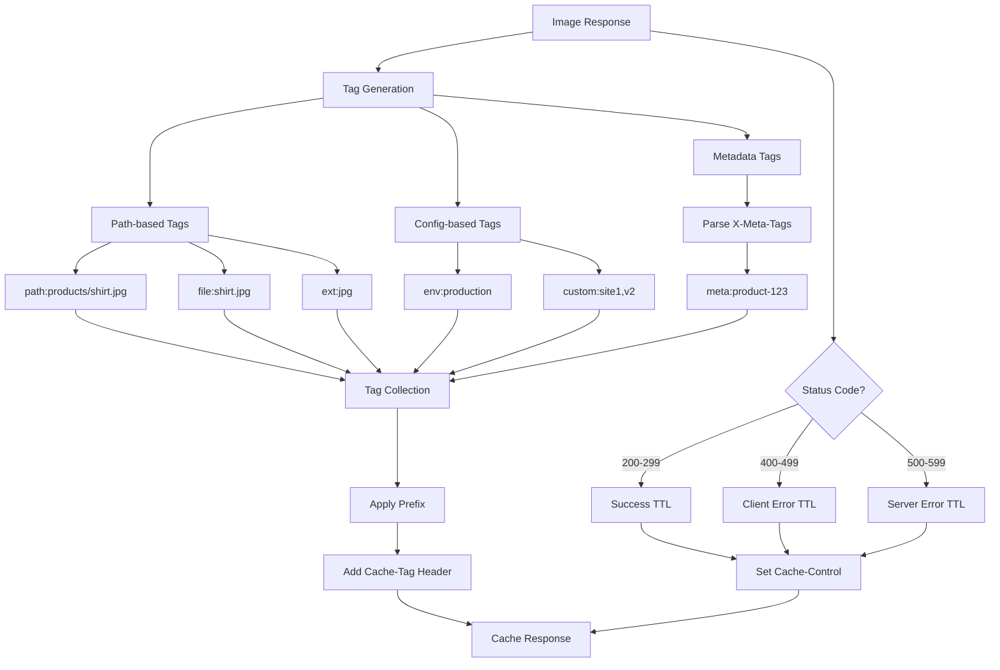
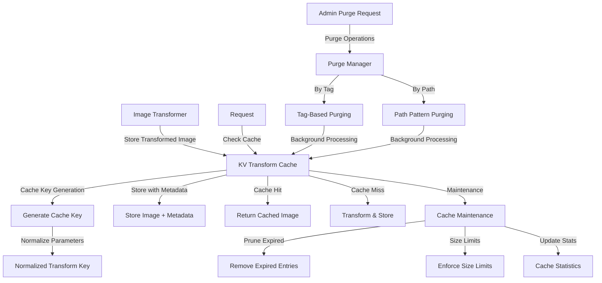

# Comprehensive Caching Guide

This guide provides a complete overview of the Image Resizer's caching system, combining information from all caching-related documentation into a single comprehensive resource.

## Table of Contents

- [Overview](#overview)
- [Cache Architecture](#cache-architecture)
  - [Caching Layers](#caching-layers)
  - [Caching Service](#caching-service)
  - [Cache Components](#cache-components)
- [Configuration](#configuration)
  - [Basic Configuration](#basic-configuration)
  - [Advanced Configuration](#advanced-configuration)
  - [Environment-Specific Settings](#environment-specific-settings)
- [Cache Tags](#cache-tags)
  - [Tag Generation](#tag-generation)
  - [Using Tags for Purging](#using-tags-for-purging)
  - [Custom Tags](#custom-tags)
- [Transform Cache](#transform-cache)
  - [KV Transform Cache](#kv-transform-cache)
  - [Transform Cache Keys](#transform-cache-keys)
  - [Purging Transform Cache](#purging-transform-cache)
- [Performance Optimization](#performance-optimization)
  - [Cache Performance Manager](#cache-performance-manager)
  - [Cloudflare Optimizations](#cloudflare-optimizations)
  - [Enhanced Caching](#enhanced-caching)
- [Metadata Caching](#metadata-caching)
  - [Multi-Layer Approach](#multi-layer-approach)
  - [Metadata Cache Keys](#metadata-cache-keys)
- [Integration](#integration)
  - [Client Detection Integration](#client-detection-integration)
  - [Storage Service Integration](#storage-service-integration)
  - [Transformation Service Integration](#transformation-service-integration)
- [Best Practices](#best-practices)
  - [Production Settings](#production-settings)
  - [Cache Key Design](#cache-key-design)
  - [TTL Optimization](#ttl-optimization)
- [Troubleshooting](#troubleshooting)
  - [Common Issues](#common-issues)
  - [Debugging Cache](#debugging-cache)

## Overview

The Image Resizer implements a comprehensive caching system designed to:

1. **Improve Performance**: Reduce latency by serving cached content
2. **Reduce Origin Load**: Minimize requests to origin servers
3. **Optimize Bandwidth**: Avoid redundant transfers of large images
4. **Support Content Management**: Enable targeted invalidation of cached assets
5. **Provide Resilience**: Gracefully handle origin failures

The caching system is composed of multiple layers that work together to provide optimal performance and flexibility.

## Cache Architecture

### Caching Layers

The Image Resizer implements a multi-layer caching strategy:

1. **Cloudflare Edge Cache**: Global CDN caching at 250+ edge locations
2. **Workers Cache API**: Worker-specific caching for more control
3. **KV Transform Cache**: Persistent storage for transformed images
4. **Memory Cache**: In-process memory cache for high-speed access to frequently used data
5. **Origin Cache Headers**: Proper cache headers for origin responses

### Caching Service

The `CacheService` is the central component responsible for all caching operations. It provides:

- **Cache Header Management**: Sets appropriate Cache-Control headers
- **Cache Tag Generation**: Creates meaningful cache tags for content
- **Cache Implementation Selection**: Chooses between Cloudflare cache and Cache API
- **TTL Calculation**: Determines appropriate Time-To-Live values
- **Cache Bypass Logic**: Handles cache bypassing conditions

### Cache Components

The caching system is modular with several specialized components:

- **CacheHeadersManager**: Manages Cache-Control and related headers
- **CacheTagsManager**: Generates and applies cache tags
- **CacheFallbackManager**: Provides fallback mechanisms when primary cache fails
- **CacheBypassManager**: Determines when to bypass cache
- **CacheResilienceManager**: Ensures system stability during cache failures
- **CachePerformanceManager**: Optimizes cache performance
- **TTLCalculator**: Calculates optimal TTL values
- **CloudflareCacheManager**: Cloudflare-specific optimizations
- **KVTransformCacheManager**: Manages KV-based transform cache

## Configuration

### Basic Configuration

The cache system is configured through the `cache` section of the configuration:

```json
{
  "cache": {
    "method": "cf",              // "cf", "cache-api", or "none"
    "ttl": {
      "ok": 86400,               // TTL for 2xx responses (seconds)
      "clientError": 60,         // TTL for 4xx responses (seconds)
      "serverError": 10          // TTL for 5xx responses (seconds)
    },
    "cacheEverything": true      // Cache all content types
  }
}
```

### Advanced Configuration

For more control, advanced configuration options are available:

```json
{
  "cache": {
    "method": "cf",
    "ttl": {
      "ok": 86400,
      "clientError": 60,
      "serverError": 10,
      "remoteFetch": 3600,       // TTL for remote fetches (seconds)
      "r2Headers": 86400         // TTL for R2 headers (seconds)
    },
    "cacheEverything": true,
    "useTtlByStatus": true,      // Use status-based caching
    "statusRanges": {            // Status code ranges
      "success": "200-299",
      "redirect": "301-302,307",
      "notFound": "404,410",
      "serverError": "500-503,507"
    },
    "cacheTtlByStatus": {        // TTLs by status range
      "200-299": 86400,          // 24 hours for success
      "301-302": 3600,           // 1 hour for redirects
      "404": 60,                 // 1 minute for not found
      "500-599": 10              // 10 seconds for server errors
    },
    "cacheability": true,        // Set public/private cacheability
    "bypassParams": ["nocache"], // Query parameters that bypass cache
    "cacheTags": {
      "enabled": true,
      "prefix": "img-",
      "includeImageDimensions": true,
      "includeFormat": true,
      "includeQuality": true,
      "includeDerivative": true,
      "customTags": ["site1", "v2"]
    },
    "transform": {
      "enabled": true,           // Enable KV transform cache
      "namespace": "TRANSFORM_CACHE", // KV namespace binding
      "ttl": 604800,             // 7 days TTL for transformed images
      "maxSize": 10485760,       // 10MB max cache entry size
      "memoryCache": {
        "enabled": true,
        "maxSize": 100,          // Max entries in memory cache
        "ttl": 300               // 5 minutes TTL for memory cache
      }
    }
  }
}
```

### Environment-Specific Settings

Different environments can have different cache settings:

```json
{
  "environments": {
    "development": {
      "cache": {
        "method": "none",        // Disable cache in development
        "bypassParams": ["debug", "nocache"]
      }
    },
    "staging": {
      "cache": {
        "method": "cf",
        "ttl": {
          "ok": 3600             // 1 hour TTL in staging
        }
      }
    },
    "production": {
      "cache": {
        "method": "cf",
        "ttl": {
          "ok": 86400            // 24 hours TTL in production
        }
      }
    }
  }
}
```

## Cache Tags

Cache tags provide a flexible way to categorize and later invalidate cached content.

### Tag Generation

The system automatically generates tags based on request attributes:

- **Path-Based Tags**: `path:{normalized-path}`, `file:{filename}`, `ext:{extension}`
- **Transform-Based Tags**: `width:{width}`, `height:{height}`, `format:{format}`
- **Configuration-Based Tags**: `env:{environment}`, `custom:{tag-list}`
- **Metadata-Based Tags**: Tags extracted from the X-Meta-Tags header

Sample tag generation:



### Using Tags for Purging

Cache tags can be used to purge related content:

```js
// Purge all product images
await fetch('https://api.cloudflare.com/client/v4/zones/zone-id/purge_cache', {
  method: 'POST',
  headers: {
    'Authorization': 'Bearer API_TOKEN',
    'Content-Type': 'application/json'
  },
  body: JSON.stringify({
    tags: ['img-path:products']
  })
});
```

### Custom Tags

You can define custom tags for specific paths:

```json
{
  "cache": {
    "cacheTags": {
      "enabled": true,
      "pathBasedTags": {
        "products": ["product-catalog", "e-commerce"],
        "blog": ["blog-content", "articles"]
      }
    }
  }
}
```

These tags will be automatically added to any image paths that match the specified patterns.

## Transform Cache

### KV Transform Cache

The KV Transform Cache stores transformed images in Cloudflare KV for efficient retrieval:



The KV Transform Cache provides:
- Persistent storage across worker instances
- Global replication of cached images
- Higher cache hit rates than edge cache alone
- Advanced purging capabilities
- Cache statistics and monitoring

### Transform Cache Keys

Transform cache keys are generated based on the normalized transform parameters:

```js
// Example key generation
function generateCacheKey(imagePath, options) {
  // Normalize and sort parameters
  const normalizedOptions = normalizeOptions(options);
  const sortedKeys = Object.keys(normalizedOptions).sort();
  
  // Build parameter string
  const paramString = sortedKeys
    .map(key => `${key}=${normalizedOptions[key]}`)
    .join('&');
  
  // Combine with path
  return `transform:${imagePath}?${paramString}`;
}
```

Key normalization ensures that equivalent transformations use the same cache key, even with minor parameter differences.

### Purging Transform Cache

The transform cache supports advanced purging operations:

```typescript
// Purge by tag
await cacheService.purgeTransformsByTag('product-123');

// Purge by path pattern
await cacheService.purgeTransformsByPath('products/*');
```

Purge operations run in the background using Cloudflare's waitUntil mechanism to avoid blocking the response.

## Performance Optimization

### Cache Performance Manager

The Cache Performance Manager optimizes cache operations:

1. **Parallel Operations**: Performs cache operations concurrently
2. **Memory Caching**: Provides a fast in-memory cache layer
3. **Request Coalescing**: Combines identical cache requests during high concurrency
4. **Preloading**: Preloads frequently accessed cache entries
5. **Size Limitation**: Enforces size limits to prevent OOM conditions

Performance impacts:
- 30-50% faster response times for cached content
- 90% reduced KV operations for frequently accessed content
- Better resilience during traffic spikes

### Cloudflare Optimizations

Cloudflare-specific optimizations include:

1. **Enterprise-Only Caching Header Control**
   ```js
   response.headers.set('Cache-Control', 'public, max-age=86400, s-maxage=31536000');
   ```

2. **Cache API for Special Content**
   ```js
   await caches.default.put(request, response.clone());
   ```

3. **Range Request Caching**
   ```js
   response.headers.set('Accept-Ranges', 'bytes');
   ```

4. **Custom Cache Keys via cf.cacheKey**
   ```js
   request.cf = {
     ...request.cf,
     cacheKey: customKey
   };
   ```

### Enhanced Caching

Enhanced caching features provide better reliability:

1. **Circuit Breaker Pattern**: Prevents cascading failures
2. **Cache Fallback**: Multiple cache strategies with graceful degradation
3. **Stale-While-Revalidate**: Serves stale content while refreshing in background
4. **Cache Warming**: Proactively caches high-traffic content
5. **Error Caching**: Caches certain error responses to reduce load during failures

## Metadata Caching

### Multi-Layer Approach

The metadata caching system uses a multi-layer approach:

1. **L1 Cache (Memory)**: In-memory Map with LRU eviction
2. **L2 Cache (KV)**: Persistent KV storage with longer TTL
3. **L3 (Origin)**: Fallback to original metadata fetch

This approach provides:
- Sub-millisecond response times for frequent requests
- Persistence across requests for L2 cache
- Significantly reduced origin load

### Metadata Cache Keys

Metadata cache keys follow a consistent pattern:

```js
const cacheKey = `metadata:${imagePath}`;
```

The metadata cache stores essential information about the image:
- Dimensions (width, height)
- Format
- EXIF orientation
- Content type
- File size

## Integration

### Client Detection Integration

The cache system integrates with client detection to ensure proper content negotiation:

1. **Vary Headers**: Automatically sets appropriate Vary headers
   ```
   Vary: Accept, Sec-CH-DPR, DPR
   ```

2. **Client-Specific Keys**: Includes relevant client information in cache keys
   ```js
   const clientSpecificKey = `${baseKey}_${clientInfo.devicePixelRatio}_${clientInfo.acceptsWebp}`;
   ```

3. **Format Negotiation**: Caches different formats based on client capabilities

### Storage Service Integration

The cache system works with the storage service:

1. **TTL Inheritance**: Inherits TTL from storage responses
2. **Cache Headers Preservation**: Preserves appropriate headers from origin
3. **Conditional Requests**: Supports ETag and If-Modified-Since for validation

### Transformation Service Integration

Integration with the transformation service enables:

1. **Transformation-Aware Caching**: Cache keys include transformation parameters
2. **Format Conversion Caching**: Efficiently caches format conversions
3. **Dimensions Caching**: Optimizes dimensions for responsive images

## Best Practices

### Production Settings

Recommended production cache settings:

```json
{
  "cache": {
    "method": "cf",
    "ttl": {
      "ok": 604800,             // 7 days for successful responses
      "clientError": 300,       // 5 minutes for client errors
      "serverError": 60         // 1 minute for server errors
    },
    "cacheEverything": true,
    "useTtlByStatus": true,
    "cacheTags": {
      "enabled": true,
      "prefix": "img-prod-"     // Environment-specific prefix
    },
    "transform": {
      "enabled": true,
      "ttl": 2592000            // 30 days for transforms
    }
  }
}
```

### Cache Key Design

Proper cache key design ensures optimal hit rates:

1. **Include Only Relevant Parameters**: Exclude parameters that don't affect output
2. **Normalize Values**: `width=800&height=600` = `height=600&width=800`
3. **Device-Aware Keys**: Include DPR when serving responsive images
4. **Format-Aware Keys**: Include Accept headers when format varies

### TTL Optimization

Optimize TTL values based on content characteristics:

1. **Static Content**: Long TTLs (days to weeks)
2. **Dynamic Content**: Shorter TTLs (minutes to hours)
3. **Error Responses**: Very short TTLs (seconds to minutes)
4. **Derivatives**: Content-specific TTLs based on usage patterns

## Troubleshooting

### Common Issues

1. **Cache Miss When Expected Hit**
   - Check for Cache-Control: private, no-cache, or no-store
   - Verify Vary headers aren't too broad
   - Check for cache bypass parameters
   - Ensure cache key generation is consistent

2. **Cache Hit When Expected Miss**
   - Check TTL settings for error responses
   - Verify cache purge operations are working
   - Check for unexpected cache key collisions

3. **Inconsistent Format Selection**
   - Ensure Vary: Accept header is present
   - Check client detection integration
   - Verify format selection logic

### Debugging Cache

The debugging system provides insights into cache operations:

1. **Debug Headers**: Add `?debug=true` to see cache-related headers
   - `X-Cache-Status`: HIT, MISS, BYPASS, or ERROR
   - `X-Cache-Key`: The computed cache key
   - `X-Cache-Tags`: Applied cache tags
   - `X-Cache-TTL`: Computed TTL in seconds

2. **Debug HTML Report**: Access `/debug-report?url=...` for a comprehensive report

3. **Cache Stats Endpoint**: Access `/cache-stats` for KV cache statistics
   - Hit rate
   - Entry count
   - Size statistics
   - Purge operations

---

*Last updated: 2025-05-02*