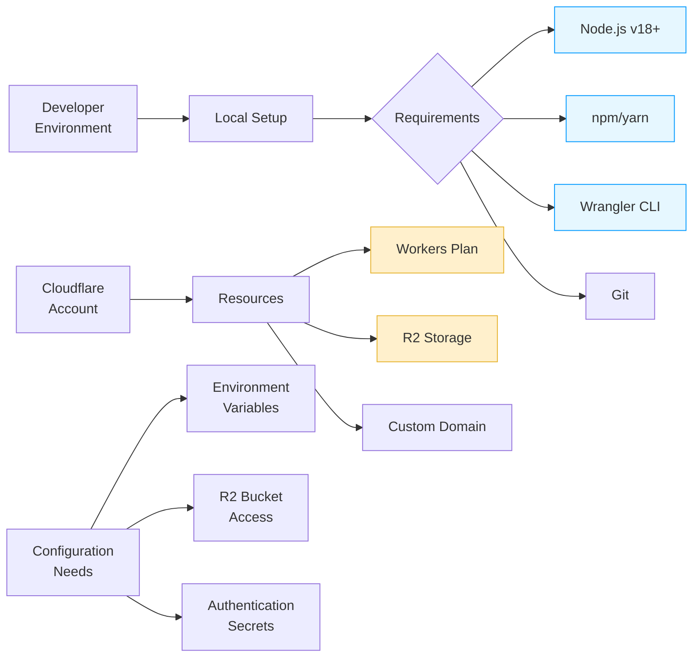

# Setup Guide

This technical guide outlines the process for deploying and configuring the Image Resizer service on Cloudflare's edge network.

## Prerequisites

Required technical components:

1. **Cloudflare Account**: Active account with Workers & R2 enabled
2. **Node.js Environment**: v18.0.0+ (required for ES modules)
3. **Wrangler CLI**: v4.2.0+ (`npm install -g wrangler@latest`)
4. **R2 Storage**: Optional but recommended for origin storage



## Installation

### 1. Clone the Repository

```bash
git clone https://github.com/yourusername/image-resizer-2.git
cd image-resizer-2
```

### 2. Install Dependencies

```bash
npm install
```

### 3. Configure Wrangler

Create or update your `wrangler.jsonc` file with your account details and configuration. The repository includes a comprehensive `wrangler.jsonc` with sensible defaults that you can customize.

Key sections to update:

```jsonc
{
  "account_id": "your-account-id-here",
  "vars": {
    "REMOTE_URL": "https://your-image-source.com",
    "FALLBACK_URL": "https://your-fallback.com"
  },
  "r2_buckets": [
    {
      "binding": "IMAGES_BUCKET",
      "bucket_name": "your-r2-bucket-name",
      "preview_bucket_name": "your-dev-bucket-name"
    }
  ],
  "routes": [
    {
      "pattern": "images.yourdomain.com/*",
      "zone_id": "your-zone-id-here"
    }
  ]
}
```

## Environment Configuration

Image Resizer 2 supports three environments (development, staging, production) with separate configurations for each. You can customize these in the `wrangler.jsonc` file:

```jsonc
"env": {
  "development": {
    "vars": {
      "ENVIRONMENT": "development",
      "DEBUG": "true",
      "CACHE_TTL_OK": "60",
      // Other development settings
    }
  },
  "staging": {
    "vars": {
      "ENVIRONMENT": "staging",
      "DEBUG": "true",
      "CACHE_TTL_OK": "3600",
      // Other staging settings
    }
  },
  "production": {
    "vars": {
      "ENVIRONMENT": "production",
      "DEBUG": "false",
      "CACHE_TTL_OK": "604800",
      // Other production settings
    }
  }
}
```

## Authentication Setup

If you need to access protected image origins, configure authentication settings:

### 1. Configure Authentication Variables

```jsonc
"vars": {
  // Global Auth Settings
  "AUTH_ENABLED": "true",
  "AUTH_SECURITY_LEVEL": "strict",
  "AUTH_CACHE_TTL": "3600",
  "AUTH_USE_ORIGIN_AUTH": "true",
  "AUTH_SHARE_PUBLICLY": "true",
  
  // Remote URL Auth Configuration
  "REMOTE_AUTH_ENABLED": "true",
  "REMOTE_AUTH_TYPE": "aws-s3",
  "REMOTE_AUTH_REGION": "us-east-1",
  "REMOTE_AUTH_SERVICE": "s3",
  "REMOTE_AUTH_ACCESS_KEY_VAR": "AWS_ACCESS_KEY_ID",
  "REMOTE_AUTH_SECRET_KEY_VAR": "AWS_SECRET_ACCESS_KEY"
}
```

### 2. Set Up Authentication Secrets

For production, use Wrangler to set secrets:

```bash
# AWS S3/R2 credentials
wrangler secret put AWS_ACCESS_KEY_ID --env production
wrangler secret put AWS_SECRET_ACCESS_KEY --env production

# Bearer token secrets
wrangler secret put AUTH_TOKEN_SECRET_SECURE --env production

# Basic auth credentials
wrangler secret put AUTH_BASIC_USERNAME_BASIC --env production
wrangler secret put AUTH_BASIC_PASSWORD_BASIC --env production
```

For local development, create a `.dev.vars` file with development credentials:

```
AWS_ACCESS_KEY_ID=your-dev-access-key
AWS_SECRET_ACCESS_KEY=your-dev-secret-key
AUTH_TOKEN_SECRET_SECURE=your-dev-token-secret
AUTH_BASIC_USERNAME_BASIC=your-dev-username
AUTH_BASIC_PASSWORD_BASIC=your-dev-password
```

## Development Workflow

### 1. Start the Development Server

```bash
npm run dev
# or
wrangler dev
```

This starts a local development server that simulates the Cloudflare Workers environment.

### 2. Testing with Different Storage Sources

You can dynamically control the storage priority order without modifying code:

```bash
# To use remote sources only
wrangler dev --var STORAGE_PRIORITY=remote,fallback

# To use fallback only
wrangler dev --var STORAGE_PRIORITY=fallback

# To try different priority order
wrangler dev --var STORAGE_PRIORITY=fallback,remote,r2
```

### 3. Testing with Debug Mode

Enable debug mode to see detailed information:

```
http://localhost:8787/path/to/image.jpg?debug=true
```

Or visit the debug report page:

```
http://localhost:8787/debug-report?url=http://localhost:8787/path/to/image.jpg
```

### 4. Running Tests

Run the test suite to ensure everything works correctly:

```bash
npm test
```

To run a specific test:

```bash
npm run test:watch -- -t "test name"
```

### 5. Checking Types

Verify TypeScript types:

```bash
npm run typecheck
```

## Deployment

### 1. Deploy to Different Environments

Development:
```bash
npm run deploy:dev
# or
wrangler deploy --env development
```

Staging:
```bash
npm run deploy:staging
# or
wrangler deploy --env staging
```

Production:
```bash
npm run deploy:prod
# or
wrangler deploy --env production
```

### 2. Custom Domain Setup

1. Go to Workers & Pages in your Cloudflare dashboard
2. Select your worker
3. Go to the Triggers tab
4. Add a Custom Domain
5. Add a CNAME record for your subdomain (e.g., `images.yourdomain.com`) pointing to `workers.dev`

## R2 Bucket Setup

### 1. Create an R2 Bucket

1. Go to R2 in your Cloudflare dashboard
2. Create a new bucket for your images
3. Upload test images to the bucket

### 2. Configure R2 in Wrangler

Update your `wrangler.jsonc` file with your R2 bucket details:

```jsonc
"r2_buckets": [
  {
    "binding": "IMAGES_BUCKET",
    "bucket_name": "your-r2-bucket-name",
    "preview_bucket_name": "your-dev-bucket-name"
  }
]
```

## Advanced Configuration

### Path Transformations

Configure path mapping for different storage types:

```jsonc
"PATH_TRANSFORMS": {
  "images": {
    "prefix": "",
    "removePrefix": true
  },
  "assets": {
    "prefix": "img/",
    "removePrefix": true,
    "r2": {
      "prefix": "img/",
      "removePrefix": true
    },
    "remote": {
      "prefix": "assets/",
      "removePrefix": true
    }
  }
}
```

### Custom Derivatives

Create custom transformation templates:

```jsonc
"DERIVATIVES": {
  "hero": {
    "width": 1920,
    "height": 600,
    "fit": "cover",
    "gravity": "auto",
    "quality": 80
  },
  "thumbnail": {
    "width": 320,
    "height": 180,
    "fit": "contain",
    "quality": 75
  }
}
```

### Cache Configuration

Fine-tune caching behavior:

```jsonc
"CACHE_TAGS_ENABLED": "true",
"CACHE_TAGS_PREFIX": "img-",
"CACHE_TAGS_CUSTOM": "site1,v2",
"CACHE_TAGS_PARSE_METADATA": "true",
"CACHE_USE_TTL_BY_STATUS": "true",
"CACHE_STATUS_SUCCESS_RANGE": "200-299",
"CACHE_TTL_STATUS_SUCCESS": "604800"
```

### Format Quality Settings

Adjust quality settings by format:

```jsonc
"FORMAT_QUALITY_WEBP": "85",
"FORMAT_QUALITY_AVIF": "80",
"FORMAT_QUALITY_JPEG": "85",
"FORMAT_QUALITY_PNG": "90",
"DEFAULT_QUALITY": "85"
```

### Debug Settings

Configure debug behavior:

```jsonc
"DEBUG": "true",
"DEBUG_HEADERS": {
  "enabled": true,
  "headers": ["ir", "cache", "transform", "auth"],
  "allowedEnvironments": ["development", "staging"],
  "verbose": true,
  "includePerformance": true,
  "forceDebugHeaders": false,
  "prefix": "X-",
  "specialHeaders": {
    "x-processing-mode": true
  }
}
```

## Akamai Compatibility

To enable Akamai Image Manager compatibility:

```jsonc
"ENABLE_AKAMAI_COMPATIBILITY": "true",
"ENABLE_AKAMAI_ADVANCED_FEATURES": "true"
```

This allows the use of Akamai-style URL parameters:

```
https://yourdomain.com/image.jpg?im.resize=width:400,height:300,mode:fit&im.quality=80
```

## Monitoring and Troubleshooting

### 1. Logging

Configure logging level and format:

```jsonc
"LOGGING_LEVEL": "DEBUG",
"LOGGING_STRUCTURED": "true",
"LOGGING_TIMESTAMP": "true",
"LOGGING_BREADCRUMBS_ENABLED": "true"
```

### 2. View Logs in Cloudflare Dashboard

1. Go to Workers & Pages
2. Select your worker
3. Go to the Logs tab

### 3. Diagnosing 524 Timeout Errors

If you experience 524 timeout errors, see the [Diagnosing Timeouts](DIAGNOSING_TIMEOUTS.md) guide.

## Performance Optimization

### 1. Use Client Hints

Enable client hints in your HTML for responsive images:

```html
<meta http-equiv="Accept-CH" content="DPR, Viewport-Width, Width">
```

### 2. Optimize Cache Settings

For production environments:

```jsonc
"CACHE_METHOD": "cf",
"CACHE_EVERYTHING": "true",
"CACHE_TTL_OK": "604800"
```

### 3. Use Auto Formats

Let the system choose the best format based on browser support:

```
https://yourdomain.com/image.jpg?format=auto
```

## Next Steps

- Review the [Authentication Guide](AUTHENTICATION.md) for secured image access
- Explore [Akamai Compatibility](AKAMAI_COMPATIBILITY.md) for migration from Akamai
- Check [Cache Tags Documentation](CACHE_TAGS.md) for cache management
- Learn about the [Interceptor Pattern](INTERCEPTOR_PATTERN.md) for handling large images