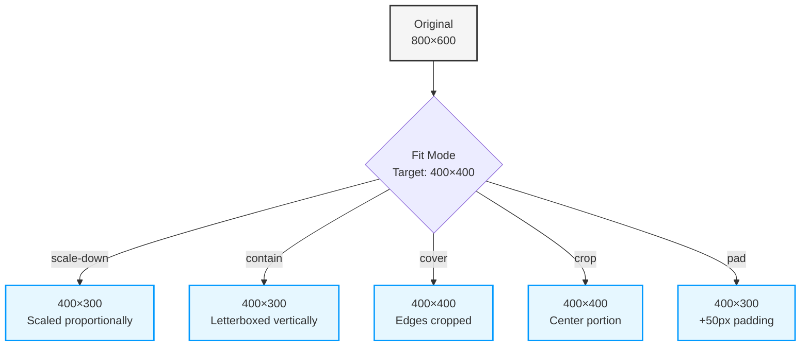
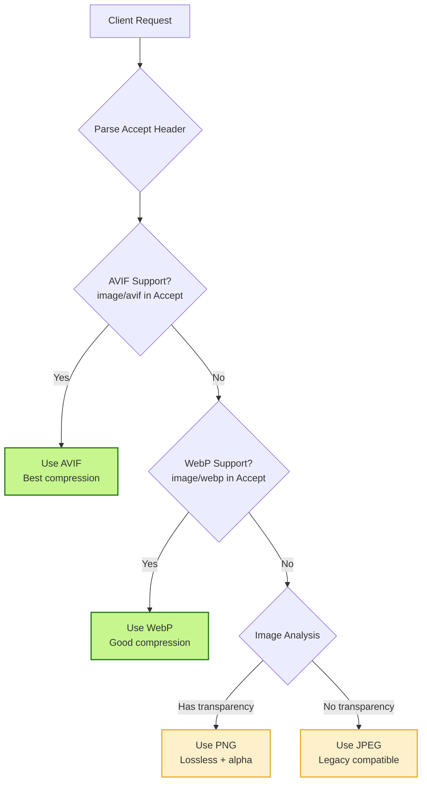
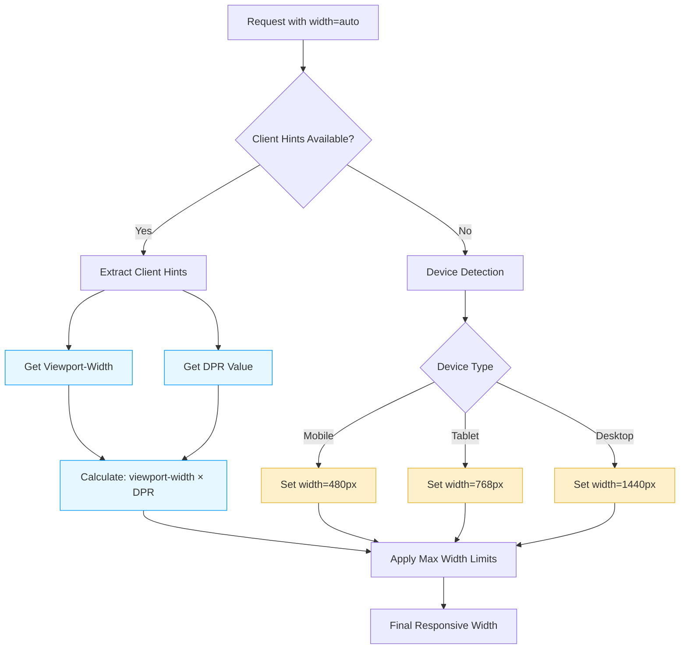
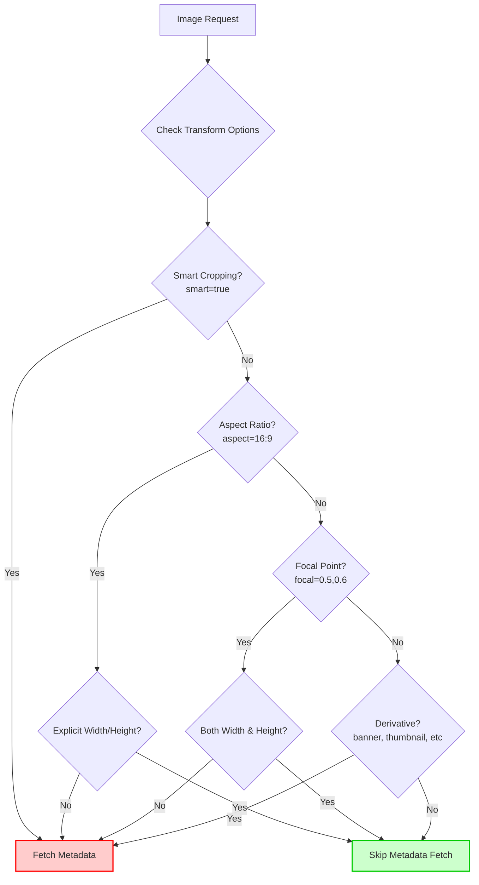

# Image Transformation Guide

This guide provides a comprehensive overview of all supported image transformation options in Image Resizer 2. Learn how to resize, crop, convert formats, adjust quality, and apply visual effects to images on the fly.

## Quick Navigation

- [Back to Documentation Home](../index.md)
- [Core Documentation](index.md)
- [Architecture Overview](architecture.md)
- [Setup Guide](setup.md)
- [Configuration Reference](configuration-reference.md)

## Transformation Basics

Image Resizer 2 leverages Cloudflare's Image Resizing service to transform images on the fly. It supports a wide range of transformations including:

- Resizing and cropping
- Format conversion
- Quality adjustments
- Visual effects
- Metadata handling

All transformations are applied via URL parameters, path parameters, or predefined transformation templates (derivatives).

## Transformation Parameters

### Basic Dimensions

| Parameter | Description | Example | Default |
|-----------|-------------|---------|---------|
| `width` | Maximum width in pixels | `width=800` | Original width |
| `height` | Maximum height in pixels | `height=600` | Original height |
| `dpr` | Device Pixel Ratio (for retina displays) | `dpr=2` | Based on client hints |

### Fit Modes

The `fit` parameter controls resizing behavior when both width and height are specified:

| Value | Description | Example |
|-------|-------------|---------|
| `scale-down` | Scale only if image exceeds target dimensions | `fit=scale-down` |
| `contain` | Fit entire image within bounds (may letterbox) | `fit=contain` |
| `cover` | Fill entire area (may crop edges) | `fit=cover` |
| `crop` | Exact dimensions with cropping | `fit=crop` |
| `pad` | Fit within bounds with padding | `fit=pad` |



### Format Conversion

| Parameter | Description | Example | Default |
|-----------|-------------|---------|---------|
| `format` | Output image format | `format=webp` | Original format |

Supported values:
- `auto` - Automatically select best format based on browser support
- `webp` - Google WebP format (excellent compression with transparency)
- `avif` - AVIF format (best compression, growing browser support)
- `jpeg` - JPEG format (universal support, no transparency)
- `png` - PNG format (lossless, supports transparency)
- `gif` - GIF format (static only unless `anim=true`)

Format selection logic for `format=auto`:



### Quality Settings

| Parameter | Description | Example | Default |
|-----------|-------------|---------|---------|
| `quality` | Image quality (1-100) | `quality=80` | Format-specific default |

You can also use named quality levels:
- `quality=auto` (uses format-specific optimized values)
- `quality=high` (90)
- `quality=medium` (75)
- `quality=low` (50)

Format-specific default quality settings:
- WebP: 85
- AVIF: 80
- JPEG: 85
- PNG: 90 (for lossy PNG)

Quality is automatically reduced for:
- Slow connections (detected via Client Hints)
- Requests with `Save-Data: on` header
- Small image dimensions (especially thumbnails)

### Image Adjustments

| Parameter | Description | Example | Default |
|-----------|-------------|---------|---------|
| `brightness` | Adjust brightness (-100 to 100) | `brightness=20` | 0 |
| `contrast` | Adjust contrast (-100 to 100) | `contrast=15` | 0 |
| `gamma` | Adjust gamma (0.1 to 10.0) | `gamma=1.5` | 1.0 |
| `saturation` | Adjust saturation (-100 to 100, -100=grayscale) | `saturation=-100` | 0 |
| `sharpen` | Apply sharpening (0.0-10.0) | `sharpen=1.5` | 0 |
| `blur` | Apply blur (0.5-100.0) | `blur=5` | 0 |

### Cropping and Positioning

| Parameter | Description | Example | Default |
|-----------|-------------|---------|---------|
| `gravity` | Focal point for cropping | `gravity=auto` | center |
| `trim` | Crop off pixels from sides | `trim=20;30;20;0` | none |
| `crop` | Crop to region (x,y,width,height) | `crop=200,300,400,500` | none |

Gravity options:
- `auto` - Smart detection of focal point or faces
- `center`, `top`, `bottom`, `left`, `right` - Fixed positions
- `top-left`, `top-right`, `bottom-left`, `bottom-right` - Corner positions
- `face` - Face detection (similar to auto but prioritizes faces)
- `0.5x0.5` - Coordinates from 0.0 to 1.0 (x,y)

### Rotation and Flipping

| Parameter | Description | Example | Default |
|-----------|-------------|---------|---------|
| `rotate` | Rotate the image (90, 180, or 270 degrees) | `rotate=90` | 0 |
| `flip` | Flip the image | `flip=h` | none |

Flip options:
- `h` - Horizontal flip (left-to-right)
- `v` - Vertical flip (top-to-bottom)
- `hv` - Both horizontal and vertical flip

### Background Options

| Parameter | Description | Example | Default |
|-----------|-------------|---------|---------|
| `background` | Background color for transparent areas | `background=white` | transparent |

The background parameter accepts any CSS color format:
- Named colors: `red`, `blue`, `transparent`
- Hex: `%23FF0000` (encoded `#FF0000`)
- RGB: `rgb%28255%2C0%2C0%29` (encoded `rgb(255,0,0)`)
- RGBA: `rgba%28255%2C0%2C0%2C0.5%29` (encoded `rgba(255,0,0,0.5)`)

### Metadata Handling

| Parameter | Description | Example | Default |
|-----------|-------------|---------|---------|
| `metadata` | Control EXIF metadata retention | `metadata=copyright` | `copyright` |

Options:
- `none` - Remove all metadata
- `copyright` - Keep only copyright info
- `keep` - Preserve all metadata

### Animation Control

| Parameter | Description | Example | Default |
|-----------|-------------|---------|---------|
| `anim` | Control animation in GIFs and WebP | `anim=false` | true |

Options:
- `true` - Preserve animation frames
- `false` - Use only first frame (static image)

### Advanced Parameters

| Parameter | Description | Example | Default |
|-----------|-------------|---------|---------|
| `onerror` | Fallback behavior on error | `onerror=redirect` | `status` |
| `fetchpriority` | Browser fetch priority hint | `fetchpriority=high` | `auto` |
| `filename` | Suggested download filename | `filename=image.jpg` | Original filename |
| `stripmeta` | Legacy alias for metadata=none | `stripmeta=true` | false |

## URL Formats

Image Resizer 2 supports multiple ways to specify transformation parameters:

### Query Parameters

The most straightforward way to specify transformations:

```
https://example.com/images/photo.jpg?width=800&height=600&quality=80
```

### Compact Parameters

For improved URL readability and brevity, you can use these compact parameter formats:

| Compact Format | Equivalent Standard Format | Description |
|---------------|---------------------------|-------------|
| `r=16:9`      | `aspect=16:9`            | Sets aspect ratio (width:height) |
| `p=0.5,0.6`   | `focal=0.5,0.6`          | Sets focal point (x,y coordinates from 0-1) |
| `f=m`         | `width=700`              | Sets image width using size codes |

Example:
```
https://example.com/images/photo.jpg?r=16:9&p=0.3,0.7&f=xl
```

The `f=` parameter accepts standard size codes that map to specific pixel widths:

| Size Code | Width (px) | Description |
|-----------|------------|-------------|
| `xxu`     | 40         | Extra extra ultra small |
| `xu`      | 80         | Extra ultra small |
| `u`       | 160        | Ultra small |
| `xxxs`    | 300        | Triple extra small |
| `xxs`     | 400        | Double extra small |
| `xs`      | 500        | Extra small |
| `s`       | 600        | Small |
| `m`       | 700        | Medium |
| `l`       | 750        | Large |
| `xl`      | 900        | Extra large |
| `xxl`     | 1100       | Double extra large |
| `xxxl`    | 1400       | Triple extra large |
| `sg`      | 1600       | Small giant |
| `g`       | 2000       | Giant |
| `xg`      | 3000       | Extra giant |
| `xxg`     | 4000       | Double extra giant |

Compact parameters can also be used inside the `im=` parameter in Akamai compatibility mode:

```
https://example.com/images/photo.jpg?im=r=4:3,p=0.5,0.4,f=l
https://example.com/images/photo.jpg?im=AspectCrop=(1,1),f=m,xPosition=.5,yPosition=.5
```

### Path Parameters

Parameters can be specified in the path using the underscore prefix format:

```
https://example.com/images/_width=800/_height=600/_quality=80/photo.jpg
```

### Derivatives (Transformation Templates)

Predefined sets of transformations can be applied using derivatives:

```
https://example.com/images/thumbnail/photo.jpg
```

Which might apply the following transformations:
```javascript
{
  width: 320,
  height: 150,
  quality: 85,
  fit: "scale-down",
  metadata: "none",
  sharpen: 1
}
```

### Path Templates

Specific path patterns can be mapped to derivatives:

```
https://example.com/images/products/item123.jpg
```

With path template configuration:
```javascript
{
  pathTemplates: {
    "products": "product",
    "avatars": "avatar",
    "banners": "banner"
  }
}
```

## Built-in Derivatives

Image Resizer 2 comes with several built-in derivatives for common use cases:

| Derivative | Description | Parameters |
|------------|-------------|------------|
| `thumbnail` | Small preview | width=320, height=150, fit=scale-down |
| `avatar` | Profile picture | width=180, height=180, fit=cover, gravity=face |
| `banner` | Wide header image | width=1600, height=400, fit=cover |
| `product` | Product image | width=800, height=800, fit=contain, background=white |
| `header` | Header image | width=1600, height=73, fit=scale-down |
| `og` | Open Graph/social preview | width=1200, height=630, fit=cover, gravity=auto |
| `twitter` | Twitter card image | width=1200, height=600, fit=cover, gravity=auto |
| `mobile` | Mobile-optimized image | width=480, format=auto, quality=auto |
| `desktop` | Desktop-optimized image | width=1440, format=auto, quality=auto |
| `thumbnail-square` | Square thumbnail | width=320, height=320, fit=cover, gravity=auto |

## Custom Derivatives

You can define custom derivatives in your `wrangler.jsonc` configuration:

```jsonc
"vars": {
  "DERIVATIVES": {
    "hero": {
      "width": 1920,
      "height": 600,
      "fit": "cover",
      "gravity": "auto",
      "format": "auto",
      "quality": 85
    },
    "logo": {
      "width": 250,
      "height": 100,
      "fit": "contain",
      "background": "transparent",
      "format": "webp"
    }
  }
}
```

## Auto-optimization Features

Image Resizer 2 implements intelligent auto-optimization when parameters are omitted:

### Responsive Width Calculation

When `width=auto` is specified (or implied through parameter omission):



The system incorporates both explicit client hints and Cloudflare-provided device data:

### Automatic Format Selection

When `format=auto` is used (or implied):

1. It checks browser support using the `Accept` header
2. It prioritizes formats in this order (if supported):
   - AVIF (best compression)
   - WebP (good compression, wide support)
   - Original format or JPEG (universal support)

3. It preserves transparency when needed:
   - For PNG inputs with transparency, uses WebP or AVIF with alpha support
   - Falls back to PNG if transparency is needed but not supported in target format

### Quality Selection

When `quality=auto` is used (or implied):

1. It selects format-specific quality settings:
   - WebP: 85
   - AVIF: 80
   - JPEG: 85
   - PNG: 90

2. It adjusts quality based on network conditions:
   - Low bandwidth (detected via `Downlink` header): Reduces quality by 10%
   - `Save-Data: on` header: Reduces quality by 15%
   - Both conditions: Reduces quality by 20%

### Metadata Fetching Optimization

When certain transformation parameters are used, the system needs to fetch image metadata to ensure proper processing:



The system optimizes metadata fetching by intelligently determining when it's necessary:

1. **Skip metadata** when:
   - Using aspect ratio (`r=16:9`) with explicit width or height (like `width=800` or `f=m`)
   - Using focal point (`p=0.5,0.6`) with both explicit width and height
   - Using regular resizing without special cropping needs

2. **Fetch metadata** when:
   - Using smart cropping (`smart=true`)
   - Using aspect ratio without explicit dimensions
   - Using focal point without both dimensions
   - Using certain derivative templates that require original dimensions

This optimization significantly improves performance, especially when using compact parameters with size codes:

```
https://example.com/images/photo.jpg?r=16:9&p=0.5,0.5&f=m
```

In this example, metadata fetching is skipped because the size code (`f=m`) provides an explicit width.

## Client Hints

Image Resizer 2 uses the following client hints to optimize images:

- `Viewport-Width` or `Sec-CH-Viewport-Width` - Browser viewport width
- `DPR` or `Sec-CH-DPR` - Device pixel ratio
- `Save-Data` - Data-saving mode enabled
- `ECT` (Effective Connection Type) - Network connection type
- `Downlink` - Connection speed in Mbps
- `RTT` - Round trip time in milliseconds
- `Accept` - Supported image formats
- `CF-Device-Type` - Cloudflare's device detection (mobile, tablet, desktop)

To enable client hints in your HTML:

```html
<meta http-equiv="Accept-CH" content="DPR, Viewport-Width, Width">
```

## Akamai Compatibility Mode

Image Resizer 2 supports Akamai Image Manager URL parameters for seamless migration.

### Akamai Parameter Mapping

| Akamai Parameter | Cloudflare Equivalent | Example |
|------------------|----------------------|---------|
| `im.resize` | width, height, fit | `im.resize=width:400,height:300,mode:fit` |
| `im.crop` | crop | `im.crop=x:100,y:100,w:200,h:200` |
| `im.quality` | quality | `im.quality=80` |
| `im.format` | format | `im.format=webp` |
| `im.rotate` | rotate | `im.rotate=90` |
| `im.grayscale` | saturation | `im.grayscale=true` |

### Compact Parameters in Akamai Mode

You can use compact parameters both as direct URL parameters and inside the `im=` parameter:

```
// Using standard compact parameters
https://example.com/images/photo.jpg?r=16:9&p=0.5,0.5&f=m

// Using compact parameters inside im= parameter
https://example.com/images/photo.jpg?im=r=16:9,p=0.5,0.5,f=m

// Mixing with Akamai AspectCrop
https://example.com/images/photo.jpg?im=AspectCrop=(1,1),f=m,width=800
```

This provides a more concise way to specify common transformations while maintaining compatibility with the Akamai parameter format.

### Advanced Akamai Features

With `ENABLE_AKAMAI_ADVANCED_FEATURES` enabled, the system also supports:

- `im.blur` - Apply blur effect
- `im.mirror` - Mirror/flip the image
- `im.strip` - Strip metadata
- `im.composite` - Watermarking
- `im.if-dimension` - Conditional transformations

Example of advanced Akamai parameters:
```
https://example.com/image.jpg?im.blur=20&im.mirror=horizontal&im.if-dimension=width>800,im.resize=width:400
```

## Transformation Examples

### Basic Resizing

```
https://example.com/images/photo.jpg?width=800&height=600&fit=contain
```

### Cropping to Square with Face Detection

```
https://example.com/images/photo.jpg?width=500&height=500&fit=cover&gravity=face
```

### Converting to WebP with Quality Adjustment

```
https://example.com/images/photo.jpg?format=webp&quality=80
```

### Creating a Grayscale Image

```
https://example.com/images/photo.jpg?saturation=-100&contrast=15
```

### Rotating and Applying Background

```
https://example.com/images/photo.jpg?rotate=90&fit=contain&background=lightgray
```

### Full Example with Multiple Parameters

```
https://example.com/images/photo.jpg?width=800&height=600&fit=cover&gravity=auto&format=webp&quality=85&sharpen=1&metadata=none
```

### Path Parameter Example

```
https://example.com/images/_width=800/_format=webp/_quality=85/photo.jpg
```

### Derivative Example

```
https://example.com/images/banner/photo.jpg
```

## Performance Tips

1. **Use Client Hints**: Enable client hints in your HTML for responsive images
2. **Specify Dimensions**: Always specify width and height to optimize caching
3. **Use Modern Formats**: Use `format=auto` to leverage WebP and AVIF when supported
4. **Appropriate Quality**: Use `quality=auto` or set appropriate values (80-85 is usually sufficient)
5. **Size Codes with Aspect Ratio**: When using aspect ratios (`r=16:9`) and focal points (`p=0.5,0.5`), add a size code (`f=m`) to skip metadata fetching
6. **Derivatives for Common Cases**: Create derivatives for recurring transformation needs
7. **Path Templates**: Use path templates for directory-based transformations
8. **Cache Control**: Optimize caching with appropriate TTL settings

## Limits and Considerations

- **Maximum Dimensions**: Images are limited to 12,000×12,000 pixels
- **File Size Limit**: Input images up to 100 MB are supported
- **GIF Animation**: Animated GIFs work best with minimal transformations
- **SVG Support**: SVG files are supported but with limited transformation options
- **EXIF Orientation**: Automatically respected unless disabled
- **ICC Profiles**: Color profiles are preserved by default
- **Timeout Handling**: Large images are handled with the interceptor pattern to prevent 524 errors

## Implementation Details

The transformation logic is implemented in the `transform.ts` module, which:

1. Processes transformation parameters from various sources
2. Applies client hint optimizations
3. Processes derivative templates
4. Builds the Cloudflare Image Resizing options
5. Applies the transformation through `cf.image` fetch event handler
6. Returns the transformed image with appropriate headers

## Advanced Usage

### Watermarking

You can apply watermarks using the background feature with positioning:

```
https://example.com/images/photo.jpg?width=800&height=600&background=url(https://example.com/watermark.png)
```

### Conditional Transformations

Using Akamai compatibility mode, you can apply conditional transformations:

```
https://example.com/images/photo.jpg?im.if-dimension=width>800,im.resize=width:400
```

### Responsive Image Tags

For optimal user experience, combine with responsive HTML:

```html

```

## Troubleshooting

### Image Not Transforming

If your image isn't transforming as expected:

1. Check the URL parameters for typos or incorrect values
2. Verify the image format is supported
3. Check if the original image is accessible
4. Look for any format compatibility issues
5. Enable debug headers to see transformation details

### Image Quality Issues

If transformed images have quality issues:

1. Increase the quality parameter (try 85-95 for high quality)
2. For transparent images, ensure you're using a format that supports transparency
3. For detailed images, consider using sharpen parameter
4. Check if the original image has sufficient resolution

## Related Resources

- [Client Detection Framework](../client-detection/index.md) - Browser and device detection for format optimization
- [Cache Tags](../caching/cache-tags.md) - Cache management for transformed images
- [Debug Headers](../debugging/debug-headers.md) - Troubleshooting transformation issues
- [Akamai Compatibility](../integrations/akamai/index.md) - Migration from Akamai Image Manager
- [Cloudflare Image Resizing Documentation](https://developers.cloudflare.com/images/image-resizing/)

---

*Last Updated: March 22, 2025*