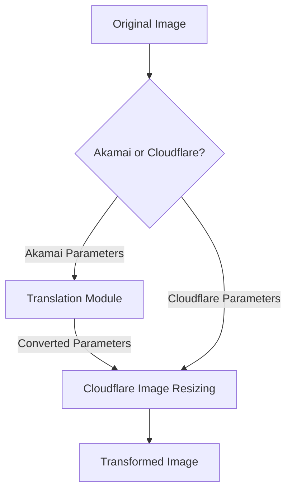

# Akamai Image Manager Compatibility

This guide explains how to use Image Resizer 2 as a drop-in replacement for Akamai Image Manager. It includes a parameter translation module and configuration guidelines to ensure smooth migration from Akamai to Cloudflare Image Resizing without changing your existing image URLs.

## Quick Navigation

- [Back to Documentation Home](../../index.md)
- [Akamai Integration](index.md)
- [Advanced Features](advanced-features.md)
- [Implementation Details](implementation.md)
- [Demos](demos.md)
- [Transformation Guide](../../core/transformation.md)

## Summary

The Akamai compatibility module enables seamless migration from Akamai Image Manager to Cloudflare Image Resizing without changing your existing image URLs. Key features include:

- **Automatic Parameter Translation**: Converts Akamai's URL parameters to Cloudflare format
- **Multiple URL Format Support**: Works with both query parameters and path-based formats
- **Complete Feature Support**: All major Akamai parameters are supported
- **Advanced Transformation Support**: Implements Akamai's powerful transformations including AspectCrop, Composite, and more
- **Zero Client Changes**: No need to update references in your websites or applications
- **Minimal Performance Impact**: Efficient parameter translation with negligible overhead
- **Detailed Debugging**: Comprehensive debug information for troubleshooting

Test this feature with real-world examples at https://images.erfi.dev/ using the documented Akamai parameters.

## Overview

Akamai Image Manager and Cloudflare Image Resizing are similar services with different parameter formats. Image Resizer 2 provides compatibility with Akamai Image Manager's URL format through a translation module that converts Akamai parameters to Cloudflare parameters.



## Parameter Mapping

Akamai Image Manager uses several parameter formats, with the standard formats being the `im=` notation and direct parameters like `imwidth`. The following table shows the mapping between standard Akamai Image Manager parameters and Cloudflare Image Resizing parameters:

> **Note:** While the code supports a non-standard `im.` dot notation (e.g., `im.resize=width:400`), this is not official Akamai syntax and should be avoided in new implementations. Use the standard `im=` notation or direct parameters instead.

| Akamai Parameter | Cloudflare Parameter | Description |
|------------------|----------------------|-------------|
| `im=Resize,width=X` | `width=X` | Image width |
| `imwidth=X` | `width=X` | Direct width parameter |
| `w=X` | `width=X` | Compact width parameter |
| `im=Resize,height=X` | `height=X` | Image height |
| `imheight=X` | `height=X` | Direct height parameter |
| `h=X` | `height=X` | Compact height parameter |
| `im=Resize,mode=fit` | `fit=contain` | Preserve aspect ratio, fit within dimensions |
| `im=Resize,mode=stretch` | `fit=scale-down` | No enlargement, preserve aspect ratio |
| `im=Resize,mode=fill` | `fit=cover` | Fill area, crop if needed |
| `im=Resize,mode=crop` | `fit=crop` | Crop to fit dimensions |
| `im=Resize,mode=pad` | `fit=pad` | Pad to fit dimensions |
| `f=X` | Fit parameter (varies with value) | Size code compact parameter |
| `im=AspectCrop=(X,Y)` | Simulated via fit, width, height & gravity | Crop or expand image to specific aspect ratio |
| `im=AspectCrop,width=X,height=Y` | Simulated via fit, width, height & gravity | Crop or expand image to specific aspect ratio |
| `r=X:Y` | Aspect parameter (width:height) | Aspect ratio parameter |
| `aspect=X:Y` | Aspect parameter (width:height) | Aspect ratio parameter |
| `im=AspectCrop,xPosition=X,yPosition=Y` | `gravity=[position]` | Control aspect crop positioning |
| `p=X,Y` | `gravity=[position]` | Focal point (compact parameter) |
| `focal=X,Y` | `gravity=[position]` | Focal point parameter |
| `im=AspectCrop,allowExpansion=true` | `background=transparent` | Add transparent pixels instead of cropping |
| `im=Quality=X` | `quality=X` | Image quality (1-100) |
| `imquality=X` | `quality=X` | Direct quality parameter |
| `q=X` | `quality=X` | Compact quality parameter |
| `im=Format=webp` | `format=webp` | Image format conversion |
| `imformat=webp` | `format=webp` | Direct format parameter |
| `im=Rotate=X` | `rotate=X` | Rotation in degrees (90/180/270) |
| `imrotate=X` | `rotate=X` | Direct rotation parameter |
| `im=Crop,rect=(X,Y,W,H)` | `trim=top;right;bottom;left` | Crop specific area |
| `imcrop=X,Y,W,H` | `trim=top;right;bottom;left` | Direct crop parameter |
| `im=Grayscale` | `saturation=0` | Convert to grayscale |
| `im=Contrast=X` | `contrast=X` | Adjust contrast |
| `im=Brightness=X` | `brightness=X` | Adjust brightness |
| `im=UnsharpMask,gain=X` | `sharpen=X` | Sharpen image (scaled to Cloudflare range) |
| `im=BackgroundColor=X` | `background=#X` | Background color for padding/transparency |
| `imcolor=X` | `background=#X` | Direct background color parameter |
| `im=Frame=X` | `anim=false` | Disable animation/GIF frame selection |
| `im=Blur=X` | `blur=X` | Apply blur effect (scaled to Cloudflare range) |
| `im=Mirror,horizontal` | `flip=h` | Mirror image horizontally |
| `im=Mirror,vertical` | `flip=v` | Mirror image vertically |
| `im=Composite,image=(url=X),placement=Y` | Implemented via `draw` array | Add watermark or overlay images |
| `im=Watermark,image=(url=X),placement=Y` | Implemented via `draw` array | Add watermark (alias for Composite) |
| `gravity=X` | Positioning for overlays | Control overlay placement |
| `im=if-dimension=condition,transform` | Custom implementation | Apply transformations conditionally based on image dimensions |

## Advanced Features

### Composite (Watermarking)

The compatibility module now provides support for Akamai's composite functionality to add watermarks and overlays:

```
im.composite=url:https://example.com/watermark.png,placement:southeast,opacity:80
```

This is implemented using Cloudflare's `draw` array, which allows for:
- Positioning watermarks in various placements
- Setting opacity
- Tiling watermarks across the image
- Multiple overlays in one request

### Conditional Transformations

Akamai's conditional transformation parameters are supported through custom processing:

```
im=if-dimension=width>1000,im=Resize,width=800
```

This applies different transformations based on conditions like image dimensions, orientation, or format.

### Visual Effects

Additional visual effects are supported:

#### Blur
```
im=Blur=15
```

#### Mirror/Flip
```
im=Mirror,horizontal
```

#### HSL Adjustments
```
imhue=10&imsaturation=120&imlightness=90
```

## Legacy Parameters

The following Akamai Image Manager features have partial or complete support:

| Akamai Feature | Implementation | Notes |
|----------------|----------------|-------|
| `im=Composite` | Cloudflare `draw` array | Supports overlay images, positioning, opacity |
| Text overlays | Limited implementation | Basic text overlays with size, color and position support |
| `im=Watermark` | Full implementation | Alias for `im=Composite` |
| Overlay parameters | Full implementation | Multiple ways to add overlays |
| Path transformations | Partial implementation | Basic path transformations supported |
| Policy parameters | Mapped to derivatives | Policies mapped to Cloudflare derivative templates |
| `im=Blur` | Full implementation | Mapped to Cloudflare's blur parameter |
| `im=Mirror` | Full implementation | Maps to flip/flop parameters |
| `im=if-dimension` | Custom implementation | Conditional transforms based on image dimensions |
| HSL adjustments | Combined implementation | Maps to saturation, brightness and other parameters |

## Unsupported Features

The following features have limited or no direct support:

| Akamai Feature | Limitation in Cloudflare | Workaround |
|----------------|--------------------------|------------|
| CMYK colorspace | Limited colorspace support | Convert to RGB before serving |
| Complex blend modes | Limited blend mode support | Pre-process images with required blend modes |
| Arbitrary angle rotations | Only 90° increment rotations | Pre-rotate images to required angle |
| Region-specific optimizations | No region-specific optimizations | Use standard quality settings |
| Multiple image transforms in sequence | No transform chaining | Apply all transformations in a single step |
| Custom ICC profiles | Limited ICC profile support | Convert to sRGB color space |
| Complex effects | No direct equivalent | Pre-process images with effects |
| Face detection features | Limited detection capabilities | Precompute and use fixed coordinates |

## Implementation

### Enabling Akamai Compatibility

In your wrangler.jsonc file, set the `ENABLE_AKAMAI_COMPATIBILITY` environment variable:

```json
"vars": {
  "ENABLE_AKAMAI_COMPATIBILITY": "true"
}
```

This flag can be set independently for each environment:

```json
"env": {
  "staging": {
    "vars": {
      "ENABLE_AKAMAI_COMPATIBILITY": "true"
    }
  },
  "production": {
    "vars": {
      "ENABLE_AKAMAI_COMPATIBILITY": "false"
    }
  }
}
```

### Enabling Advanced Features

To enable the advanced Akamai features like compositing, conditional transforms, and more:

```json
"vars": {
  "ENABLE_AKAMAI_COMPATIBILITY": "true",
  "ENABLE_AKAMAI_ADVANCED_FEATURES": "true"
}
```

This will activate the extended feature set including watermarking/compositing and conditional transformations.

## Feature Implementation Details

### Aspect Crop

Akamai's Aspect Crop changes the height or width of an image to a specific aspect ratio, either by cropping the image or by expanding the canvas with transparent pixels:

1. **Basic Aspect Crop (16:9 ratio)**
   ```
   im=AspectCrop=(16,9)
   ```

2. **Aspect Crop with Positioning (keep the top of the image)**
   ```
   im=AspectCrop=(16,9),xPosition=0.5,yPosition=0
   ```

3. **Aspect Crop with Expansion (add transparent pixels)**
   ```
   im=AspectCrop=(16,9),allowExpansion=true
   ```

### Composite (Watermark)

The composite functionality adds images on top of the base image:

#### Basic Watermark

**Akamai URL:**
```
https://images.erfi.dev/Granna_1.JPG?im=Composite,image=(url=https://cdn.erfianugrah.com/ea_favicon.png),placement=southeast
```

,placement=southeast)

#### Watermark with Opacity

**Akamai URL:**
```
https://images.erfi.dev/Granna_1.JPG?im=Composite,image=(url=https://cdn.erfianugrah.com/ea_favicon.png),opacity=0.5,placement=center
```

,opacity=0.5,placement=center)

#### Watermark with Size Control

**Akamai URL:**
```
https://images.erfi.dev/Granna_1.JPG?im=Composite,image=(url=https://cdn.erfianugrah.com/ea_favicon.png),width=100,placement=northeast
```

,width=100,placement=northeast)

### Blur Effect

Apply Gaussian blur to the image:

**Akamai URL:**
```
https://images.erfi.dev/Granna_1.JPG?im=Blur=15
```


The blur amount is scaled appropriately to match Cloudflare's 0-250 blur range.

### Mirror/Flip

Mirror the image horizontally or vertically:

**Horizontal Mirror:**
```
https://images.erfi.dev/Granna_1.JPG?im=Mirror,horizontal
```


**Vertical Mirror:**
```
https://images.erfi.dev/Granna_1.JPG?im=Mirror,vertical
```


### Size and Quality Options

Use direct parameters for width, height and quality:

**Akamai URL:**
```
https://images.erfi.dev/Granna_1.JPG?imwidth=800&imheight=600&imquality=85
```


Or use compact parameters:

**Akamai URL:**
```
https://images.erfi.dev/Granna_1.JPG?w=800&h=600&q=85
```


### Aspect Ratio and Focal Point

Control aspect ratio and focal point with compact parameters:

**Akamai URL:**
```
https://images.erfi.dev/Granna_1.JPG?r=16:9&p=0.5,0.3
```


Or use standard parameters:

**Akamai URL:**
```
https://images.erfi.dev/Granna_1.JPG?aspect=16:9&focal=0.5,0.3
```


### Format and Size Codes

Use Akamai's size code parameters:

**Fit Size Code:**
```
https://images.erfi.dev/Granna_1.JPG?f=fit&w=800&h=600
```


**Crop Size Code:**
```
https://images.erfi.dev/Granna_1.JPG?f=crop&w=800&h=600
```


### Conditional Transformations

Apply transformations based on image properties:

**Dimension-Based Transformation:**
```
https://images.erfi.dev/Granna_1.JPG?im=if-dimension=width>1000,im=Resize,width=800
```


**Orientation-Based Transformation:**
```
https://images.erfi.dev/Granna_1.JPG?im=if-orientation=landscape,im=AspectCrop=(16,9)
```

)

## URL Format Support

The compatibility module supports three different Akamai URL formats:

1. **Query Parameters**
   ```
   https://example.com/images/test.jpg?im=Resize,width=800,height=600&imquality=85
   ```

2. **Path Segment Parameters with im-**
   ```
   https://example.com/images/im-resize=width:800/im-quality=85/test.jpg
   ```

3. **Path Segment Parameters with im()**
   ```
   https://example.com/images/im(resize=width:800,quality=85)/test.jpg
   ```

All formats are automatically detected and converted to Cloudflare's query parameter format.

## Debugging

When Akamai compatibility mode is enabled and used, the worker adds several debug headers:

```
X-Debug-Akamai-Compatibility: used
X-Debug-Akamai-Original-Params: im=Resize,width=800,height=600&imquality=85
X-Debug-Akamai-Translated-Params: width=800&height=600&quality=85
```

These headers are only visible when debug mode is enabled via `?debug=true` or setting the `DEBUG` variable to `true`.

The debug report page also shows detailed information about Akamai parameter translation:

```
https://example.com/debug-report
```

## Example Transformations

### Basic Resizing


**Akamai URL:**
```
https://images.erfi.dev/Granna_1.JPG?im=Resize,width=800,height=600,mode=fit&imquality=85
```

**Translated to Cloudflare:**
```
https://images.erfi.dev/Granna_1.JPG?width=800&height=600&fit=contain&quality=85
```

### Aspect Ratio Transformation

,xPosition=0.5,yPosition=0.3)

**Akamai URL:**
```
https://images.erfi.dev/Granna_1.JPG?im=AspectCrop=(16,9),xPosition=0.5,yPosition=0.3
```

**Translated to Cloudflare:**
```
https://images.erfi.dev/Granna_1.JPG?width=800&height=450&fit=crop&gravity=north
```

### Watermark with Positioning

,placement=southeast)

**Akamai URL:**
```
https://images.erfi.dev/Granna_1.JPG?im=Composite,image=(url=https://cdn.erfianugrah.com/ea_favicon.png),placement=southeast,opacity=0.8
```

**Translated to Cloudflare:**
```
https://images.erfi.dev/Granna_1.JPG?draw=[{"url":"https://cdn.erfianugrah.com/ea_favicon.png","bottom":5,"right":5,"opacity":0.8}]
```

### Blur Effect


**Akamai URL:**
```
https://images.erfi.dev/Granna_1.JPG?im=Blur=20
```

**Translated to Cloudflare:**
```
https://images.erfi.dev/Granna_1.JPG?blur=50
```

### Complex Multi-Parameter Transformation


**Akamai URL:**
```
https://images.erfi.dev/Granna_1.JPG?imwidth=500&imquality=80&imformat=webp&im=Blur=10&im=Grayscale
```

**Translated to Cloudflare:**
```
https://images.erfi.dev/Granna_1.JPG?width=500&quality=80&format=webp&blur=25&saturation=0
```

## Migration Strategy

When migrating from Akamai Image Manager to Cloudflare Image Resizing, consider the following approach:

1. **Enable compatibility mode** in a staging environment
2. **Test thoroughly** with various URL formats and parameters
3. **Identify unsupported features** using the table above and create workarounds
4. **Deploy to production** with compatibility mode enabled
5. **Monitor usage** and resolve any issues
6. **Update image URLs** in your content over time to use native Cloudflare format
7. **Eventually disable** compatibility mode once all URLs are migrated

## Performance Considerations

The Akamai compatibility layer adds a small processing overhead for parameter translation. For optimal performance:

1. **Use native Cloudflare parameters** for new content
2. **Cache aggressively** to minimize the translation overhead
3. **Consider pre-processing** images that use unsupported features
4. **Monitor server timing headers** to identify performance bottlenecks
5. **Be aware that advanced features** like compositing may increase processing time

## Testing

The compatibility module includes comprehensive tests covering:

- Detection of Akamai format URLs
- Parameter translation for all supported features
- Path format parsing and normalization
- URL conversion to Cloudflare format
- Integration with the main image processing pipeline
- Advanced features and effects

Run tests with:

```bash
npm test -- akamai-compatibility
```

You can also test specific parameter translations:

```bash
npm test -- -t "composite parameters"
```

## Testing the Implementation

To verify that the Akamai compatibility layer is working correctly in your environment, you can use the following test image:


```
https://images.erfi.dev/Granna_1.JPG
```

Here are recommended test cases to validate different aspects of the compatibility module:

1. **Basic Functionality**: Verify resize and quality parameters

   
   
   ```
   https://images.erfi.dev/Granna_1.JPG?im=Resize,width=800,height=600&imquality=85&debug=true
   ```

2. **Advanced Functionality**: Test aspectCrop with positioning

   ,xPosition=0.5,yPosition=0.2)
   
   ```
   https://images.erfi.dev/Granna_1.JPG?im=AspectCrop=(16,9),xPosition=0.5,yPosition=0.2&debug=true
   ```

3. **Watermarking**: Test composite functionality

   ,placement=southeast)
   
   ```
   https://images.erfi.dev/Granna_1.JPG?im=Composite,image=(url=https://cdn.erfianugrah.com/ea_favicon.png),placement=southeast&debug=true
   ```

4. **Visual Effects**: Test blur and other effects

   
   
   ```
   https://images.erfi.dev/Granna_1.JPG?im=Blur=15&im=Grayscale&debug=true
   ```

5. **Conditional Transformations**: Test dimension-based conditions

   
   
   ```
   https://images.erfi.dev/Granna_1.JPG?im=if-dimension=width>500,im=Resize,width=300&debug=true
   ```

Look for the `X-Debug-Akamai-Compatibility: used` header in the response to confirm that the Akamai parameters were detected and translated correctly.

### Advanced Debugging Techniques

When troubleshooting complex Akamai parameter translations, you can use these advanced debugging techniques:

1. **Enable Detailed Debug Headers**: Add `debug=verbose` to see all internal processing steps
2. **Inspect Breadcrumb Tracing**: Look for the `X-Debug-Breadcrumbs` header to see step-by-step translation
3. **Use the Debug Report**: For visual comparison of before/after translation
4. **Check Translation Performance**: Look for the `X-Debug-Timing` header to identify any performance issues
5. **Test Advanced Features Individually**: Isolate complex features for easier debugging

## Implementation Roadmap

The Akamai compatibility module is continually evolving. Future enhancements include:

1. **More Visual Effects**: Support for additional Akamai effects and filters
2. **Enhanced Conditional Logic**: More sophisticated condition types and combinations
3. **Text Overlay Improvements**: Better font handling and text positioning
4. **Performance Optimizations**: Improved caching and parameter parsing
5. **Custom Effects Pipeline**: Framework for implementing custom effects not natively supported by Cloudflare

## Contributing

Contributions to the Akamai compatibility module are welcome. When implementing new features, please ensure:

1. Thorough test coverage
2. Performance benchmarking
3. Documentation updates
4. Proper error handling

## Conclusion

The enhanced Akamai compatibility module provides a comprehensive solution for migrating from Akamai Image Manager to Cloudflare Image Resizing, supporting a wide range of transformations and effects while maintaining backward compatibility with existing image URLs.

## Troubleshooting

### Parameter Translation Issues

If Akamai parameters aren't being translated correctly:

1. Check for typos or incorrect syntax in your Akamai parameters
2. Enable debug mode to see detailed translation information
3. Verify the parameter is supported by checking the parameter mapping table
4. Try simplifying complex parameter combinations to isolate the issue
5. Check for special characters or encoding issues in parameter values

### Feature Compatibility Problems

If a particular Akamai feature isn't working as expected:

1. Verify the feature is supported in the current implementation
2. Check if the feature requires advanced features to be enabled
3. Compare with the demo examples to understand correct usage
4. Try alternative parameters that achieve similar results
5. Consult the implementation documentation for limitations

## Related Resources

- [Advanced Features](advanced-features.md) - Complex Akamai transformations and effects
- [Implementation Details](implementation.md) - Technical implementation of the Akamai compatibility module
- [Demos](demos.md) - Live examples of Akamai parameter translation
- [Transformation Guide](../../core/transformation.md) - Native Cloudflare transformation options
- [Core Architecture: Akamai Compatibility](../../core/architecture.md#9-akamai-compatibility-utilsakamai-compatibilityts) - Architectural overview
- [Akamai Image Manager Documentation](https://techdocs.akamai.com/imaging/docs/image-manager) - Original Akamai documentation

---

*Last Updated: March 22, 2025*