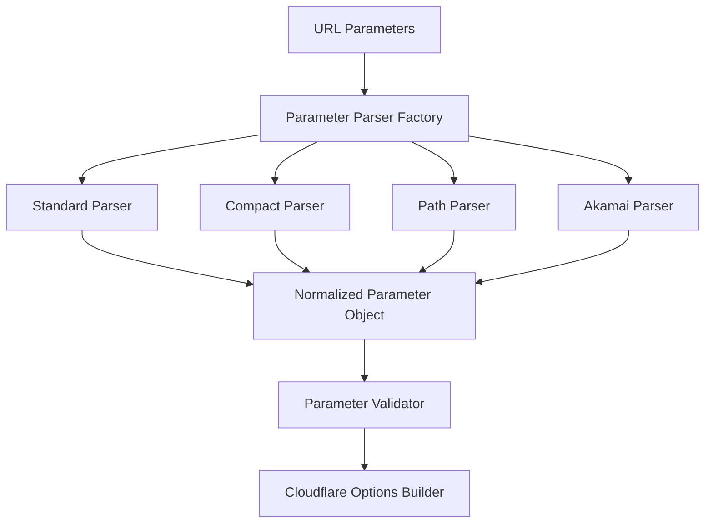

# Parameter Handling Modularization Plan

## Current State Analysis

The current parameter handling in Image Resizer 2 has grown organically to include multiple parameter formats:

1. Standard URL parameters (`width=800`)
2. Compact parameters (`r=16:9`, `p=0.5,0.6`, `f=m`)
3. Path parameters (`_width=800`)
4. Akamai dot notation (`im.resize=width:400`)
5. Akamai equals notation (`im=AspectCrop=(1,1)`)
6. Parameters nested inside `im=` value (`im=AspectCrop=(1,1),f=m,width=800`)

This has led to:
- Code duplication across `path.ts` and `akamai-compatibility.ts`
- Complex parameter extraction and normalization logic
- Multiple overlapping regex patterns
- Lack of clear separation between parameter formats
- Challenging testability due to intertwined responsibilities

## Proposed Architecture

We propose a modular parameter handling system with clear separation of concerns:



### Core Components

#### 1. Parameter Interface

Create a common interface for all parameter types:

```typescript
export interface TransformParameter {
  name: string;           // Parameter name (e.g., 'width', 'aspect')
  aliasFor?: string;      // For compact parameters, the standard parameter name
  value: string | number; // Parameter value
  source: 'url' | 'path' | 'akamai' | 'compact' | 'derivative'; // Parameter source
  priority: number;       // Precedence when conflicting parameters exist
}

export interface TransformParameterDefinition {
  name: string;
  aliases?: string[];     // Alternative names ('r' for 'aspect')
  type: 'number' | 'string' | 'boolean' | 'enum' | 'size-code' | 'coordinate';
  validator?: (value: any) => boolean;
  formatter?: (value: any) => any; // Convert to Cloudflare format
  defaultValue?: any;
  allowedValues?: any[];  // For enum types
}
```

#### 2. Parameter Registry

Create a central registry of all supported parameters with their definitions:

```typescript
// parameters/registry.ts
export const parameterRegistry: Record<string, TransformParameterDefinition> = {
  width: {
    name: 'width',
    aliases: ['w'],
    type: 'number',
    validator: (value) => typeof value === 'number' && value > 0,
  },
  aspect: {
    name: 'aspect',
    aliases: ['r'],
    type: 'string',
    validator: (value) => /^\d+:\d+$|^\d+-\d+$/.test(value),
  },
  // ...other parameters
};
```

#### 3. Parser Modules

Create dedicated parser modules for each parameter format:

- `parsers/StandardParser.ts` - Handles standard URL parameters
- `parsers/CompactParser.ts` - Handles compact parameters (r=, p=, f=)
- `parsers/PathParser.ts` - Handles path-based parameters (_width=800)
- `parsers/AkamaiParser.ts` - Handles Akamai notation parameters
- `parsers/NestedParser.ts` - Handles parameters inside im= value

Each parser implements a common interface:

```typescript
export interface ParameterParser {
  parse(input: string | URLSearchParams | Request): TransformParameter[];
  canParse(input: string | URLSearchParams | Request): boolean;
}
```

#### 4. Parameter Factory

Create a factory that selects the appropriate parser(s) based on the input:

```typescript
// parsers/ParameterParserFactory.ts
export class ParameterParserFactory {
  static getParsers(request: Request): ParameterParser[] {
    const parsers: ParameterParser[] = [];
    const url = new URL(request.url);
    
    // Always include the standard parser
    parsers.push(new StandardParser());
    
    // Check for path parameters
    if (url.pathname.includes('_')) {
      parsers.push(new PathParser());
    }
    
    // Check for Akamai parameters
    if (Array.from(url.searchParams.keys()).some(k => k.startsWith('im.'))) {
      parsers.push(new AkamaiDotParser());
    }
    
    // Check for compact parameters
    if (url.searchParams.has('r') || url.searchParams.has('p') || url.searchParams.has('f')) {
      parsers.push(new CompactParser());
    }
    
    // Check for im= parameter
    if (url.searchParams.has('im')) {
      parsers.push(new AkamaiEqualsParser());
      // Also check for nested parameters inside im=
      const imValue = url.searchParams.get('im');
      if (imValue && (imValue.includes('f=') || imValue.includes('r=') || imValue.includes('p='))) {
        parsers.push(new NestedParser());
      }
    }
    
    return parsers;
  }
}
```

#### 5. Parameter Merger & Validator

Create a component that merges and validates parameters from multiple parsers:

```typescript
// parameters/ParameterProcessor.ts
export class ParameterProcessor {
  private registry: Record<string, TransformParameterDefinition>;
  
  constructor(registry = parameterRegistry) {
    this.registry = registry;
  }
  
  process(parameters: TransformParameter[]): Record<string, any> {
    // Group by parameter name
    const paramsByName = this.groupByName(parameters);
    
    // Select highest priority parameter for each name
    const mergedParams = this.mergeByPriority(paramsByName);
    
    // Validate all parameters
    const validatedParams = this.validate(mergedParams);
    
    // Format parameters for Cloudflare
    return this.formatForCloudflare(validatedParams);
  }
  
  // Implementation details...
}
```

#### 6. Size Code Handler

Create a dedicated module for handling size codes:

```typescript
// parameters/SizeCodeHandler.ts
export class SizeCodeHandler {
  private sizeMap: Record<string, number>;
  
  constructor() {
    this.sizeMap = {
      'xxu': 40,
      'xu': 80,
      'u': 160,
      // ...etc
    };
  }
  
  resolveSize(code: string): number | null {
    return this.sizeMap[code] || null;
  }
  
  getAllSizeCodes(): Record<string, number> {
    return { ...this.sizeMap };
  }
}
```

### Implementation Strategy

1. **Start with Parameter Registry**:
   - Create a comprehensive registry of all parameters
   - Document each parameter with its properties and validation rules

2. **Create the Parser Interface**:
   - Define the common interface for all parsers
   - Create base class with shared functionality

3. **Implement Parsers One by One**:
   - Start with StandardParser as the simplest case
   - Move to CompactParser, then AkamaiParsers
   - Each parser should be self-contained and well-tested

4. **Create the Parameter Processor**:
   - Implement merging logic with clear priority rules
   - Ensure validation is comprehensive

5. **Update Transformation Service**:
   - Replace direct parameter handling with the new modular system
   - Maintain backwards compatibility

### Testing Strategy

1. **Unit Tests for Individual Parsers**:
   - Each parser should have comprehensive tests
   - Test both valid and invalid inputs
   - Test edge cases specific to each format

2. **Integration Tests for the Factory**:
   - Test parser selection logic
   - Ensure all relevant parsers are included

3. **End-to-End Tests**:
   - Test that complex URLs with multiple parameter formats are handled correctly
   - Compare output with existing implementation to ensure consistency

4. **Performance Tests**:
   - Ensure the new implementation doesn't introduce significant overhead
   - Benchmark parsing time for complex URLs

## Benefits of Modularization

1. **Clearer Code Organization**:
   - Separate modules for each parameter format
   - Clear separation of parsing, validation, and transformation

2. **Better Testability**:
   - Each parser can be tested independently
   - Easier to mock components for testing

3. **Easier Extension**:
   - Add new parameter formats by creating new parsers
   - Add new parameters by updating the registry

4. **Improved Maintainability**:
   - Better error handling and validation
   - Clearer code paths for each parameter type

5. **Better Documentation**:
   - Centralized parameter definitions
   - Clear documentation of parameter behavior and validation rules

## Implementation Timeline

1. **Phase 1: Parameter Registry and Interfaces** (1-2 days)
   - Create parameter definitions
   - Define interfaces for parsers and parameters

2. **Phase 2: Basic Parsers** (2-3 days)
   - Implement StandardParser and CompactParser
   - Create tests for basic functionality

3. **Phase 3: Advanced Parsers** (3-4 days)
   - Implement AkamaiParser and NestedParser
   - Add tests for complex parameter combinations

4. **Phase 4: Parameter Processor** (2-3 days)
   - Implement merger and validator
   - Add comprehensive validation

5. **Phase 5: Integration** (2-3 days)
   - Update transformation service
   - Ensure backward compatibility
   - Comprehensive testing

Total estimated time: 10-15 days for full implementation.

## Risk Mitigation

1. **Performance Impact**:
   - Benchmark existing implementation
   - Compare with new implementation
   - Optimize hot paths if needed

2. **Backwards Compatibility**:
   - Maintain feature parity with current implementation
   - Comprehensive testing with existing URL formats

3. **Complexity**:
   - Start with simplest parsers first
   - Clear documentation of parser responsibilities
   - Regular code reviews to prevent scope creep

## Conclusion

This modularization plan provides a clear path to improving the maintainability and extensibility of the parameter handling system in Image Resizer 2. By separating concerns and clearly defining interfaces, we can make the code more robust, testable, and easier to extend with new parameter formats in the future.

The proposed architecture addresses the current "spaghetti code" issues while maintaining full backward compatibility with all existing parameter formats. The modular approach will also make it easier to add new parameter formats and validation rules in the future.