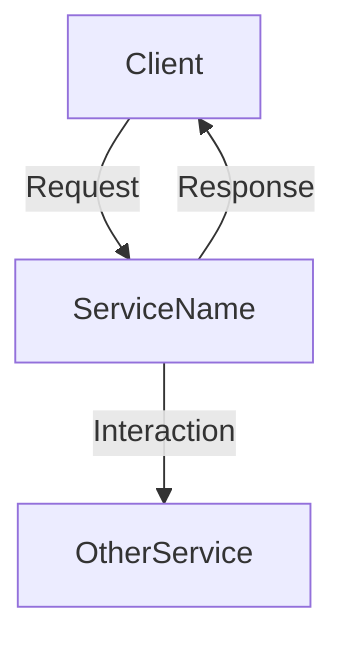

# Service Name

Brief description of what this service does and its role in the system.

## Overview

A more detailed explanation of the service, its responsibility, and its place in the architecture.

## Architecture

How this service fits into the overall architecture:



## Service Interface

The public interface of this service:

```typescript
interface ServiceNameInterface {
  // Methods and properties
  methodOne(param1: Type): ReturnType;
  methodTwo(param1: Type, param2: Type): Promise<ReturnType>;
}
```

## Implementation Details

Key implementation details of the service:

### Key Components

- **Component 1**: Description of component 1
- **Component 2**: Description of component 2

### Lifecycle Management

- **Initialization**: How the service is initialized
- **Operation**: How the service operates
- **Shutdown**: How the service is shut down

### Error Handling

How errors are handled in this service:

- Error type 1: How it's handled
- Error type 2: How it's handled

## Configuration

How to configure this service:

```json
{
  "serviceName": {
    "option1": "value1",
    "option2": "value2"
  }
}
```

## Dependencies

Other services that this service depends on:

- [DependencyService1](dependency-service1.md)
- [DependencyService2](dependency-service2.md)

## Usage Examples

```typescript
// Example code showing how to use this service
const service = container.get(ServiceName);
const result = await service.methodOne('param');
```

## Testing

How to test this service:

```typescript
// Example test code
describe('ServiceName', () => {
  it('should perform methodOne correctly', async () => {
    const service = new ServiceName(mockDependencies);
    const result = await service.methodOne('test');
    expect(result).toBe(expectedValue);
  });
});
```

## See Also

- [Related Service](related-service.md)
- [Related Feature](../features/related-feature.md)
- [Configuration Reference](../configuration/index.md)

---

*Last updated: YYYY-MM-DD*